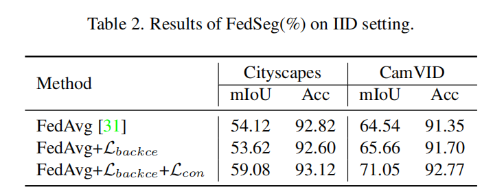

## **《FedSeg: Class-Heterogeneous Federated Learning for Semantic Segmentation》**

## **文献阅读报告**

### 1. 论文摘要

作者的工作主要集中在提出一种新的联邦学习方法`FedSeg`，用于解决类别异构语义分割任务中的挑战。主要贡献如下：

1. **问题识别**：识别并指出了现有联邦学习在语义分割任务中的挑战，特别是在非独立同分布（non-IID）数据和类别异构的情况下。
2. **改进损失函数**：提出了一种修改版的交叉熵损失函数`BackLoss`，以纠正客户端局部优化问题并解决前景-背景不一致的问题。
3. **像素级对比学习**：引入像素级对比学习`Pixel Contrastive Learning`，增强本地像素嵌入与全局语义空间的一致性。
4. **实验验证**：在`Cityscapes`、`CamVID`、`PascalVOC`和`ADE20k`四个语义分割基准上进行了大量实验，验证了FedSeg方法的有效性。


### 2. 论文引言

首先，语义分割是将给定图像中的每个像素分配唯一的语义标签的任务。这意味着对图像中的每个像素进行分类，以确定其所属的语义类别。语义分割任务中有两个问题。

1. 像素级别的数据很难获取，并且模型的训练需要大量的数据
2. 合作训练有泄漏用户隐私的风险，例如居住照片可能泄漏用户的居住地，车辆行驶图片可能泄漏用户的个人数据等。

基于上述两个问题，在语义分割任务中引入联邦学习是很有必要的。之后来简单介绍一下什么是联邦学习。

**联邦学习**（**Federated Learning**，**FL**）是一种新兴的分布式机器学习方法(**之后简称为FL**)，其核心理念是通过多个参与方（如智能设备、机构等）在不共享本地数据的情况下，协同训练一个全局模型。联邦学习旨在解决数据隐私、安全性和数据孤岛等问题，使各方能够共同受益于联合模型的优势，而无需交换或集中存储敏感数据，**图1**是联邦学习的基本流程。


<center>图1 - 联邦学习</center>

联邦学习通常包含四个步骤：

1. **本地训练**：本地训练是联邦学习的起点。在这一阶段，每个参与的客户端（例如，个人设备、组织服务器）在本地数据集上训练模型。此时数据不会离开本地设备，保持数据的隐私性和安全性。
2. 模型更新：在本地训练完成后，每个客户端将其训练得到的模型参数发送回中央服务器或协调节点。这样可以确保中央服务器能够获得来自不同客户端的最新模型信息。
3. 模型聚合：中央服务器接收到所有客户端的模型参数后，将这些参数进行聚合，生成一个新的全局模型。这一步是联邦学习的核心步骤，旨在整合各个客户端的训练成果，提升模型的整体性能。
4. 模型部署：在模型聚合完成后，更新后的全局模型被部署到各个客户端，以便在下一个训练周期中使用。这个步骤确保每个客户端都能够从最新的全局模型中受益，从而不断提高模型的性能。

本论文就是在本地训练过程中进行研究。本篇论文聚焦于面向语义分割的类异构联邦学习，然而，先前的大多数FL方法在分类任务上进行评估，而很少有工作专注于更具挑战性的语义分割。相较于分类任务，语义分割具有特定且更为严重的问题。首先，语义分割图像更加复杂，像素级别的注释极其耗时。客户端通常会对频繁出现的类别进行标注，而忽略稀有类别。

之后来看一下联邦学习用于语义分割中的两个基本问题以及作者提出的解决办法。


<center>图2 - 前景后景不一致导致的本地最优化方向不同</center>

首先，由于不同客户端的数据分布是非独立同分布的，一个客户端忽略的类别可能在另一个客户端是前景类别。对于**图2**中，Person在1中被忽略，但是在2中被识别为主要类。Cat在2中被忽略，但是在3中被识别为主要类。跨客户端的前景-背景不一致性导致了分散的优化方向，并降低了聚合的全局模型的能力。

针对此问题，作者修改了交叉熵损失函数，通过聚合背景类别的概率来校正本地更新中的“客户端漂移”，缓解了前景-背景不一致性问题。


<center>图2 - 无法学习到不同语义类别在像素嵌入空间中的相对位置导致的嵌入空间混乱</center>

其次，对于非独立同分布的情况，复杂的密集预测使得本地优化方向与全局最优点的距离比分类任务更远，导致收敛性较差。从像素嵌入空间的角度来看，每个客户端的本地更新无法学习到不同语义类别在像素嵌入空间中的相对位置，从而在全局聚合后导致混乱的嵌入空间。如图所示，各种不同的语义类别无法在全局空间中被正确的区分开来。

针对此问题，作者进一步引入了一个本地到全局的像素级对比学习损失，强化本地像素嵌入空间与全局语义空间的接近程度，提高了全局模型的收敛性。

总的来说，作者做出来如下贡献：

- 系统地研究了联邦学习在语义分割任务中应用于多种类别情况下的情况，特别是类异构问题。

- 提出了一个强有力的基准模型，采用了简单修改的CE损失和局部到全局的度量学习方法，以缓解客户端之间的类别分布漂移问题。

- 在四个语义分割数据集上提供了基准结果，评估了FedSeg在语义分割联邦学习问题上的表现。希望这项工作能够激励联邦学习社区进一步研究联邦学习问题。

### 3. FedSeg方法

#### 3.1. FedAvg

作者采用了`FedAvg`作为基本的联邦学习方法。**图3**展示了FedAvg的基本流程和方法。


<center>图3 - FedAvg的基本流程和方法</center>

**FedAvg（Federated Averaging）** 是一种用于联邦学习（Federated Learning, FL）的基本算法。其目标是在保证数据隐私的前提下，通过多个客户端（Clients）协同训练一个共享的全局模型。Avg指的是模型聚合的时候平均所有客户端权重，算法基本流程如下：

**参数定义**

- K ：客户端总数
- B ：本地小批量数据的大小
- E ：本地训练的轮数
-  η：学习率
- C ：选择客户端的比例（例如图中C=0.1 表示每轮选取10%的客户端）

##### 服务器端执行
1. **初始化全局模型参数** $$w_0$$
2. **进行多轮训练**（每轮训练包括以下步骤）：
   
   - 计算参与本轮训练的客户端数量 $$m$$，公式为 $$m \leftarrow \max(C \cdot K, 1)$$
   - 随机选取 $$m$$ 个客户端构成集合 $$S_t$$
   - 对于每个客户端 $$k \in S_t$$，并行地执行以下步骤：
     - 客户端 $$k$$ 进行本地模型更新 $$w_{t+1}^k \leftarrow \text{ClientUpdate}(k, w_t)$$
   - 聚合所有客户端的本地模型参数，更新全局模型参数：
     $$
     w_{t+1} \leftarrow \sum_{k=1}^K \frac{n_k}{n} w_{t+1}^k
     $$
     其中，$$n_k$$ 是客户端 $$k$$ 的本地数据量，$$n$$ 是所有客户端数据量的总和。
##### 客户端执行
**ClientUpdate(k, w)** 在客户端 $$k$$ 上运行，具体步骤如下：

1. 将客户端的数据集 $$P_k$$ 分成大小为 $$B$$ 的小批量数据
2. **进行本地训练**（每个本地训练轮数为 $$E$$）：
   
   - 对于每一小批量数据 $$b \in \mathcal{B}$$，执行以下步骤：
     - 使用批量数据 $$b$$ 更新模型参数 $$w$$：
       $$
       w \leftarrow w - \eta \nabla \ell(w; b)
       $$
       其中，$$\ell(w; b)$$ 是批量数据 $$b$$ 上的损失函数。
3. 将本地更新后的模型参数 $$w$$ 返回给服务器。

##### **FedAvg算法特点**

- **数据隐私**：数据从不离开客户端，保护了用户的隐私。
- **分布式训练**：多个客户端并行进行本地训练，提高了训练效率。
- **非独立同分布（Non-IID）数据处理**：FedAvg能够处理不同客户端上的非独立同分布的数据，尽管这会对模型收敛带来挑战。


<center>图4 - FedAvg实验评估</center>

上面左边四张图中，横坐标为通信轮次，纵坐标为准确率。可以看到，FedAvg可以用较少的通信轮次达到较高的准确率。右边图中，横坐标为通信轮次，纵坐标为训练损失，可以看到，FedAvg在通信轮次较少的时候可以达到一个相对较低的损失。以上实验证明了**FedAvg是可行的。可以用少的通信轮次达到较好的效果**。

#### 3.2 初步定义

在这一节中，作者首先定义了他们的方法的基础和目标。他们考虑一个有 N 个客户端的场景，每个客户端有一个本地语义分割数据集 $D_i$。在类别异构的设置中，不同客户端的类别概率分布是不相同的，即 $P_{c\sim D_i} \not～ P_{c\sim D_j}$ 对于$i \not= j$ 。目标是训练一个在组合数据集 $D:= U^N_{i=1}D_i  $上的语义分割模型 $w$，且不共享原始数据。目标是最小化全局损失 $L(w)$，定义为：
$$
arg min_{w} L(w) = \sum_{i=1}^{N} \frac{|D_i|}{D_i} L_i(w)
$$
其中 $Li(w)=E(x,y)_{∈Di}[li(x,y;w)] $代表客户端 $i$ 的本地目标。使用的框架是 FedAvg，每个训练轮次涉及客户端在各自数据集上优化本地模型。服务器通过取本地模型的加权平均来更新全局模型：
$$
w=\sum_{i=1}^{N}\frac{|D_i|}{|D|}w_i
$$
其中 $w_i$ 表示客户端 $i$ 的本地参数。作者提出对本地优化过程进行修改，以在不交换额外信息的情况下提升性能。


#### 3.3. BackCE Loss

在集中学习中，交叉熵（CE）损失是语义分割的标准目标函数。CE 损失定义为：
$$
L_{ce}(x,y)=-\frac{1}{|P|}\sum_{j\in P}logq_x(j,y_i)
$$
其中 $y_j$ 是像素 $j$ 的真实标签，$P$ 是标注像素的集合。在联邦学习（FL）中，本地客户端只有总类的一部分，导致本地优化方向不一致，全局收敛性差。

为了解决这个问题，作者修改了 CE 损失，通过聚合本地客户端数据集中不存在的类别的概率来纠正本地优化方向。修改后的 CE 损失是：
$$
L_i^{backce}(x,y)=-\frac{1}{|P|}\sum_{j\in P}log\hat{q_x}(j,y_j)
$$
其中 $P$ 是所有像素的集合，$\hat{q}_x(j,c)$ 表示聚合的概率。定义为：
$$
\hat{q}_x(j, y_j) = \begin{cases}
q_x(j, y_j) & \text{if } y_j \in C_i, \\
\sum_{c \in C \setminus C_i} q_x(j, c) & \text{if } y_j \notin C_i,
\end{cases}
$$

其中： $C_i$ 是客户端 $i$ 本地数据集中的类别集合。 $C$ 是全局类别集合。 $q_x(j, c)$ 是像素 $j$ 被预测为类别 $c$ 的概率。

从优化的角度来看，提出的$L_{\text{backce}}$的目的是纠正优化，使其类似于集中式学习。假设像素$j$的类别$c$的预测logit为$z_{jc}$，则$L_{\text{ce}}$关于$z_{jc}$的梯度为：

$$
\frac{\partial L_{\text{ce}}}{\partial z_{c}^{j}} =
\begin{cases}
p_{c}^{j} - 1 & \text{if } y_j = c \\
p_{c}^{j} & \text{if } y_j \neq c
\end{cases}
\tag{6}
$$


其中，$p_{jc} = \frac{e^{z_c}}{\sum_{k=1}^{K} e^{z_k}}$是像素$j$的类别$c$的预测概率。为了简化公式中的符号，使用$z_c$代替$z_{jc}$。对于集中式语义分割，由于数据集中包含所有类别，因此关于$z_c$的优化考虑了像素标签是否为$c$，包含了正方向和负方向的梯度。

然而，对于去中心化的联邦学习，假设客户端$i$的标注数据只包含类别$l$。对于类别$c \notin C_i$，标准CE损失关于$z_c$的优化仅为正方向，即：$\frac{∂L_{ce}}{∂z_c}=p_c > 0$ 这会使得优化方向远离全局最优。因此，作者通过$L_{backce}$来修正优化方向。对于标签$y_i \notin l$的背景像素，$L_{backce}$相对于$z_c$的梯度如下所示。
$$
\frac{\partial L_{backce}}{\partial z_c} = - \frac{e^{z_c}}{\sum_{k=1}^{K} e^{z_k}} \cdot \frac{e^{z_l}}{\sum_{k \neq l} e^{z_k}} = -p_c \cdot \frac{e^{z_l}}{\sum_{k \neq l} e^{z_k}} \approx -p_c \cdot p_l
$$
其中，$p_c$和$p_l$分别表示类别$c$和$l$的预测概率。公式表明对于客户端i中的背景像素（即$y_j \not= l$），$L_{backce}$为类别$c$的$logit \ z_c$提供了负方向的优化，这与两个项$p_c$和$p_l$相关。由于本地模型是从包含所有类别信息的聚合全局模型开始的，预测概率可以提供伪标签信息。如果p_c较大，即像素标签y_j为c的预测概率高，则梯度 $\frac{\partial L_{backce}}{\partial z_c} $相对于类别c更大。如果$p_l$较大，因为标签不是$l$，梯度提供了一个更大的数值，使得优化方向指向类别c并远离类别l。

通过这种方式，修改后的交叉熵损失将本地客户端未包含的类别视为背景类，从而纠正本地优化方向，减轻由于前景-背景不一致而引起的本地更新漂移问题。 为了更具体地理解，假设在客户端 $i$ 的数据集中不存在某些类别 $y_j$ ，则这些类别的预测概率会被视为背景类的概率进行聚合。这种处理方法使得本地客户端能够更好地对齐全局优化目标，改善全局模型的收敛性。 这种方法不仅简化了模型的训练过程，还通过纠正本地优化方向，有效地解决了类别异构问题，从而提升了语义分割任务的整体性能。

#### 3.4. **Local-to-Global Pixel Contrastive Learning**

传统的 FL 方法，如 FedProx 和 MOON，通过在本地和全局模型之间应用粗糙的约束来解决非独立同分布（non-IID）问题。然而，这些方法对语义分割的密集预测任务是不够的。

为了改进这一点，作者提出了一种局部到全局像素对比学习方法。在本地更新过程中，从本地和全局模型中提取像素表示。目标是将本地像素表示拉近到同类别的全局表示，同时将它们推离不同类别的表示。这种细粒度的方法有助于对齐本地像素嵌入空间和全局嵌入空间。

局部到全局像素对比损失定义为：
$$
L^{con}_j=\frac{1}{|P_j|}\sum_{v_+\in P_j}-log\frac{exp(v_l·v_+/τ)}{exp(v_l·v_+/τ)+\sum_{v_-\in N_j}exp(v_l·/v_-τ)}
$$

公式中的元素含义如下：

$v_l$：局部模型提取的像素表示。

$c$：像素的语义标签。

$v_{g+}$：全局模型提取的属于相同标签 $c$ 的像素表示，作为正样本。

$v_{g-}$：全局模型提取的属于其他类别 $C \setminus c$ 的像素表示，作为负样本。

$L_{\text{con}}$：局部到全局像素对比损失。

$\tau$：温度超参数，用于调整对比损失的尺度。

$P^j$：像素 $j$ 的正样本集合。

$N^j$：像素 $j$ 的负样本集合。

在联合学习（FL）训练中，面对类别异构的问题，局部客户端只包含部分语义标签，而负样本不足。背景像素可能包含其他语义类别。因此，作者提出利用全局模型为背景像素提供伪标签，因为聚合的全局模型能够预测所有语义类别。作者设定了一个阈值 θ，如果像素的预测概率大于 θ，则将其标注为对应类别的伪标签。

综上所述，最终的目标函数为
$$
L = L_{\text{backce}} + \lambda L_{\text{con}}
$$
其中 $\lambda$ 是一个超参数，用于控制像素对比损失的权重。

### 4. 实验验证

#### 4.1 数据设置

作者在四个语义分割数据集上进行了实验，即`Cityscapes` 、`CamVID` 、`PascalVOC`  和 `ADE20k` ，之后我来简单介绍一下这些数据集。

- **Cityscapes 和 CamVID **：这两个数据集包含街景图像，分别具有19个和11个语义类别。不同于分类任务，语义分割数据集中的图像包含许多类别的对象，这些对象很难拆分。为了生成类异质的数据分区，我们将Cityscapes和CamVID划分为K个子集。每个子集保留一到两个语义类别，其他类别设置为背景。对于Cityscapes和CamVID，K分别设置为19和11。在这种设置下，不同客户端之间存在前景-背景不一致的问题。
- **PascalVOC **：这是一个图像语义分割数据集，包含2,913张图像、20个前景类别和一个背景类别。PascalVOC中的图像较为简单，大多数图像包含一到两个前景类别。为了生成非独立同分布（non-IID）数据分区，我们将其划分为20个子集，每个子集对应一个前景类别。一个子集的背景不包含其他语义类别。
- **ADE20k **：这是一个大规模的语义分割数据集，包含20,210张图像和150个语义类别。语义类别的分布呈长尾分布。为了生成非独立同分布数据分区，我们逐渐将尾部类别拆分为子集，最终生成150个子集。频繁类别的子集不包含尾部类别。一个子集的背景不包含其他类别。

作者采用了两种常用的语义分割评估指标：

- **mIoU（mean Intersection-over-Union）**：表示预测像素与真实像素之间的交并比，平均到所有类别上。

- **Pixel Accuracy**：表示正确分类的像素比例。

#### 4.2 消融实验和对比实验

<center>表1 - 消融实验和对比实验</center>


这张表包含两部分a和b，其中a进行了消融实验，证明了fedseg各个部分的有效性，b进行了对比实验，讲fedseg和目前最先进的方法做对比证明fedseg的优越性。

在表1（a）中，作者展示了FedSeg的主要组成的效果，即$L_{\text{backce}}$和$L_{\text{con}}$的有效性。我们使用FedAvg作为基础的FL框架。表中的FedAvg表示使用标准交叉熵损失的FedAvg方法。FedAvg+$L_{\text{backce}}$表示我们使用修改后的CE损失，而FedAvg + $L_{\text{backce}}+L_{\text{con}}$表示同时使用$L_{\text{backce}}$和$L_{\text{con}}$。我们进行了三次尝试并报告了平均值。实验证明了：

- **$L_{backce}$的有效性**: 表1(a)显示了背景聚合CE损失相比于标准CE损失显著提高了分割性能。这表明背景聚合的优化校正对于类别异构的FL语义分割非常重要。对于Cityscapes、CamVID和PascalVOC，$L_{\text{backce}}$将mIoU提高了20%以上。对于困难的大规模ADE20k，$L_{\text{backce}}$也有1.4%的mIoU改善。
- **$L_{con}$的有效性**: 表1(a)显示添加$L_{\text{con}}$可以将Cityscapes和CamVID的mIoU提高2.5%到5.2%，证明了$L_{\text{con}}$的有效性。对于PascalVOC，$L_{\text{con}}$的有效性有限。这是因为对比损失需要足够的负样本才能获得良好的性能。然而，PascalVOC是一个简单的数据集，每个客户端只包含一个或两个类别，即负类相当有限，$L_{\text{con}}$起作用。对于困难的大规模ADE20k，mIoU略有提高0.3%。

作者在表1(b)中将FedSeg与其他FL方法进行了比较，包括FedAvg 、FedProx 、FedDyn 和MOON 。为了公平比较，它们都在局部更新中使用了$L_{\text{backce}}$，因为$L_{\text{backce}}$可以被视为一个强大的基准线。表1(b)显示了先前用于非IID问题的FL方法（FedProx 、FedDyn 、MOON ）的分割性能与FedAvg 相似甚至更低。这表明，对于密集预测任务，整个模型权重或表示的粗略正则化效果不佳。作者的FedSeg采用了细粒度的像素级对比学习，并有效地提高了mIoU分数。

#### 4.3 IID数据集实验和LOSS对比

<center>表2 - IID数据集实验</center>





作者在表2中报告了FedSeg在IID分布设置下的性能，该设置随机将图像拆分到不同的客户端。结果显示，使用$L_{\text{backce}}$与标准CE损失取得了类似的性能。这是因为$L_{\text{backce}}$旨在纠正优化并解决非IID问题。由于在IID情况下，每个客户端都包含所有类别，因此$L_{\text{backce}}$和标准CE损失（$L_{\text{ce}}$）之间的梯度更新是相似的。添加$L_{\text{con}}$后，性能有所提高，因为它学习了更好的像素嵌入空间。

<center>表3 - 不同的LOSS对比</center>


作者进一步将$L_{\text{backce}}$与常用的语义分割损失进行了比较，包括BCELoss、DiceLoss 和Lova´szLoss 。这些语义分割损失只对前景类别的logits进行梯度计算，从而缓解了FL分割的优化分歧问题。如表3所示，这些结构感知的优化准则的分割性能优于标准CE损失。相比这些损失，我们提出的$L_{\text{backce}}$进一步提高了分割性能，表明$L_{\text{backce}}$在优化方向上更接近于集中训练。具体来说，$L_{\text{backce}}$在Cityscapes（non-IID1）和CamVID（non-IID1）上分别超过了最佳竞争对手DiceLoss 15.7%和16.3%。在PascalVOC上，$L_{\text{backce}}$的提升不如其他数据集显著。这是因为$L_{\text{backce}}$解决了背景不一致的问题，更适用于客户端背景包含其他客户端类别的情况。然而，对于PascalVOC，每个客户端并不包含其他客户端的类别。

<center>表4 - 本地到全局和本地到本地的对比损失比较</center>


<center>表5 - 像素到像素和像素到区域的对比损失</center>


表4和表5展示了不同对比损失的效果，基于上述实验现象，作者选取了本地到全局，像素到区域的对比学习损失。

#### 4.4 FedSeg效果


<center>图5 - Cityscapes和CamVID的通信效率比较</center>

图5显示了训练过程中每轮的mIoU分数，由于作者的FedSeg增加了局部到全局的对比损失，以进行细粒度的局部更新校正，从而持续提高了分割性能和通信效率。如图5所示，在Cityscapes（non-IID1和non-IID2）和CamVID（non-IID1和non-IID2）数据集上，FedSeg在开始阶段的mIoU提升速度显著快于FedAvg。


<center>图6 - 不同语义类的像素嵌入的可视化</center>

作者使用t-SNE 对Cityscapes验证数据集中的语义类别像素嵌入进行可视化，如图6所示。作者比较了FedAvg（使用标准CE损失）、FedAvg + $L_{\text{backce}}$和FedAvg + $L_{\text{backce}} + L_{\text{con}}$。图6显示，使用标准CE损失训练的模型学习到的嵌入效果较差，不同语义类别的像素嵌入甚至混杂在一起。使用背景聚合CE损失可以学习到更好的像素嵌入。添加像素对比学习进一步改善了嵌入空间中不同类别的分离度。

从通信效率和最终像素嵌入的可视化来看，FedSeg相对于其他的FL算法，展现出了很好的优越性，通过像素嵌入的可视化，也能看出作者提出的两处修改也确实起到了作用。

#### 4.5 clients的影响


<center>图6 - non-IID数据下参与客户端数量的影响</center>

图6为不同参与客户端的数量对mIoU的影像图。作者评估了不同数量的参与客户端对FedSeg的影响。具体来说，作者随机选择了5、10、15、20个客户端参与每轮的联邦学习。如图7所示，随着客户端数量的增加，使用标准CE损失的FedAvg 的mIoU性能显著提高，因为每轮参与的更多客户端提供了更多数据，缓解了客户端偏移问题。在图7中，随着客户端数量的增加，FedSeg的性能也略有提升。并且不论在client为多少的情况下， FedAvg + $L_{\text{backce}} + L_{\text{con}}$ 的表现总是最好的。

### 5. 代码复现


<center>图7 - 代码复现-客户端总数60-每次参与5</center>

从github中将代码clone到本地仓库，更改配置文件中的参与客户端总数和每次参与客户端的数量

```shell
# 随时输出log: cityscapes
date_now=$(date +"%Y%m%d_%H%M%S")
#python=../envs/torch11/bin/python

#ROOT_DIR='../data/cityscapes'
#ROOT_DIR='../data/cityscapes_split_erase19'
#ROOT_DIR='../data/cityscapes_split_erase19C2'
ROOT_DIR='/root/workspace/voc'
#ROOT_DIR='../data/ade20k_erase_150C1'

LABEL_ONLINE_GEN=False
LOSSTYPE=back #ce,ohem,back,'dice','focal','lovasz','bce'

WARMSTEP=20
FRAC_NUM=5 # 每次参与的客户端数量
LOCAL_EP=2
MIXLABLE=True
FEDPROX_MU=0
##################
DISTILL=False
TEMP_DIST=0.1
LAMB_PI=0.1
LAMB_PA=0
##################
RAND_INIT=False

##################PROTO_NEW
IS_PROTO=True
MOM_UPDATE=False

GLOBALEMA=False
PROTO_START_EPOCH=1
CON_LAMB=0.1
MOMENTUM=0.99
TEMP=0.07
EPOCH_NUM=300
MAX_ANCHOR=4096
KMEAN_NUM=2
PSEUDO_LABLE=True
PSEUDO_LABEL_START_EPOCH=1
LOCALMEM=True
CON_LAMB_LOCAL=1

##################
DATASET=voc #cityscapes #ade20k  #camvid
NUM_CLS=20
NUM_USERS=60 # 总共多少个客户端

python -u segmentation/federated_main.py \
--gpu="0" \
--dataset=$DATASET \
--root_dir=$ROOT_DIR \
--USE_ERASE_DATA=True \
--num_classes=$NUM_CLS \
--data="train" \
--num_workers=4 \
--model="bisenetv2" \
--checkpoint="" \
--lr=0.05 \
--lr_scheduler="step" \
--iid=False \
--num_users=$NUM_USERS \
--frac_num=$FRAC_NUM \
--epochs=$EPOCH_NUM \
--local_ep=$LOCAL_EP \
--local_bs=8 \
--is_proto=$IS_PROTO \
--losstype=$LOSSTYPE \
--fedprox_mu=$FEDPROX_MU \
--label_online_gen=$LABEL_ONLINE_GEN \
--distill=$DISTILL \
--distill_lamb_pi=$LAMB_PI \
--distill_lamb_pa=$LAMB_PA \
--rand_init=$RAND_INIT \
--warmstep=$WARMSTEP \
--globalema=$GLOBALEMA \
--temp_dist=$TEMP_DIST \
--mixlabel=$MIXLABLE \
--proto_start_epoch=$PROTO_START_EPOCH \
--con_lamb=$CON_LAMB \
--con_lamb_local=$CON_LAMB_LOCAL \
--momentum=$MOMENTUM \
--temperature=$TEMP \
--max_anchor=$MAX_ANCHOR \
--kmean_num=$KMEAN_NUM \
--pseudo_label=$PSEUDO_LABLE \
--pseudo_label_start_epoch=$PSEUDO_LABEL_START_EPOCH \
--localmem=$LOCALMEM \
--mom_update=$MOM_UPDATE \
--save_frequency=20 \
--local_test_frequency=9999 \
--global_test_frequency=20 \
--USE_WANDB=0 \
--date_now=${date_now} \
| tee -a "save/logs/log-${date_now}.txt"

```

修改`FRAC_NUM`和`NUM_USERS`，设置通信轮次分别为150，250和300，可以看到，FedSeg可以在较少的通信轮次中达到较低的损失。

### 6. 论文总结 

作者研究了用于语义分割的类别异构联邦学习。为了解决局部更新过程中前景-背景不一致和客户端漂移的问题，提出了一种基准方法FedSeg，使用了修改后的CE损失和局部到全局的像素对比损失。在四个语义分割数据集上进行了大量实验，以展示FedSeg的有效性。

### 7. 学习心得

通过阅读《FedSeg: Class-Heterogeneous Federated Learning for Semantic Segmentation》这篇文章，我学习到了机器学习领域中关于联邦学习和语义分割的前沿知识，加深了我对分布式机器学习系统的理解，在学习FedSeg这篇文章的时候，由于FedSeg采用了FedAvg作为基本的FL框架，我还去阅读了《Communication-Efficient Learning of Deep Networks from Decentralized Data》这篇文章，了解了FedAvg的基本原理和其用于机器学习的效果，汇报中的ppt和本文章中的FedAvg相关的图是从这篇文章中截取的，这篇文章让我了解到了在机器学习领域也可以使用分布式系统，并且对其基本问题给出了基本的解决方案。除此之外，我还掌握了一些关键的技术和方法。具体来说：

**学习到了联邦学习的基本概念和挑战**：

- 理解到了联邦学习的基本方法例如Fedavg等。
- 联邦学习的目标是在保护数据隐私的前提下，通过多个分布式客户端协作训练一个全局模型。
- 立即到了联邦学习和传统机器学习的异同之处，通过进行实际的代码复现进一步加深了对语义分割任务和联邦学习对传统机器学习的优化的理解。
- 理解了Non-IID数据（数据分布不均匀）对模型训练的影响，特别是在类异构的场景下，不同客户端的数据包含不同的语义类别，导致训练过程中出现的前景-背景不一致问题。

**加深了对语义分割任务的认识**：

- 语义分割是一种密集预测任务，需要对图像中的每个像素进行分类，应用广泛但挑战较大。
- 语义分割的模型训练需要像素级的标签数据，这种数据很难被获取到，并且在进行和做训练的时候需要进行用户隐私的保护。
- 通过本论文，我了解了现有的语义分割方法以及它们在联邦学习场景下的局限性。

**掌握了改进联邦学习的方法和技术**：

- **修改的交叉熵损失 ($ L_{backce} $)**：通过调整损失函数来纠正本地优化方向，从而缓解由数据分布不均匀引起的优化问题。
- **像素级对比学习 ($L_{con}$)**：通过局部到全局的对比学习方法，将本地像素嵌入逼近全局语义空间，提高了全局模型的收敛性和精度。

**掌握了实验设计与评估技能**：

- 了解了如何设计实验来验证方法的有效性，包括选择合适的数据集、设定对比实验、分析结果和绘制性能曲线。
- 学习并掌握了如何使用多种评估指标（如$mIoU$）来衡量模型在不同任务和数据集上的表现。

**进行了模型的部署和云服务器的应用**：

- 学会了如何将训练好的模型部署到云服务器上，通过云服务器解决本地配置不足的问题。
- 学习到了ssh连接云服务器的基本原理和过程，和它的具体使用方法。
- 熟悉了centos的基本环境和操作指令。
- 掌握了在云环境中配置和管理服务器的技能，包括服务器的启动与停止、文件权限的设置等。
- 理解了如何优化模型的部署，提高服务的效率和稳定性，确保模型在实际应用中的有效性和可靠性。

总之，这篇文章不仅拓宽了我在机器学习和计算机视觉领域的知识面，还提供了一些实用的方法和技术，帮助我掌握了应对实际问题的技能。同时，通过模型的部署和云服务器的应用实践，我进一步提升了自己的技术水平，能够将所学知识应用于未来的科研和实际工作中。