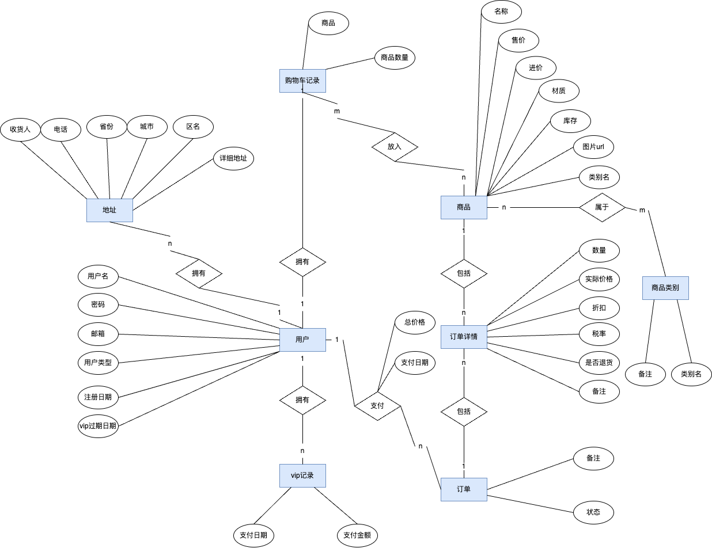

### 1. 实验目的

​	掌握数据库设计的过程和方法。

### 2. 实验内容和要求

​	每人请从下面的题目当中选择一个，进行数据库设计，通过网络平台或图书馆查找相关 文献进行需求分析，按照下面的实验步骤完成设计要求。

​	**选题为：(10)网上超市购物系统的设计**

### 3. 实验步骤

(1)根据所选题目进行系统需求分析和系统设计，画出系统的 E-R 图，给出实体或联系的属性，标明联系的种类;

#### 3.1 需求分析设计

##### 3.1.1 需求分析

​		随着网络的不断普及，日益忙碌的人们开始追求足不出户地利用互联网这一强大的平台 来实现网上购物，网上超市购物应运而生。网上超市购物系统是一种具有交互功能的商业信 息系统，它在网络上建立了一个虚拟的购物商城，使购物过程变得轻松、快捷、方便。本课 题要求针对某个超市设计并实现一个集个性化推荐与在线超市于一体的专业型电子商务网站。

##### 3.1.2 系统设计

1. **前端设计：**

用户界面

1. **主页：** 展示热门商品、促销信息等。
2. **商品列表页：** 显示各类商品，支持分类、搜索。
3. **商品详情页：** 包括商品详细信息、用户评价、相关推荐等。
4. **用户个人中心：** 提供订单管理、个人信息管理等功能。
5. **购物车页面：** 显示用户已选商品，支持编辑和结算。

交互体验

1. **用户注册和登录：** 提供注册和登录功能，使用安全的身份验证。
2. **购物流程：** 流畅的购物车、结算流程，包括支付选项和订单确认。
3. **个性化推荐：** 根据用户历史行为和购买记录实现个性化推荐。

2. **后端设计：**

业务逻辑

1. **用户管理：** 处理用户注册、登录、个人信息修改等请求。
2. **商品管理：** 处理商品的添加、编辑、删除等请求。
3. **购物车和订单：** 管理用户购物车内容和处理订单生成、支付等操作。
4. **推荐引擎：** 实现个性化推荐算法。

数据存储

1. **用户信息数据库：** 存储用户账号信息、个人信息。
2. **商品数据库：** 存储商品信息、库存等。
3. **订单数据库：** 记录用户订单信息和支付状态。
4. **推荐数据：** 存储个性化推荐所需的用户行为数据

##### 3.1.3 E-R图




(2)把 E-R 图转换为关系模式;

#### 3.2 关系模式

下划线为主键，括号为联合主键

- 用户表：<u>用户编号</u>，用户名，密码，邮箱，用户类型，注册日期，vip过期日期
- 地址表：<u>地址编号</u>，收货人，电话，省份，城市，区号，详细地址
- 购物车记录表：<u>购物车记录编号</u>，<u>(用户编号，商品编号)</u>，数量
- 商品表：<u>商品编号</u>，商品名称，商品售价，批发价格，商品材质，商品库存，商品图片地址，商品备注
- 订单表：<u>订单编号</u>，用户编号，订单总价格，订单日期，订单状态，订单备注，订单地址
- 订单明细表：<u>订单明细编号</u>，<u>(商品编号，订单编号)</u>，数量，价格，折扣，税率，退货编辑，订单明细备注
- 商品类别表：<u>类别编号</u>，类别名称，类别备注
- vip记录表：<u>记录编号</u>，用户编号，支付日期，支付金额

日志记录表(会使用存储过程实现)

- 订单信息变更表
- 用户信息变更表


(3)根据关系规范理论进行数据库的逻辑设计，给出数据库表的设计，数据库表设计 格式参照下面:

<center>表 1 学生表(student)</center>

| 字段名         | 中文含义    | 类型         | 约束             | 备注                                 |
| -------------- | ----------- | ------------ | ---------------- | ------------------------------------ |
| uid            | 学号        | char(6)      | 主键             |                                      |
| Username       | 姓名        | Varchar(255) | not null, unique |                                      |
| password       | 出生日期    | varchar(255) | not null         | 应经过md5加密                        |
| usertype       | 专业        | int          | Check(0,1,2)     | 普通用户0<br />vip用户1<br />管理员2 |
| regdate        | 注册日期    | datetime     | not null         | 注册日期，默认当前                   |
| expirationdate | vip过期日期 | datetime     | null             | 仅对vip用户有效                      |

#### 3.3 数据库设计

<center>表 1 用户表(users)</center>

| 字段名         | 中文含义    | 类型         | 约束             | 备注                                 |
| -------------- | ----------- | ------------ | ---------------- | ------------------------------------ |
| uid            | 学号        | char(6)      | 主键             |                                      |
| Username       | 姓名        | Varchar(255) | not null, unique |                                      |
| password       | 出生日期    | varchar(255) | not null         | 应经过md5加密                        |
| usertype       | 专业        | int          | Check(0,1,2)     | 普通用户0<br />vip用户1<br />管理员2 |
| regdate        | 注册日期    | datetime     | not null         | 注册日期，默认当前                   |
| expirationdate | vip过期日期 | datetime     | null             | 仅对vip用户有效                      |

<center>表 2 地址表(address)</center>

| 字段名   | 中文含义   | 类型         | 约束        | 备注             |
| -------- | ---------- | ------------ | ----------- | ---------------- |
| Aid      | 地址编号   | int          | 主键        |                  |
| uid      | 用户编号   | int          | FOREIGN KEY | 参考表users(did) |
| name     | 收货人姓名 | Varchar(255) | not null    |                  |
| Tel      | 电话       | varchar(255) | not null    |                  |
| Province | 省份       | varchar(255) | not null    |                  |
| City     | 城市       | varchar(255) | not null    |                  |
| county   | 地区       | varchar(255) | not null    |                  |
| Detail   | 详细地址   | varchar(255) | not null    |                  |
| Comment  | 备注       | varchar(255) | Null        |                  |

<center>表 3 购物车记录表(shopcar)</center>

| 字段名   | 中文含义 | 类型         | 约束        | 备注             |
| -------- | -------- | ------------ | ----------- | ---------------- |
| scid     | 地址编号 | int          | 主键        |                  |
| uid      | 用户编号 | int          | FOREIGN KEY | 参考表users(did) |
| iid      | 商品编号 | Varchar(255) | FOREIGN KEY | 参考表items(iid) |
| quantity | 数量     |              | not null    | 默认为1          |

<center>表 4 商品表(items)</center>

| 字段名    | 中文含义 | 类型         | 约束     | 备注                 |
| --------- | -------- | ------------ | -------- | -------------------- |
| iid       | 商品编号 | int          | 主键     |                      |
| name      | 商品名   | varchar(255) | not null |                      |
| price     | 商品售价 | decimal(8,2) | not null |                      |
| wholesale | 商品进价 | decimal(8,2) | not null |                      |
| material  | 商品材质 | varchar(255) | null     |                      |
| comment   | 商品备注 | varchar(255) | null     |                      |
| img       | 商品url  | varchar(255) | null     | 后端开发时需要此字段 |

<center>表 5 订单表(orders)</center>

| 字段名     | 中文含义 | 类型         | 约束         | 备注                              |
| ---------- | -------- | ------------ | ------------ | --------------------------------- |
| oid        | 订单编号 | int          | 主键         |                                   |
| uid        | 用户编号 | int          | FOREIGN KEY  | 参考表users(uid)                  |
| orderdate  | 订单日期 | datetime     | not null     | 默认当前                          |
| aid        | 地址编号 | int          | FOREIGN KEY  | 参考表address(aid)                |
| totalprice | 总价格   | decimal(8,2) | null         |                                   |
| status     | 订单状态 | int          | Check(0,1,2) | 已提交0<br />已支付1<br />已完成2 |
| comment    | 备注     | varchar(255) | Null         |                                   |

<center>表 6 订单明细表(orderitems)</center>

| 字段名     | 中文含义 | 类型         | 约束         | 备注                                           |
| ---------- | -------- | ------------ | ------------ | ---------------------------------------------- |
| oid        | 订单编号 | int          | 主键         |                                                |
| uid        | 用户编号 | int          | FOREIGN KEY  | 参考表users(uid)                               |
| orderdate  | 订单日期 | datetime     | not null     | 默认当前                                       |
| aid        | 地址编号 | int          | FOREIGN KEY  | 参考表address(aid)                             |
| totalprice | 总价格   | decimal(8,2) | null         |                                                |
| status     | 订单状态 | int          | Check(0,1,2) | 已提交0<br />已支付1<br />已发货2<br />已完成3 |
| comment    | 备注     | varchar(255) | Null         |                                                |

<center>表 7 商品类别表(itemclass)</center>

| 字段名    | 中文含义 | 类型         | 约束            | 备注 |
| --------- | -------- | ------------ | --------------- | ---- |
| cid       | 类别编号 | int          | 主键            |      |
| classname | 类别名称 | varchar(255) | not null,unique |      |
| comment   | 备注     | varchar(255) | null            |      |

<center>表 8 vip记录表(vippayment)</center>

| 字段名   | 中文含义         | 类型            | 约束        | 备注             |
| -------- | ---------------- | --------------- | ----------- | ---------------- |
| vpid     | vip记录编号      | int             | 主键        |                  |
| uid      | 用户编号类别名称 | intvarchar(255) | FOREIGN KEY | 参考表users(uid) |
| paydate  | 支付日期         | datetime        | not null    | 默认当前         |
| payprice | 支付价格         | decimal(8,2)    | not null    |                  |
| comment  | 备注             | varchar(255)    | null        |                  |

<center>表 9 商品分类表(icsmapping)</center>

| 字段名 | 中文含义   | 类型         | 约束        | 备注                 |
| ------ | ---------- | ------------ | ----------- | -------------------- |
| icid   | 分类映射id | int          | 主键        |                      |
| iid    | 商品编号   | Varchar(255) | FOREIGN KEY | 参考表items(iid)     |
| cid    | 类别编号   | int          | FOREIGN KEY | 参考表itemclass(cid) |

<center>表 10 订单信息变更表(icsmapping)</center>

| 字段名  | 中文含义 | 类型         | 约束     | 备注                                       |
| ------- | -------- | ------------ | -------- | ------------------------------------------ |
| loid    | 记录编号 | int          | 主键     |                                            |
| oid     | 订单编号 | int          | not null | 不能用外键约束，如果使用会触发订单删除异常 |
| logtime | 记录时间 | int          | datetime | 默认当前                                   |
| comment | 详细信息 | varchar(255) | null     |                                            |

<center>表 11 用户信息变更表(icsmapping)</center>

| 字段名  | 中文含义 | 类型         | 约束         | 备注                                       |
| ------- | -------- | ------------ | ------------ | ------------------------------------------ |
| luid    | 记录编号 | int          | 主键         |                                            |
| uid     | 用户编号 | int          | not null     | 不能用外键约束，如果使用会触发用户删除异常 |
| logtime | 记录时间 | int          | datetime     | 默认当前                                   |
| type    | 操作类型 | int          | check(0,1,2) | 0,1,2 分别对应用户的新增删除和修改         |
| comment | 详细信息 | varchar(255) | null         |                                            |


(4)对给定的逻辑数据模型选取一个最适合应用环境的物理结构，进行数据库的物理设计，考虑不同的 DBMS 选型，进行设计方案对比，对物理结构进行评价，评价的重点是时间和空间效率;

#### 3.4 物理设计评价

数据库的物理设计：

①本实验中，对于网状、层次数据模型来看，首先选择**关系数据模型**作为基石，其具有以下优势：

1、容易理解：二维表结构是非常贴近逻辑世界一个概念，关系模型相对网状、层次等其他模型来说更容易理解；

2、使用方便：通用的SQL语言使得操作关系型数据库非常方便，其他模型的学习使用成本相对较高；

3、易于维护：丰富的完整性(实体完整性、参照完整性和用户定义的完整性)大大减低了数据冗余和数据不一致的概率；

4、支持SQL，可用于复杂的查询；

②关系模式中存取方式的选择：**B+树索引存取方法**

常用存取方式有B+树索引存取方法、Hash索引存取方法，下面进行两种方法的对比：

**1、B+树索引存取方法：**

选择索引存取方法的一般规则有：

如果一个(或一组)属性经常在查询条件中出现，则考虑在这个(或这组)属性上建立索引(或组合索引)。

如果一个属性经常作为最大值或最小值等聚集函数的参数，则考虑在这个属性上建立索引。

如果一个(或一组)属性经常在连接操作的连接条件中出现，则考虑在这个(或这组)属性上建立索引。

**2、Hash索引存取方法：**

选择Hash存取方法的一般规则有：

如果一个关系的属性主要出现在等值连接条件中或相等比较选择条件中，并且满足下列两个条件之一时，则此关系可以选择HASH存取方法。

一个关系的大小可预知，并且不变；

该关系的大小动态变化，但所选用的数据库管理系统提供了动态Hash存取方法。

**两者对比如下：**

1）Hash索引只包含哈希值和行指针,而不存储字段值,所以不能使用索引中的值来避免读取行。

2）Hash索引中存放的是经过Hash计算之后的Hash值，不是按照索引值顺序存储的，而且Hash值的大小关系并不一定和Hash运算前的键值完全一样，所以数据库无法利用索引的数据来避免任何排序运算。B+tree 索引的叶子节点形成有序链表，可用于排序。

3）Hash索引只有精确匹配索引所有列的查询才有效，不支持部分索引列匹配查找，所以其无法做 like‘xxx%’这样的部分模糊查询，因为需要对完整 key 做 Hash 计算，定位bucket。而 B+tree 索引具有最左前缀匹配，可以进行部分模糊查询。

4）Hash 索引只支持等值比较查询（包括=、in0、<=>）、无法索成范围查询检索，而B+tree索引的叶子节点形成有序链表，便于范围查询。

5）因为存在Hash碰撞问题，在有大量重复键值情况下，Hash索引的效率极低，索引维护操作的代价也会很高。B+tree 所有查询都要找到叶子节点，性能稳定。

对于专业建设管理系统来说，需要经常对学号、工号等查询得到学生、教师信息，存在大量组合查询，范围查询、排序、分组、模糊查询等查询特征，Hash 索引无法满足要求，所以选择B+树索引存取方法。

③DBMS的选择：**MySQL数据库**

常见的关系数据库有MySQL数据库、Microsoft SQL Server数据库、Oracle数据库、Postgresql数据库、Sybase数据库、DB2数据库、Access数据库等，我选择MySQL数据库与Oracle数据库进行对比：

| 特性             | MySQL                                      | Oracle                           | SQL Server                        |
| ---------------- | ------------------------------------------ | -------------------------------- | --------------------------------- |
| 开发公司         | Oracle Corporation                         | Oracle Corporation               | Microsoft Corporation             |
| 数据类型         | 支持多种数据类型，但相较 Oracle 较少       | 支持丰富的数据类型               | 支持丰富的数据类型                |
| 存储过程和触发器 | 支持存储过程和触发器                       | 支持存储过程和触发器             | 支持存储过程和触发器              |
| 支持的编程语言   | 支持多种编程语言，如SQL、Python、C++等     | 支持 PL/SQL（过程化SQL）         | 支持 T-SQL（Transact-SQL）        |
| 开源/商业        | 开源                                       | 商业                             | 商业                              |
| 跨平台           | 支持多个平台，包括 Windows、Linux、macOS等 | 支持多个平台                     | 仅限于 Windows 和 Linux           |
| 分区表           | 支持                                       | 支持                             | 支持                              |
| 执行计划优化     | 依赖于存储引擎（如 InnoDB）                | 使用 Cost-Based Optimizer（CBO） | 使用查询优化器（Query Optimizer） |
| 备份和恢复       | 支持                                       | 支持                             | 支持                              |
| 事务管理         | 支持                                       | 支持                             | 支持                              |
| 数据复制         | 支持主从复制和集群复制                     | 支持主从复制和多节点复制         | 支持主从复制和 Always On 可用性组 |
| 视图和索引       | 支持                                       | 支持                             | 支持                              |
| 安全性           | 支持基于角色的访问控制                     | 支持 RBAC（基于角色的访问控制）  | 支持基于角色的访问控制            |

1、MySQL操作简单、部署方便，用户可以根据应用的需求去定制数据库，而Oracle学习和使用难度较大，学习成本高；

2、Oracle获得最高认证级别的ISO标准认证，而MySQL的安全性较差；

3、MySQL和Oracle的写入性能差别比较小；

4、索引会极大降低Oracle的写入性能，对MySQL写入性能影响极小，同数据量下，可能MySQL的索引会快一点。

经过对时间、空间利用率等因素的综合考量，我选择MySQL数据库，版本选用8.0.32。

```tex
mysql  Ver 8.0.32 for macos13 on arm64 (MySQL Community Server - GPL)
```


(5)在 My SQL 数据库中创建数据库并使用 SQL 语句创建相应的数据库表;

#### 3.5 数据库和表的创建

- 用户表：<u>用户编号</u>，用户名，密码，邮箱，用户类型，注册日期，vip过期日期

```sql
CREATE TABLE `users`
(
    `uid`            int                                                    NOT NULL AUTO_INCREMENT,
    `username`       varchar(255) CHARACTER SET utf8mb3 COLLATE utf8mb3_bin NOT NULL,
    `password`       varchar(255) CHARACTER SET utf8mb3 COLLATE utf8mb3_bin NOT NULL,
    `email`          varchar(255) CHARACTER SET utf8mb3 COLLATE utf8mb3_bin NOT NULL,
    `usertype`       int                                                             DEFAULT '0',
    `regdate`        datetime                                               NOT NULL DEFAULT CURRENT_TIMESTAMP,
    `expirationdate` datetime                                                        DEFAULT NULL,
    PRIMARY KEY (`uid`),
    UNIQUE KEY `username` (`username`),
    UNIQUE KEY `password` (`password`),
    CONSTRAINT `users_chk_1` CHECK ((`usertype` IN (0, 1, 2)))
) ENGINE = InnoDB
  DEFAULT CHARSET = utf8mb3
  COLLATE = utf8mb3_bin;
```


- 地址表：<u>地址编号</u>，收货人，电话，省份，城市，区号，详细地址

```sql
CREATE TABLE `address`
(
    `aid`      int NOT NULL AUTO_INCREMENT,
    `uid`      int NOT NULL,
    `name`     varchar(255) CHARACTER SET utf8mb3 COLLATE utf8mb3_bin DEFAULT NULL,
    `tel`      varchar(255) CHARACTER SET utf8mb3 COLLATE utf8mb3_bin DEFAULT NULL,
    `province` varchar(255) CHARACTER SET utf8mb3 COLLATE utf8mb3_bin DEFAULT NULL,
    `city`     varchar(255) CHARACTER SET utf8mb3 COLLATE utf8mb3_bin DEFAULT NULL,
    `county`   varchar(255) CHARACTER SET utf8mb3 COLLATE utf8mb3_bin DEFAULT NULL,
    `detail`   varchar(255) CHARACTER SET utf8mb3 COLLATE utf8mb3_bin DEFAULT NULL,
    `comment`  varchar(255) CHARACTER SET utf8mb3 COLLATE utf8mb3_bin DEFAULT NULL,
    PRIMARY KEY (`aid`),
    KEY `fk_address_uid` (`uid`),
    CONSTRAINT `fk_address_uid` FOREIGN KEY (`uid`) REFERENCES `users` (`uid`)
) ENGINE = InnoDB
  AUTO_INCREMENT = 9
  DEFAULT CHARSET = utf8mb3
  COLLATE = utf8mb3_bin;
```


- 购物车记录表：<u>购物车记录编号</u>，<u>(用户编号，商品编号)</u>，数量

```sql
CREATE TABLE `shopcar`
(
    `scid`     int NOT NULL AUTO_INCREMENT,
    `uid`      int NOT NULL,
    `iid`      int NOT NULL,
    `quantity` int DEFAULT NULL,
    PRIMARY KEY (`scid`),
    KEY `fk_shopcar_iid` (`iid`),
    KEY `fk_shopcar_uid` (`uid`),
    CONSTRAINT `fk_shopcar_iid` FOREIGN KEY (`iid`) REFERENCES `items` (`iid`),
    CONSTRAINT `fk_shopcar_uid` FOREIGN KEY (`uid`) REFERENCES `users` (`uid`)
) ENGINE = InnoDB
  AUTO_INCREMENT = 12
  DEFAULT CHARSET = utf8mb3
  COLLATE = utf8mb3_bin;
```


- 商品表：<u>商品编号</u>，商品名称，商品价格，商品材质，商品库存，商品图片地址，商品备注

```sql
CREATE TABLE `items`
(
    `iid`      int                                                    NOT NULL AUTO_INCREMENT,
    `name`     varchar(255) CHARACTER SET utf8mb3 COLLATE utf8mb3_bin NOT NULL,
    `price`    decimal(8, 2)                                          NOT NULL,
    `material` varchar(255) CHARACTER SET utf8mb3 COLLATE utf8mb3_bin DEFAULT NULL,
    `quantity` int                                                    NOT NULL,
    `comment`  varchar(255) CHARACTER SET utf8mb3 COLLATE utf8mb3_bin DEFAULT NULL,
    `img`      varchar(255) CHARACTER SET utf8mb3 COLLATE utf8mb3_bin DEFAULT NULL, -- 图片url地址
    PRIMARY KEY (`iid`)
) ENGINE = InnoDB
  AUTO_INCREMENT = 58
  DEFAULT CHARSET = utf8mb3
  COLLATE = utf8mb3_bin;
```


- 订单表：<u>订单编号</u>，用户编号，订单总价格，订单日期，订单状态，订单备注，订单地址

```sql
CREATE TABLE `orders`
(
    `oid`        int      NOT NULL AUTO_INCREMENT,
    `uid`        int      NOT NULL,
    `orderdate`  datetime NOT NULL,
    `comment`    varchar(255) CHARACTER SET utf8mb3 COLLATE utf8mb3_bin DEFAULT NULL,
    `aid`        int      NOT NULL,
    `totalprice` decimal(8, 2)                                          DEFAULT NULL,
    `status`     int                                                    DEFAULT NULL,
    PRIMARY KEY (`oid`),
    KEY `fk_orders_uid` (`uid`),
    KEY `fk_order_aid` (`aid`),
    CONSTRAINT `fk_order_aid` FOREIGN KEY (`aid`) REFERENCES `address` (`aid`),
    CONSTRAINT `fk_orders_uid` FOREIGN KEY (`uid`) REFERENCES `users` (`uid`),
    CONSTRAINT `orders_chk_1` CHECK ((`totalprice` >= 0)),
    CONSTRAINT `orders_chk_2` CHECK ((`status` IN (0, 1, 2, 3)))
) ENGINE = InnoDB
  AUTO_INCREMENT = 19
  DEFAULT CHARSET = utf8mb3
  COLLATE = utf8mb3_bin;
```


- 订单明细表：<u>订单明细编号</u>，<u>(商品编号，订单编号)</u>，数量，价格，折扣，税率，退货编辑，订单明细备注

```sql
CREATE TABLE orderitems
(
    oiid        int PRIMARY KEY AUTO_INCREMENT,
    iid         int NOT NULL,                                -- 物品号
    oid         int NOT NULL,                                -- 此物品属于的订单号
    quantity    int,
    extendprice decimal(8, 2),                               -- 此订单中此物品的价格
    discount    decimal(3, 2),                               -- 折扣, 针对vip来说
    tax         decimal(3, 2),                               -- 税率
    returnflag  int CHECK ( returnflag IN (0, 1)) DEFAULT 0, -- 退货标记
    comment     varchar(255),
    CONSTRAINT fk_orderitems_iid FOREIGN KEY (iid) REFERENCES items (iid),
    CONSTRAINT fk_orderitems_oid FOREIGN KEY (oid) REFERENCES orders (oid)
);
```


- 商品类别表：<u>类别编号</u>，类别名称，类别备注

```sql
CREATE TABLE `itemclass`
(
    `cid`       int NOT NULL AUTO_INCREMENT,
    `classname` varchar(255) CHARACTER SET utf8mb3 COLLATE utf8mb3_bin DEFAULT NULL,
    `comment`   varchar(255) CHARACTER SET utf8mb3 COLLATE utf8mb3_bin DEFAULT NULL,
    PRIMARY KEY (`cid`)
) ENGINE = InnoDB
  AUTO_INCREMENT = 5
  DEFAULT CHARSET = utf8mb3
  COLLATE = utf8mb3_bin;
```


- vip记录表：<u>记录编号</u>，用户编号，支付日期，支付金额

```sql
CREATE TABLE `vippayment`
(
    `vpid`     int      NOT NULL AUTO_INCREMENT,
    `uid`      int      NOT NULL,
    `paydate`  datetime NOT NULL DEFAULT CURRENT_TIMESTAMP,
    `payprice` decimal(8, 2)     DEFAULT NULL,
    PRIMARY KEY (`vpid`),
    KEY `fk_vippayment_uid` (`uid`),
    CONSTRAINT `fk_vippayment_uid` FOREIGN KEY (`uid`) REFERENCES `users` (`uid`)
) ENGINE = InnoDB
  DEFAULT CHARSET = utf8mb3
  COLLATE = utf8mb3_bin;
```


- 商品分类表

```sql
CREATE TABLE `icsmapping`
(
    `icid` int NOT NULL AUTO_INCREMENT,
    `iid`  int NOT NULL,
    `cid`  int NOT NULL,
    PRIMARY KEY (`icid`),
    UNIQUE KEY `uq_iid_cid` (`iid`, `cid`),
    KEY `fk_itemclass_cid` (`cid`),
    CONSTRAINT `fk_item_iid` FOREIGN KEY (`iid`) REFERENCES `items` (`iid`),
    CONSTRAINT `fk_itemclass_cid` FOREIGN KEY (`cid`) REFERENCES `itemclass` (`cid`)
) ENGINE = InnoDB
  AUTO_INCREMENT = 16
  DEFAULT CHARSET = utf8mb3
  COLLATE = utf8mb3_bin;
```


- 订单信息变更表

```sql
CREATE TABLE `log_orders`
(
    `loid`    int      NOT NULL AUTO_INCREMENT,
    `logtime` datetime NOT NULL,
    `comment` varchar(255) COLLATE utf8mb3_bin DEFAULT NULL,
    `oid`     int      NOT NULL,
    PRIMARY KEY (`loid`)
) ENGINE = InnoDB
  DEFAULT CHARSET = utf8mb3
  COLLATE = utf8mb3_bin;
```


- 用户信息变更表

```sql
CREATE TABLE `log_users`
(
    `luid`    int      NOT NULL AUTO_INCREMENT,
    `logtime` datetime NOT NULL,
    `uid`     int      NOT NULL,
    `type`    int                              DEFAULT NULL,
    `comment` varchar(255) COLLATE utf8mb3_bin DEFAULT NULL,
    PRIMARY KEY (`luid`),
    CONSTRAINT `log_users_chk_1` CHECK ((`type` IN (0, 1, 2)))
) ENGINE = InnoDB
  AUTO_INCREMENT = 8
  DEFAULT CHARSET = utf8mb3
  COLLATE = utf8mb3_bin;
```


(6)通过导入文件的方式在数据库表中输入若干条测试数据，也可以直接插入若干条测试数据;

#### 3.6 测试数据生成

在数据生成时我使用java中的mybatis操作数据库，配合java中的编程语句进行数据的生成，同时也使用了一些update和存储过程语句，生成商品进价和售价，折扣和税率等信息，sql语句，java代码如下

```sql
# 假设税率 tax位于3% - 10%, 对每笔订单明细随机生成tax,
DROP PROCEDURE updateTaxRandom;
DELIMITER //
CREATE PROCEDURE updateTaxRandom()
BEGIN
    DECLARE done INT DEFAULT FALSE;
    DECLARE row_id INT;
    DECLARE random_tax DECIMAL(5, 2);
    -- 定义一个游标，选择所有的行
    DECLARE cur CURSOR FOR SELECT oiid, tax FROM orderitems;
    -- 设置终止条件
    DECLARE CONTINUE HANDLER FOR NOT FOUND SET done = TRUE;
    OPEN cur;
    read_loop:
    LOOP
        -- 读取下一行
        FETCH cur INTO row_id, random_tax;
        IF done THEN
            LEAVE read_loop;
        END IF;
        -- 更新每行的 tax 为随机3-10的小数
        UPDATE orderitems SET tax = ROUND(3 + RAND() * (10 - 3), 2) WHERE oiid = row_id;
    END LOOP;
    CLOSE cur;
END //
DELIMITER ;

CALL updateTaxRandom();

UPDATE items SET price = price + 20;

UPDATE orderitems,items
SET extendprice = price * (1 + tax / 100) * (discount / 10)
WHERE orderitems.iid = items.iid
  AND discount <> 0;

UPDATE orderitems,items
SET extendprice = price * (1 + tax / 100)
WHERE orderitems.iid = items.iid
  AND discount = 0;
```


```java
@SpringBootTest
class SqlexamApplicationTests {

    public static int getIntegerBetween(int v1, int v2) {
        // 生成位于 v1 和 v2 之间的随机整数
        int minValue = Math.min(v1, v2);
        int maxValue = Math.max(v1, v2);
        return (int) (Math.random() * (maxValue - minValue + 1) + minValue);
    }

    @Autowired
    private UserMapper userMapper;

    @Autowired
    private ItemMapper itemMapper;

    @Test
    void contextLoads() {
        List<User> users = userMapper.getUsers();
        System.out.println(users);
    }

    @Test
    void insertUser() {
        int n = 3;
        for (int i = 0; i < n; i++) {
            User user = new User();
            user.setUsername("user" + i);
            user.setPassword("userpass" + i);
            user.setEmail("user" + i + "@sql.com");
            user.setRegdate(LocalDateTime.now().toString());
            user.setUsertype(0);
            user.setExpirationdate(null);

            userMapper.insertUser(
                    user.getUsername(),
                    user.getPassword(),
                    user.getEmail(),
                    user.getUsertype(),
                    user.getRegdate(),
                    user.getExpirationdate()
            );
        }
    }

    @Test
    void insertItem() {
        int n = 20;
        for (int i = 0; i < n; i++) {
            Item item = new Item();
            item.setName("name" + i);
            item.setPrice(String.valueOf(getIntegerBetween(10, 200)));
            item.setQuantity(getIntegerBetween(20, 50));
            item.setComment("comment" + i);
            item.setImg("img" + i);

            itemMapper.insertItem(item.getName(), item.getPrice(), item.getQuantity(), item.getComment(), item.getImg());
        }
    }

    @Test
    void insertAddress() {
        int n = 20;
        for (int i = 0; i < n; i++) {
            Address address = new Address();
            address.setUid(getIntegerBetween(1, 6));
            address.setName("收货人" + i);
            address.setTel(generatePhoneNumber());
            address.setProvince("province" + i + i);
            address.setCity("city" + i);
            address.setCounty("county" + i);
            address.setDetail("detail" + i);
            address.setComment("comment" + i + i + i);

            userMapper.insertAddress(address);
        }
    }

    @Test
    void insertOrder() {
        int n = 50;
        for (int i = 0; i < n; i++) {
            Order order = new Order();
            int uid = getIntegerBetween(1, 6);
            List<Address> addressByUid = userMapper.getAddressByUid(uid);
            Address address = addressByUid.get(getIntegerBetween(0, addressByUid.size() - 1));
            int aid = address.getAid();

            order.setUid(uid);
            order.setAid(aid);
            order.setOrderdate(generateDateBetweenYears(2022,2023));
            order.setStatus(getIntegerBetween(0, 2));
            order.setComment("comment" + uid + aid);

            userMapper.insertOrder(order);
        }
    }

    @Test
    void insertOrderItems(){
        // item 20 orders 50
        int n = 150;
        int itemIndex = 1;
        int orderIndex = 1;
        for (int i = 0; i < n; i++) {
            itemIndex = itemIndex % 20 + 1;
            orderIndex = orderIndex % 50 + 1;
            Orderitem orderitem = new Orderitem();
            orderitem.setIid(itemIndex);
            orderitem.setOid(orderIndex);
            orderitem.setReturnflag(0); // 默认不退货
            orderitem.setQuantity(getIntegerBetween(1,3));
            orderitem.setComment("comment" + orderIndex + itemIndex);
            userMapper.insertOrderitem(orderitem);
            itemIndex++;
            orderIndex++;
        }
    }

    @Test
    void testJAVASE(){
        int a = 21;
        a %= 21;
        System.out.println(a);
    }


    public static LocalDateTime generateDateBetweenYears(int year1, int year2) {
        // 获取指定年份的第一秒
        LocalDateTime startDateTime = LocalDateTime.of(year1, 1, 1, 0, 0, 0);
        // 获取指定年份的最后一秒
        LocalDateTime endDateTime = LocalDateTime.of(year2, 12, 31, 23, 59, 59);
        // 生成介于两个年份之间的随机秒数
        long randomSecond = ThreadLocalRandom.current().nextLong(
                startDateTime.toEpochSecond(ZoneOffset.UTC),
                endDateTime.toEpochSecond(ZoneOffset.UTC)
        );
        // 构建最终的LocalDateTime
        return LocalDateTime.ofEpochSecond(randomSecond, 0, ZoneOffset.UTC);
    }

    public static String generatePhoneNumber() {
        Random random = new Random();
        StringBuilder phoneNumber = new StringBuilder("1"); // 国内手机号以1开头
        for (int i = 0; i < 10; i++) {
            phoneNumber.append(random.nextInt(10));
        }
        return phoneNumber.toString();
    }

}

```


(7)自行设计若干问题并编写 SQL 语句完成对所提问题的实现，SQL 语句要求至少 12 条，自定义功能要求，并对SQL语句运行，要求包括下面的语句:

​	create table(要求包含实体完整性、参照完整性和用户自定义完整性的定义)、create index、 create view、 select 语句 (至少 5 条，要求把 from、where、group by、having、order by 等子句用上，并实现多表查询)、insert、 delete、update、grant、revoke 语句

#### 3.7 问题设计与SQL实现

##### 3.7.1 create table语句

创建表orders1定义实体完整性、参照完整性和用户自定义完整性，要求orderdate不为空，uid和aid分别参考users中uid和address中aid，status必须在0，1，2间取值。

```sql
CREATE TABLE orders1
(
    oid        int PRIMARY KEY AUTO_INCREMENT,
    uid        int      NOT NULL,
    totalprice decimal(8, 2),
    orderdate  datetime NOT NULL,
    comment    varchar(255),
    aid        int      NOT NULL,
    status     int CHECK ( status IN (0, 1, 2)),
    CONSTRAINT fk_order1_uid FOREIGN KEY (uid) REFERENCES users (uid),
    CONSTRAINT fk_order1_aid FOREIGN KEY (aid) REFERENCES address (aid)
);
DESC orders1;
```


##### 3.7.2 create index语句

为订单orders编织索引，加快查询速度，先按照uid生序，在按照aid降序。

```sql
CREATE INDEX orders_index ON orders (uid ASC, aid DESC);
```


##### 3.7.3 create view 语句

创建一个视图，通过多表联查，显示用户购买的所有商品信息。

```sql
CREATE OR REPLACE VIEW userbuys AS
SELECT DISTINCT users.uid           '用户编号',
       username            '用户名',
       extendprice         '价格',
       items.name          '商品名',
       orderitems.quantity '数量',
       orderdate           '日期',
       detail              '详细地址'
FROM users,
     orders,
     orderitems,
     items,
     address
WHERE orders.uid = users.uid
  AND orders.oid = orderitems.oid
  AND orders.aid = address.aid
  AND orderitems.iid = items.iid;

SELECT *
FROM userbuys;
```

select结果截图均在 **3.8 SELECT语句截图** 中

**管理员根据销售量统计商品销售情况**

```sql
-- 查询销售额最大的商品
CREATE VIEW maxSale AS
SELECT items.iid                           AS '商品编号',
       name                                AS '商品名',
       items.wholesale                     AS '商品进价',
       price                               AS '商品售价',
       SUM(orderitems.quantity)            AS '本单数量',
       SUM(price - orderitems.extendprice) AS '本单利润'
FROM orderitems,
     items
WHERE orderitems.iid = items.iid
GROUP BY items.iid
ORDER BY SUM(orderitems.quantity) DESC;
```

查询视图

```sql
SELECT * FROM maxSale;
```

结果如下


**管理员根据销售利润统计商品销售情况**

```sql
CREATE VIEW maxProfit AS
SELECT items.iid                           AS '商品编号',
       name                                AS '商品名',
       items.wholesale                     AS '商品进价',
       price                               AS '商品售价',
       SUM(orderitems.quantity)            AS '本单数量',
       SUM(price - orderitems.extendprice) AS '本单利润'
FROM orderitems,
     items
WHERE orderitems.iid = items.iid
GROUP BY items.iid
ORDER BY sum(price - orderitems.extendprice) DESC;
```

查询视图

```sql
SELECT * FROM maxProfit;
```

结果如下


可以看到，name3商品销量和利润最高，故管理者应该多放置name3商品来获取更多利润


##### 3.7.4 select 语句

查询用户和对应的地址信息

```sql
# 查询用户和对应的地址信息
SELECT users.uid     AS '用户编号',
       username      AS '用户名',
       users.regdate AS '注册日期',
       name          AS '收货人姓名',
       province      AS '省份',
       city          AS '城市',
       county        AS '区域',
       detail        AS '详细'
FROM users,
     address
WHERE address.uid = users.uid;
```


查询已完成(status = 2)订单和其详细信息

```sql
# 查询已完成(status = 2)订单和其详细信息
SELECT orders.oid          '订单编号',
       name                '商品名',
       orderitems.quantity '购买数量',
       price               '商品原价',
       extendprice         '购买价格',
       orderdate           '订单日期'
FROM orders,
     orderitems,
     items
WHERE orders.oid = orderitems.oid
  AND orderitems.iid = items.iid
  AND orders.status = 2;
```


查询每个用户的购买总金额

```sql
SELECT users.uid        AS '用户编号',
       username         AS '用户名',
       CASE users.usertype
           WHEN 0 THEN '普通用户'
           WHEN 1 THEN 'VIP用户'
           ELSE '管理员'
           END          AS '用户类型',
       SUM(extendprice) AS '累计花费'
FROM users,
     orders,
     orderitems
WHERE orders.uid = users.uid
  AND orders.oid = orderitems.oid
GROUP BY users.uid
ORDER BY SUM(extendprice) DESC;
```


##### 3.7.5 insert语句

新增订单信息，验证完整性约束是否起作用。

正确新增

```sql
INSERT INTO orders
VALUES (NULL, 1, now(), 'comment-new1', 15, NULL, 0);
```


错误新增1，uid不满足外键约束

```sql
INSERT INTO orders
VALUES (NULL, 999, now(), 'comment-new2', 15, NULL, 0);
```


错误新增2，status不满足用户自定义约束

```sql
INSERT INTO orders
VALUES (NULL, 1, NOW(), 'comment-new3', 15, NULL, 4);
```


##### 3.7.5 delete语句

删除关于用户admin的所有日志记录

首先查询关于admin的日期记录

```sql
SELECT *
FROM log_users,
     users
WHERE users.uid = log_users.uid
  AND username = 'admin';
```

结果


删除语句

```sql
DELETE
FROM log_users
WHERE uid = (SELECT uid FROM users WHERE username = 'admin');
```

删除后


##### 3.7.5 update语句

**更新vip用户的所有订单明细中的折扣discount为7.5%，其余用户为0**

首先查看所有vip用户的所有订单明细

```sql
SELECT *
FROM orderitems
WHERE oid IN (SELECT oid FROM orders WHERE uid IN (SELECT uid FROM users WHERE usertype = 1));
```

结果如下


更新discount

```sql
UPDATE orderitems
SET discount = 7.50
WHERE oid IN (SELECT oid FROM orders WHERE uid IN (SELECT uid FROM users WHERE usertype = 1));
UPDATE orderitems
SET discount = 0
WHERE oid IN (SELECT oid FROM orders WHERE uid IN (SELECT uid FROM users WHERE usertype IN (0,2)));
```

再次查询结果如下


**更新所有订单明细的extendprice字段，公式为 extendprice = (items.pirce * (1 + tax/100) * (1 - discount/100))**

```sql
UPDATE orderitems,items
SET extendprice = price * (1 + tax / 100) * (1 - discount / 100)
WHERE orderitems.iid = items.iid;

SELECT *
FROM orderitems;
```

更新后的结果为


**更新所有订单的totalprice字段, 公式为 totalprice = sum(orderitems.extendprice)**

```sql
UPDATE orders,orderitems
SET totalprice = (SELECT SUM(extendprice) FROM orderitems WHERE orders.oid = orderitems.oid)
WHERE orders.oid = orderitems.oid;

SELECT *
FROM orders;
```

更新后的结果为


##### 3.7.5 grant语句

创建一个专门管理用户相关信息的管理员角色, 拥有对users, address, vippayment表的新增,修改和查看

```sql
CREATE ROLE 'admin_user';
GRANT SELECT,UPDATE,INSERT ON TABLE users TO 'admin_user';
GRANT SELECT,UPDATE,INSERT ON TABLE address TO 'admin_user';
GRANT SELECT,UPDATE,INSERT ON TABLE vippayment TO 'admin_user';
```


##### 3.7.5 revoke语句

为了防止权限滥用，收回管理员角色的update和insert权限

```sql
REVOKE UPDATE, INSERT ON TABLE users FROM 'admin_user';
REVOKE UPDATE, INSERT ON TABLE address FROM 'admin_user';
REVOKE UPDATE, INSERT ON TABLE vippayment FROM 'admin_user';
```


(8)对于 select 语句，需要给出相应的数据查询结果的截图。

#### 3.8 SELECT语句截图

- **全部select语句结果都在3.7中给出**


(9)对自定义的复杂的查询要求或复杂报表生成要求，以及复杂的自定义完整性要求， 使用存储过程和触发器来实现，并进行实验验证，给出验证结果截图。

#### 3.9 存储过程与触发器

##### 3.9.1 存储过程设计

**存储过程-用户支付成为vip**

业务流程:

- **声明变量：** 声明用于存储目标用户ID、目标用户类型等信息的变量。
- **获取目标用户ID：** 根据传入的用户名获取目标用户ID。
- **检查用户是否存在：** 检查目标用户是否存在。
- **获取用户类型：** 获取目标用户当前的用户类型。
- **检查用户是否已经是VIP：** 如果目标用户已经是VIP，返回相应信息。
- **更新用户信息：** 如果目标用户不是VIP，更新用户的到期日期和用户类型，并插入VIP支付记录。
- **用户不存在处理：** 如果目标用户不存在，返回相应信息。

```sql
DELIMITER $$ -- 作用，username用户支付费用成为vip
DROP PROCEDURE IF EXISTS tovip;
CREATE PROCEDURE tovip(IN destuser varchar(255), IN payprice decimal(8, 2), IN expirdate datetime)
BEGIN
    DECLARE destuid int DEFAULT NULL; -- 目标用户是否存在
    DECLARE destusertype int DEFAULT NULL; -- 用户是否已经是vip
    SELECT uid INTO destuid FROM users WHERE username = destuser;
    IF destuid IS NOT NULL
    THEN
        SELECT usertype INTO destusertype FROM users WHERE uid = destuid;
        IF destusertype = 1 THEN
            SELECT 'USER IS VIP!'; -- 用户已经是VIP
        ELSE
            UPDATE users SET expirationdate = expirdate, usertype = 1 WHERE username = destuser;
            INSERT INTO vippayment VALUES (NULL, destuid, now(), payprice);
        END IF;
    ELSE
        SELECT 'USER NOT EXIST!'; -- 用户不存在
    END IF;
END $$;
```

存储过程测试

```sql
CALL tovip('zhangsan', 100.00, DATE_ADD(CURDATE(), INTERVAL 1 YEAR));
```

此时zhangsan已经是vip，返回对应的信息。


之后我们重置用户zhangsan的usertype字段为0，再次运行触发器。


可以看到，zhangsan已经被设为vip，并且过期日期为明年此时。

**存储过程-用户下单**

业务流程:

- 用户下单，如果是多个物品，则一定来自于购物车
- **声明变量：** 声明用于存储商品ID、商品数量、新订单ID、用户折扣等信息的变量。
- **错误处理：** 设置一个错误处理程序，以便在发生错误时能够关闭游标。
- **开启游标：** 打开用于遍历购物车的游标。
- **生成订单：** 创建一个新的订单，并获取新订单的ID。
- **判断用户折扣：** 根据用户类型判断是否给予折扣。
- **遍历购物车：** 使用循环遍历购物车中的商品。
- **检查商品库存：** 检查商品库存是否足够。
- **生成订单明细：** 为订单添加商品明细。
- **删除购物车商品：** 从购物车中删除已生成订单的商品。
- **更新商品库存：** 减少商品库存。
- **结束循环：** 结束购物车遍历循环。

具体sql语句如下

```sql
DELIMITER $$
DROP PROCEDURE IF EXISTS makeOrderFromShopCar;
CREATE PROCEDURE IF NOT EXISTS makeOrderFromShopCar(IN destuid int, IN destaid int)
BEGIN
    DECLARE destiid int DEFAULT NULL;
    DECLARE destquantity int DEFAULT NULL;
    DECLARE newoid int DEFAULT NULL;
    DECLARE destdiscount decimal(3, 2) DEFAULT 0.0;
    DECLARE destusertype int DEFAULT 0;
    DECLARE cur CURSOR FOR SELECT iid, quantity FROM shopcar WHERE uid = destuid;
    -- 定义错误处理
    DECLARE EXIT HANDLER FOR SQLSTATE '02000' CLOSE cur;
    -- 开启游标
    OPEN cur;
    -- 创建一个order存储所有orderitems
    SELECT (MAX(oid) + 1) INTO newoid FROM orders;
    INSERT INTO orders VALUES (newoid, destuid, now(), NULL, destaid, NULL, 0);
    -- 判断用户类型, 是否给予折扣
    SELECT usertype INTO destusertype FROM users WHERE uid = destuid;
    IF destusertype <> 0 THEN
        SELECT 7.5 INTO destdiscount;
    END IF;
    -- 进入循环, 遍历购物车, 生成订单明细, 删除购物车内商品, 商品对应库存减少
    loop1:
    LOOP
        -- 遍历购物车
        FETCH cur INTO destiid,destquantity;
        -- 判断商品库存是否充足
        IF destquantity <= (SELECT quantity FROM items WHERE iid = destiid) THEN
            -- 生成订单明细
            INSERT INTO orderitems
            VALUES (NULL, destiid, newoid, destquantity, NULL, destdiscount, 4.5, 0,
                    concat('comment', destiid, newoid));
            -- 删除购物车内商品
            DELETE FROM shopcar WHERE uid = destuid AND iid = destiid;
            -- 商品对应库存减少
            UPDATE items SET quantity = quantity - destquantity WHERE iid = destiid;
        ELSE
            SELECT 'ITEMS QUANTITY IS NOT ENOUGH!';
            -- error
            SIGNAL SQLSTATE '45000'
    				SET MESSAGE_TEXT = 'ITEMS QUANTITY IS NOT ENOUGH!';
        END IF;
    END LOOP;
END $$
```

存储过程测试

```sql
CALL makeOrderFromShopCar(2, 10);
```

用户zhangsan的购物车中的物品和数量如下


张三的信息如下，是vip用户，故应有折扣


原items中商品的库存信息如下


执行存储过程之后的结果

商品库存正确的被减少


购物车物品成功被删除


orders成功新增一条订单记录


orderitems成功新增三条记录


##### 3.9.2 触发器设计

**触发器-记录用户信息的变更**

在log_users表，记录关于用户操作的一些信息，其中type表示标识了本次操作类型，0新增，1删除，2更新。

新增用户触发器

```sql
DROP TRIGGER IF EXISTS trigger_log_users_insert;
CREATE TRIGGER IF NOT EXISTS trigger_log_users -- after 触发器
    AFTER INSERT
    ON users
    FOR EACH ROW
BEGIN
    INSERT INTO log_users
    VALUES (NULL, now(), NEW.uid, 0,
            concat_ws('', 'INSERT USER INFO (', NEW.username, ',', NEW.email, ')'));
END;
```

删除用户触发器

```sql
DROP TRIGGER IF EXISTS trigger_log_users_delete;
CREATE TRIGGER IF NOT EXISTS trigger_log_users_delete -- after 触发器
    AFTER DELETE
    ON users
    FOR EACH ROW
BEGIN
    INSERT INTO log_users
    VALUES (NULL, now(), OLD.uid, 1,
            concat_ws(',', 'DELETE USER INFO (', OLD.username, OLD.email, ')'));
END;

```

更新用户触发器

```sql
DROP TRIGGER IF EXISTS trigger_log_users_update;
CREATE TRIGGER IF NOT EXISTS trigger_log_users_update -- after 触发器
    AFTER UPDATE
    ON users
    FOR EACH ROW
BEGIN
    INSERT INTO log_users
    VALUES (NULL, now(), NEW.uid, 2,
            concat(',', 'UPDATE USER INFO ( email OLD:', OLD.email, ', NEW:', NEW.email, ' | ', 'password OLD:',
                   OLD.password, ', NEW:', NEW.password, ')'));
END;
```

触发器测试

新增用户触发器测试

```sql
INSERT INTO users
VALUES (NULL, 'zhangsan11', 'zhang12113', 'zhang@qq.com',0,now(),NULL);
```

更新用户触发器测试

```sql
UPDATE users
SET password = '1111'
WHERE username = 'zhangsan11';
```

结果如下


**触发器- 商品库存随订单支付而减少**

此触发器和用户下单存储过程有相似之处，当orderitems有项目新增时，此时证明订单已经被提交, 此时需要修改商品库存。

```sql
CREATE TRIGGER IF NOT EXISTS updateItemQuantity
    AFTER INSERT
    ON orderitems
    FOR EACH ROW
BEGIN
    UPDATE items SET quantity = quantity - NEW.quantity WHERE iid = NEW.iid;
END;
```

触发器测试

为orderitems中的56号订单新增一个iid为7的物品, 数量为3

```sql
-- 为orderitems中的56号订单新增一个iid为7的物品, 数量为3
INSERT INTO orderitems VALUES (NULL,7,56,3,NULL,NULL,NULL,0,'comment-trigger');
```


原物品数量


可以看到新增一条orderitems之后物品数量成功减3


