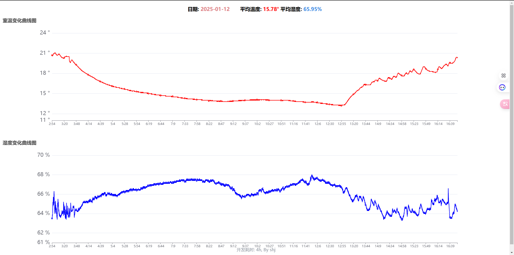

> 本项目实现了一个从esp32-dht22模块读取温湿度数据发送到flask, 通过echarts显示在页面的效果
<br>
> 仓库地址: <br>
https://github.com/BBBlllack/ESP32_DHT22_TH<br>https://github.com/BBBlllack/flask_dht22_th
<br>


### Flask后端部分
本项目后端使用flask + echarts, 其中flask的/recv路由用于接收esp发来的温湿度数据。

- `/index` 可视化页面
- `/recv?temp=&humid=` 分别为温度和湿度 
- 其中`cache`为列表, 由于本次flask需要部署在`pad`上, 考虑到性能有限，故未使用数据库, 使用了`class`序列为`json`存到文件中, 引入列表作为`cache`, 每3个或者更多一存
- 每天的数据存储格式为`yyyy-MM-dd.txt`

```python
@app.get("/recv")
def recv():
    data_file_name = getDataFileName()
    t = int(time.time())
    temp = float(request.args.get('temp', None))
    humid = float(request.args.get('humid', None))
    data = Data(t, temp, humid)
    cache.append(str(data.__dict__))
    if len(cache) >= 3:
        with open(data_file_name, "a") as f:
            f.write("\n".join(cache) + "\n")
        cache.clear()
    print(data.__dict__)
    if temp and humid:
        return "ok"
    return "err"
```

### ESP32, DHT22硬件部分

本项目使用了DHT22作为数据传感器, 使用的开发平台为`platfromio`, 使用的依赖为
```ini
[env:adafruit_metro_esp32s3]
platform = espressif32
board = adafruit_metro_esp32s3
framework = arduino
board_build.flash_mode = dio
monitor_speed = 115200
lib_deps = adafruit/DHT sensor library@^1.4.6
```

数据发送函数, 我的server本地地址为`192.168.1.150`, `flask`开在`5000`端口
```cpp
void sendReq(vector<float> data){
  String api = "http://192.168.1.150:5000/recv?temp=";
  api.concat(String(data[0]));
  api.concat("&humid=");
  api.concat(String(data[1]));
  http.begin(String(api));
  int http_code = http.GET();
  if (http_code == HTTP_CODE_OK)
  {
    api.concat(", ");
    api.concat(http.getString());
    Serial0.println(api);
  }
}
```
项目效果为



> 为了测效果我把取暖关闭了, 冻死我了昨晚呜呜呜
