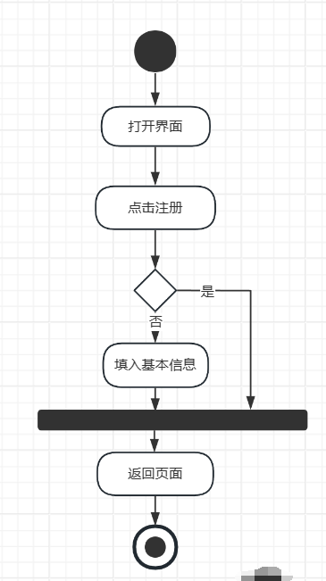
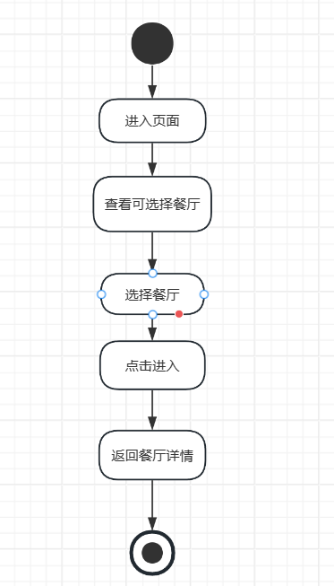
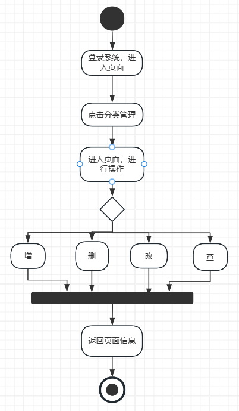
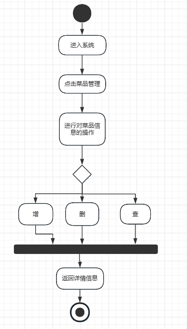
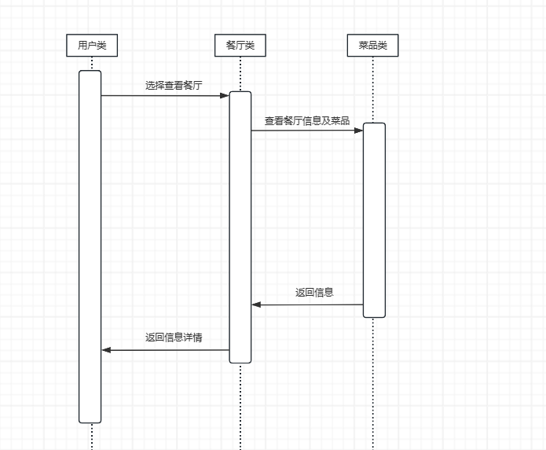
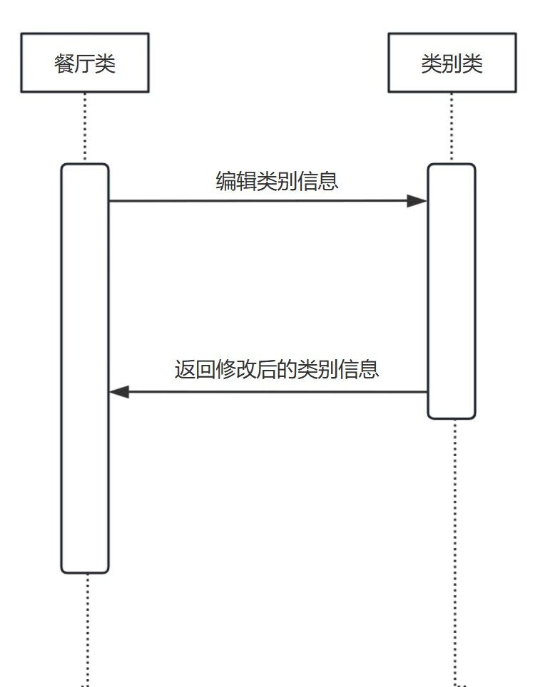
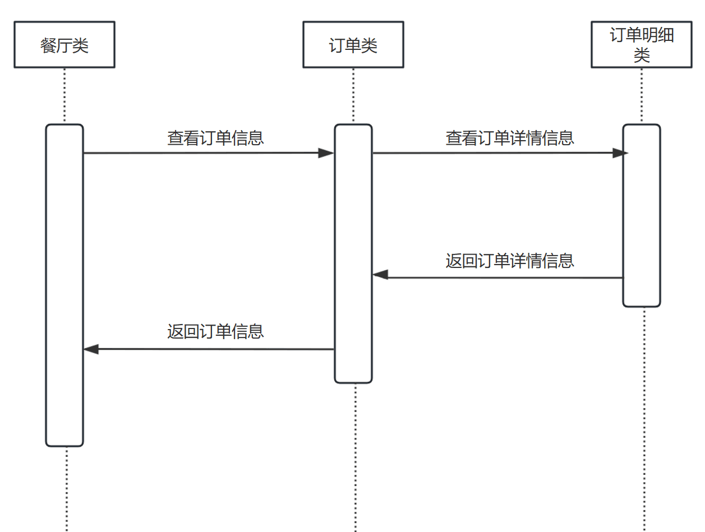
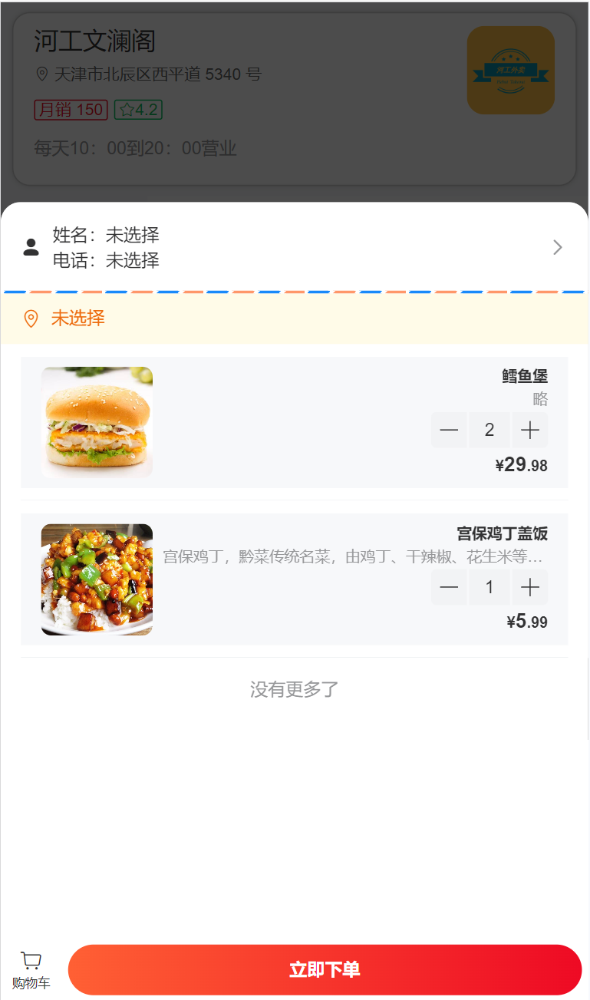
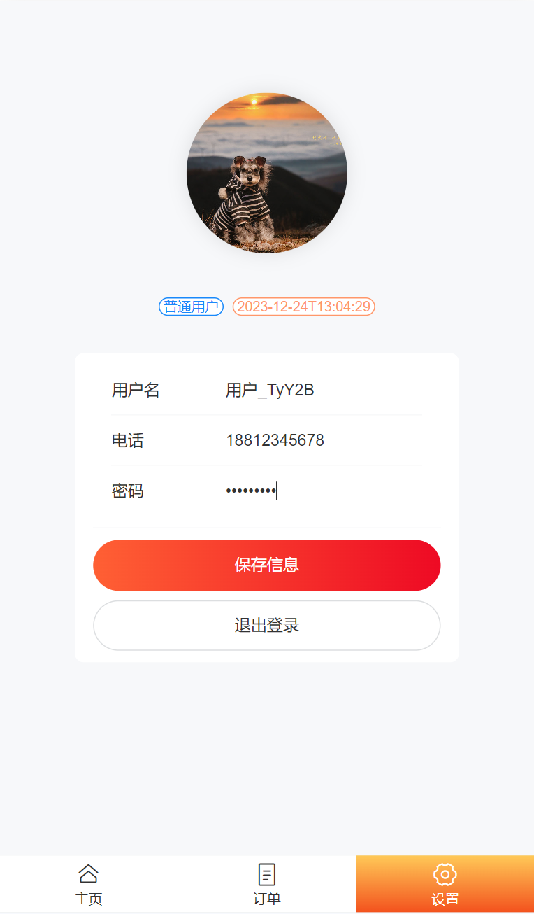
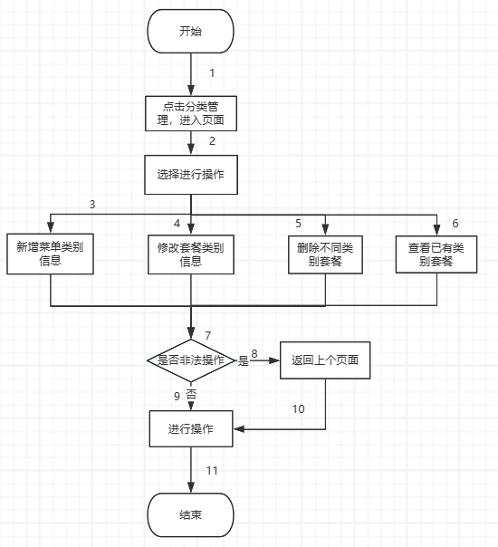

## 一、项目开发计划书

### 1.概述

#### 1.1项目的目的与目标

- **项目目的**
  1. **提升服务效率与便利性**：构建一个易于使用的在线订餐平台，使顾客能够快速方便地下单，同时帮助饭店餐厅提升订单处理效率。
  2. **促进餐饮业数字化**：通过在线平台，促进餐饮业的信息化和网络化，提高整体服务水平。
  3. **增强用户体验**：通过用户反馈和评价机制，使餐馆能够及时改进，增强顾客的用餐体验。
  4. **数据驱动的决策支持**：为饭店管理员(老板)提供数据分析工具，以便更好地管理饭馆和制定促销策略。
  5. **数据分析与管理**：利用数据分析工具，为饭店提供有效的经营决策支持。
- **项目目标**
  1. **用户友好的界面设计**：设计一个直观、易于操作的用户界面，确保用户能够轻松上手。
  2. **高效的订单处理机制**：确保订单从下单到配送的全过程高效顺畅。
  3. **实现饭店的认证和设置菜品：** 通过认证后，饭店可以登陆平台，自行设置菜品种类和菜品价格以及优惠力度。饭店可以根据菜品销量和用户评价进行调整，提供更符合市场需求的菜品选择。
  4. **实现顾客的注册、点餐和支付：** 顾客可以实名制注册登陆平台，完成菜品的网上点餐和支付，实现方便快捷的外卖订餐服务。
  5. **实现外卖配送：** 系统能匹配相应外卖快递人员送菜品到顾客家，保证及时的送达服务。
  6. **实现用户评价和统计功能：** 顾客可以对外卖人员的服务以及饭店的菜品质量进行评价打分，帮助饭店改进和提升服务质量。饭店管理员(老板)可以统计某个时期内平台的收入和销售额，统计某个时期内的销售额和最受欢迎的菜品，顾客可以查询和统计自己的外卖订单，提供数据支持和分析。
  7. **提高用户生活质量和餐饮行业的进步：** 通过方便的外卖订餐服务，提供更好的用餐体验和生活便利。同时通过用户评价和统计数据的反馈，帮助饭店改进提升，为餐饮行业的长足进步贡献力量。
- **基本架构设计**
  - **前端**：使用HTML5、Vue.js、ElementUI等技术，构建响应式网页，兼容多种设备。在移动端, 用户也需要登录后使用APP进行点餐
  - **后端**：采用Node.js、SpringBoot等后端技术，实现数据处理和业务逻辑。
  - **数据库**：使用MySQL数据库管理系统，存储用户数据、订单数据等。
  - **API接口**：构建RESTful API，实现前后端分离。
  - **构建工具**：Maven
  - **安全性**：实施HTTPS、数据加密和用户认证机制，保障用户数据安全。


#### 1.2 系统功能范围及过程规划

##### 1.2.1系统功能范围

- 管理员模块
  - **登陆管理**

- 商家模块

  - **登录管理**：内部餐厅员工必须登录后,才可以访问系统管理后台。

  - **分类管理**：主要对当前餐厅经营的 菜品分类 或 套餐分类 进行管理维护， 包含查询、新增、修改、删除等功能。

  - **菜品管理**：主要维护各个分类下的菜品信息，包含查询、新增、修改、删除、启售、停售等功能。

  - **订单明细**：主要维护用户在移动端下的订单信息，包含查询、取消、派送、完成，以及订单报表下载等功能。

  - **店铺信息设置**：上传或修改商铺基本信息。

- 顾客模块

  - **账户注册与登录**：在移动端, 用户也需要登录后使用APP进行点餐。

  - **查看餐厅**：查找餐厅，选择商铺进行选购。

  - **点餐下单**：查看菜品，选择配送地址，修改购物车后进行下单。

  - **查看订单**：查看订单记录。

  - **设置个人信息**：上传或修改个人基本信息。

##### 1.2.2过程规划

1. **需求分析阶段**：
   - 确定目标用户群（顾客、饭店、管理员）。
   - 分析用户需求和市场趋势。
   - 制定详细的功能列表和系统需求。

2. **设计阶段**：
   - 界面设计：构建用户友好的界面，包括布局、颜色和图标等。
   - 系统架构设计：确定技术栈、数据库以及所用数据结构、API设计等。
   - 安全性设计：制定数据保护和安全协议。

3. **开发阶段**：
   - 分模块开发：按照功能模块分配开发任务。
   - 迭代开发：采用敏捷开发模式，进行快速迭代。
   - 持续集成与测试：确保代码质量，进行功能和性能测试。

4. **部署与上线**：
   - 服务器部署：选择了阿里云服务提供商和服务器配置。
   - 上线测试：在模拟实际外卖环境中进行测试，包括负载测试和用户测试。
   - 正式上线：发布系统，开放用户注册和使用。

5. **运维与支持**：
   - 监控系统性能：实时监控服务器和应用性能。
   - 用户支持：提供用户帮助和技术支持。
   - 持续更新：根据用户反馈和市场变化，定期更新系统功能。

6. **市场推广**：
   - 制定市场推广计划，包括在线广告、社交媒体营销等。
   - 合作伙伴关系建立，如与当地餐厅和配送服务商建立合作。
   - 用户反馈收集，以不断优化推广策略和服务。

### 2 .可行性分析

#### 2.1 社会可行性

1. **市场需求**：随着生活节奏的加快，越来越多的人选择外卖作为日常饮食的重要方式。这一趋势表明，外卖订餐系统符合当下社会的需求。
2. **用户接受度**：数字化生活方式已深入人心，消费者普遍接受在线订餐的模式，尤其是年轻人群体。
3. **社会影响**：提高餐饮业的效率和服务水平，对提升整体生活质量有积极影响。同时，为饭店和个体经营者提供了新的商业机会。
4. **环境适应性**：考虑到环保趋势，外卖订餐系统需要鼓励使用环保包装，减少塑料等不可降解材料的使用。

#### 2.2 经济可行性

1. **初期投资**：需要资金支持系统的设计、开发和市场推广。这包括人力成本、技术采购、服务器费用等。
2. **运营成本**：主要包括服务器维护、客服支持、市场营销和平台升级等。
3. **收益预测**：通过平台抽成、广告、合作伙伴关系等多种渠道实现盈利。预计随着用户基数的增加，收益将持续增长。
4. **成本回收期**：根据市场响应和用户增长速度预估，初期投资的回收期可以在几年内实现。

#### 2.3 技术可行性

1. **技术成熟度**：目前市场上已有许多成熟的技术可供选择，包括前端和后端开发框架、数据库管理系统、支付网关等。
2. **开发能力**：开发团队已具备相关的技术知识和经验。
3. **可扩展性和维护性**：系统设计考虑了未来的扩展性，能够适应不断增长的用户量和业务需求。同时，系统的维护和更新应当简便高效。
4. **安全性**：考虑到了交易安全和个人信息保护，需要采用高标准的安全措施，如数据加密、安全支付等。

### 3.方案选择

​	为了实现外卖订餐系统，我们将比较两个主要方案：**自主开发方案**和**第三方服务集成方案**。每个方案都有其独特的优势和局限性，需要根据可行性分析进行综合考虑。

#### 3.1自主开发方案

- **系统架构与技术**
  - **前端**：React或Vue.js，以创建动态和响应式的用户界面。

  - **后端**：Node.js或Java Spring Boot，提供强大的后台服务。

  - **数据库**：MySQL，保障数据的稳定存储和高效检索。

  - **安全**：使用OAuth 2.0标准进行用户认证和授权。

  - **云服务**：阿里云，提供可靠的服务器和数据存储服务。

- **构建工具与开发平台**
  - **构建工具**：使用Maven进行项目管理，Git进行版本控制。

  - **开发平台**：IDEA2022.1

- **系统检验方案**
  - **功能测试**：采用单元测试和集成测试确保功能正确实现。

  - **性能测试**：使用LoadRunner等工具进行负载测试。

- **应对方案**
  - **技术变化**：持续关注技术趋势，定期进行技术栈评估和更新。

  - **安全风险**：实施定期的安全审计和漏洞扫描。

- **优势与局限**
  - **优势**：完全自主控制，灵活性和定制性强。

  - **局限**：开发成本和时间较高，技术风险自担。

#### 3.2第三方服务集成方案

- **系统架构与技术**

  - **前端**：使用现成的模板和框架快速搭建。

  - **后端**：集成第三方云服务，如Firebase或AWS Lambda。

  - **数据库**：使用云数据库服务，如AWS RDS。

  - **支付**：集成第三方支付服务，如Stripe或PayPal。


- **CASE工具与开发平台**

  - **CASE工具**：利用Trello进行项目协调，GitHub进行代码管理。

  - **开发平台**：依赖第三方云平台的开发环境。


- **系统检验方案**

  - **用户体验测试**：重点关注用户界面和交互的流畅度。

  - **安全合规性测试**：确保集成服务符合行业安全标准。


- **应对方案**

  - **服务依赖**：定期评估服务供应商的可靠性和性能。

  - **成本控制**：监控服务费用，避免预算超支。


- **优势与局限**

  - **优势**：快速部署，成本相对较低，减少技术维护工作。

  - **局限**：依赖第三方服务，灵活性和自主性受限。


#### 3.3综合比较

- **功能性**：自主开发方案在功能定制方面更为灵活，第三方服务集成方案在快速实现标准功能方面不灵活但有些优势。

- **技术挑战**：自主开发需要更强的技术团队和维护能力，而我们正好有。第三方服务集成降低了技术难度，我们可作为参考。

- **社会约束**：自主开发更容易适应特定市场的需求和法规要求，第三方服务可能在某些区域面临限制。

  **基于此，我们选择自主开发方案。**

### 4.项目进度计划

#### 4.1任务分解与依赖关系

- **需求分析与规划**：
  - 调研市场需求
  - 定义功能需求
  - 制定初步项目计划

- **系统设计**：
  - 界面设计
  - 系统架构设计
  - 数据库设计
  - 安全规划

- **系统开发**：
  - 前端开发
  - 后端开发
  - 数据库实现
  - 安全机制实现

- **测试与部署**：
  - 功能测试
  - 性能测试
  - 用户验收测试
  - 系统部署

- **维护与升级**：
  - 收集用户反馈
  - 系统维护
  - 功能更新

#### 4.2活动网络图

<center><b><font size ='3'>表1-1 任务表</font></b></center></font>

| 任务           | 起始时间   | 完成时间   | 持续时间 |
| -------------- | ---------- | ---------- | -------- |
| 需求分析与规划 | 2023.12.16 | 2023.12.18 | 3天      |
| 系统设计       | 2023.12.18 | 2023.12.20 | 3天      |
| 前端开发       | 2023.12.20 | 2023.12.23 | 4天      |
| 后端开发       | 2023.12.20 | 2023.12.23 | 4天      |
| 数据库实现     | 2023.12.22 | 2023.12.24 | 3天      |
| 安全机制实现   | 2023.12.20 | 2023.12.24 | 5天      |
| 功能测试       | 2023.12.24 | 2023.12.24 | 1天      |
| 性能测试       | 2023.12.24 | 2023.12.24 | 1天      |
| 用户验收测试   | 2023.12.24 | 2023.12.25 | 2 天     |
| 系统部署       | 2023.12.24 | 2023.12.25 | 2 天     |
| 维护与升级     | 2023.12.25 | 持续       | 持续     |


<center><b><font size ='3'>图1-1. 网络活动图</font></b></center></font>

**关键路径**：需求分析 → 系统设计 → 系统开发 → 测试与部署

这条路径上的任务是项目成功的关键，任何延误都将直接影响项目整体进度。

#### 4.3甘特图


<center><b><font size ='3'>图1-2. 甘特图</font></b></center></font>

### 5.人员组织计划

<center><b><font size ='3'>表1-2. 任务分配表</font></b></center></font>

| 任务模块       | 负责人   | 审查人   | 任务描述                     |
| -------------- | -------- | -------- | ---------------------------- |
| 需求分析与规划 |    |    | 负责调研、功能定义、初步计划 |
| 系统设计       |    |    | 界面、架构、数据库和安全规划 |
| 前端开发       |    |    | 开发用户界面和前端逻辑       |
| 后端开发       |    |    | 实现服务器端逻辑和API        |
| 数据库实现     |    |    | 设计和实现数据库结构         |
| 安全机制实现   |    |    | 开发和实施安全措施           |
| 功能测试       |    |    | 执行功能和单元测试           |
| 性能测试       |    |    | 进行性能和负载测试           |
| 用户验收测试   |    |    | 管理用户测试，收集反馈       |
| 系统部署       |    |    | 部署系统至生产环境           |
| 维护与升级     | 整个团队 | 整个团队 | 持续的系统维护和更新         |

<div style="page-break-after:always"></div>

## 二、需求规格说明书

### 1.系统功能需求

#### 1.1 用户需求描述

##### 1.1.1功能需求

- 管理员模块
  - **登陆管理**
  
- 商家模块

  - **登录管理**：内部餐厅员工必须登录后,才可以访问系统管理后台。

  - **分类管理**：主要对当前餐厅经营的 菜品分类 或 套餐分类 进行管理维护， 包含查询、新增、修改、删除等功能。

  - **菜品管理**：主要维护各个分类下的菜品信息，包含查询、新增、修改、删除、启售、停售等功能。

  - **订单明细**：主要维护用户在移动端下的订单信息，包含查询、取消、派送、完成，以及订单报表下载等功能。

  - **店铺信息设置**：上传或修改商铺基本信息。

- 顾客模块

  - **账户注册与登录**：在移动端, 用户也需要登录后使用APP进行点餐。

  - **查看餐厅**：查找餐厅，选择商铺进行选购。

  - **点餐下单**：查看菜品，选择配送地址，修改购物车后进行下单。

  - **查看订单**：查看订单记录。

  - **设置个人信息**：上传或修改个人基本信息。

##### 1.1.2约束条件

- **性能约束**：
  - 系统能承受高峰时段的访问压力，保证快速响应。
  - 订单处理和支付系统需实时响应，减少用户等待时间。

- **安全性与隐私**：
  - 用户数据（包括个人信息和支付信息）加密存储。
  - 系统符合数据保护法规。

- **可用性**：
  - 系统具有高可用性，减少停机时间。
  - 用户界面友好，易于导航和操作。

- **可扩展性**：
  - 系统设计考虑未来扩展，包括用户量增加和功能更新。

- **法律合规性**：
  - 系统符合所有相关法律法规，包括食品安全标准和在线支付规定。

- **维护与支持**：
  - 系统便于维护和升级。
  - 提供用户帮助和技术支持服务。 

#### 1.2 初始功能提取

<center><b><font size ='3'>表2-1. 功能需求点列表</font></b></center></font>

| 编号 | 功能名称       | 使用人 | 功能描述                                                     | 输入内容                   | 输出内容               |
| ---- | -------------- | ------ | ------------------------------------------------------------ | -------------------------- | ---------------------- |
| 1    | 账户注册与登录 | 顾客   | 允许顾客创建账户并登录                                       | 用户信息（姓名、密码）     | 注册成功确认、账户详情 |
| 2    | 查看餐厅       | 顾客   | 允许顾客登录到系统并查看餐厅                                 | 点击最左角图标             | 页面进入商家餐厅       |
| 3    | 点餐下单       | 顾客   | 进入餐厅，查看菜单，进行点餐下单                             | 餐厅选择，选择菜品         | 页面返回下单详情       |
| 4    | 查看订单       | 顾客   | 顾客能查看历史订单                                           | 点击下方中间图标           | 页面返回订单详情       |
| 5    | 设置个人信息   | 顾客   | 顾客可以设置保存个人信息                                     | 点击完善个人信息           | 页面返回信息详情       |
| 6    | 登录管理       | 商家   | 允许商家及其员工登录系统                                     | 用户信息（姓名、密码）     | 登录成功确认           |
| 7    | 分类管理       | 商家   | 主要对当前餐厅经营的 菜品分类 或 套餐分类 进行管理维护， 包含查询、新增、修改、删除等功能。 | 菜品分类信息和套餐分类信息 | 提交确认、信息详情     |
| 8    | 菜品管理       | 商家   | 主要维护各个分类下的菜品信息，包含查询、新增、修改、删除、启售、停售等功能。 | 菜品信息                   | 提交确认、信息详情     |
| 9    | 订单明细       | 商家   | 主要维护用户在移动端下的订单信息，包含查询、取消、派送、完成，以及订单报表下载等功能。 | 订单信息                   | 提交确认、信息详情     |
| 10   | 店铺信息设置   | 商家   | 上传或修改商铺基本信息。                                     | 上传商铺基本信息。         | 更新确认               |
| 11   | 登录管理       | 管理员 | 管理员登录系统                                               | 账号密码                   | 处理状态、信息详情     |

#### 1.3 系统需求描述 

##### 1.3.1用例模型


<center><b><font size ='3'>图2-1. 用例图</font></b></center></font>

- **用户注册**

  
  
  <center><b><font size ='3'>图2-2. 用户注册活动图</font></b></center></font>
  
  
  
  <center><b><font size ='3'>表2-2. 用户注册用例表</font></b></center></font>

| 项目     | 描述                                                         |
| -------- | ------------------------------------------------------------ |
| 用例名称 | 用户注册                                                     |
| 描述     | 用户打开页面，点击注册                                       |
| 参与者   | 用户                                                         |
| 优先级   | 基本的                                                       |
| 前置条件 | 用户未注册                                                   |
| 触发条件 | 点击注册                                                     |
| 主要流程 | 1. 用户选择注册。<br>2. 用户填写必要信息。<br>3. 系统验证信息。<br>4. 系统创建用户账户。<br>5. 系统显示注册成功消息。 |
| 后置条件 | 用户注册成功，可进行登录。                                   |
| 异常流程 | 用户名已存在或信息无效时，系统显示错误消息。                 |

- **用户登录**

  
  
  <center><b><font size ='3'>图2-3. 用户登录活动图</font></b></center></font>
  
  
  
  <center><b><font size ='3'>表2-3. 用户登录用例表</font></b></center></font>

| 项目     | 描述                                                         |
| -------- | ------------------------------------------------------------ |
| 用例名称 | 用户登录                                                     |
| 描述     | 用户打开页面，输入账号密码，点击登录                         |
| 参与者   | 用户                                                         |
| 优先级   | 基本的                                                       |
| 前置条件 | 用户已注册                                                   |
| 触发条件 | 点击登录                                                     |
| 主要流程 | 1. 用户输入用户名和密码。<br>2. 系统验证凭证。<br>3. 登录成功，系统显示用户主页。 |
| 后置条件 | 用户登录系统，可访问个人账户和功能。                         |
| 异常流程 | 凭证不正确时，系统显示错误消息。                             |

- **点餐下单**

  
  
  <center><b><font size ='3'>图2-4. 点餐下单活动图</font></b></center></font>
  
  
  
  <center><b><font size ='3'>表2-4. 点餐下单用例表</font></b></center></font>

| 项目     | 描述                                                         |
| -------- | ------------------------------------------------------------ |
| 用例名称 | 点餐下单                                                     |
| 描述     | 顾客查看菜单，选择菜品，点击下单                             |
| 参与者   | 用户                                                         |
| 优先级   | 基本的                                                       |
| 前置条件 | 用户登录浏览菜单并选择菜品                                   |
| 触发条件 | 点击下单                                                     |
| 主要流程 | 1. 用户浏览菜单选择菜品并添加至购物车。<br>2. 用户确认订单信息并提交订单。<br>3. 系统记录订单并生成订单号。<br>4. 系统通知用户订单成功。 |
| 后置条件 | 用户成功创建订单，等待进一步处理。                           |

- **查看订单**

  
  
  <center><b><font size ='3'>图2-5. 查看订单活动图</font></b></center></font>
  
  
  
  <center><b><font size ='3'>表2-5. 查看订单用例表</font></b></center></font>

| 项目     | 描述                                                         |
| -------- | ------------------------------------------------------------ |
| 用例名称 | 查看订单                                                     |
| 描述     | 顾客点击查看历史订单                                         |
| 参与者   | 用户                                                         |
| 优先级   | 基本的                                                       |
| 前置条件 | 用户下单成功                                                 |
| 触发条件 | 点击查看订单                                                 |
| 主要流程 | 1. 用户选择历史订单。<br>2. 系统处理并验证。<br>3. 系统显示结果。 |
| 后置条件 | 订单查看完成。                                               |

- **查看餐厅**

  
  
  <center><b><font size ='3'>图2-6. 查看餐厅活动图</font></b></center></font>
  
  
  
  <center><b><font size ='3'>表2-6. 查看餐厅用例表</font></b></center></font>

| 项目     | 描述                                                         |
| -------- | ------------------------------------------------------------ |
| 用例名称 | 查看餐厅                                                     |
| 描述     | 顾客点击查看餐厅商铺                                         |
| 参与者   | 用户                                                         |
| 优先级   | 基本的                                                       |
| 前置条件 | 用户登录程序                                                 |
| 触发条件 | 点击查看                                                     |
| 主要流程 | 1. 用户点击进入显示餐厅页面。<br>2. 系统返回当前状态。<br>3. 用户可实时查看餐厅当前信息。 |
| 后置条件 | 用户进入餐厅或离开页面。                                     |

- **设置个人信息**

  
  
  <center><b><font size ='3'>图2-7. 设置个人信息活动图</font></b></center></font>
  
  
  
  <center><b><font size ='3'>表2-7. 设置个人信息用例表</font></b></center></font>

| 项目     | 描述                                                         |
| -------- | ------------------------------------------------------------ |
| 用例名称 | 设置个人信息                                                 |
| 描述     | 顾客设置完善保存个人信息                                     |
| 参与者   | 用户                                                         |
| 优先级   | 基本的                                                       |
| 前置条件 | 用户已登录                                                   |
| 触发条件 | 点击修改信息                                                 |
| 主要流程 | 1. 用户选择最右下方图标。<br>2. 用户提交个人信息。<br>3. 系统记录信息并展示。 |
| 后置条件 | 用户已完善个人信息。                                         |

- **分类管理**

  
  
  <center><b><font size ='3'>图2-8. 分类管理活动图</font></b></center></font>
  
  
  
  <center><b><font size ='3'>表2-8. 分类管理用例表</font></b></center></font>

| 项目     | 描述                                                         |
| -------- | ------------------------------------------------------------ |
| 用例名称 | 分类管理                                                     |
| 描述     | 商家登录系统，进行菜品分类管理                               |
| 参与者   | 饭店商家                                                     |
| 优先级   | 基本的                                                       |
| 前置条件 | 商家已登录系统                                               |
| 触发条件 | 商家登录，点击分类管理                                       |
| 主要流程 | 1. 饭店商家登录系统。<br>2. 点击分类管理。<br>3. 将需要改动的信息进行增删改查。 <br>4.系统返回信息。 |
| 后置条件 | 商家维护信息成功。                                           |

- **登录管理**

  
  
  <center><b><font size ='3'>图2-9. 登录管理活动图</font></b></center></font>
  
  
  
  <center><b><font size ='3'>表2-9. 登录管理用例表</font></b></center></font>

| 项目     | 描述                                                         |
| -------- | ------------------------------------------------------------ |
| 用例名称 | 登录管理                                                     |
| 描述     | 商家登录                                                     |
| 参与者   | 饭店商家                                                     |
| 优先级   | 基本的                                                       |
| 前置条件 | 饭店已注册                                                   |
| 触发条件 | 商家点击登录                                                 |
| 主要流程 | 1. 饭店输入登录凭证。<br>2. 系统验证凭证。<br>3. 登录成功，显示饭店管理界面。 |
| 后置条件 | 饭店可管理饭店信息和订单。                                   |

- **菜品管理**

  
  
  <center><b><font size ='3'>图2-10. 菜品管理活动图</font></b></center></font>
  
  
  
  <center><b><font size ='3'>表2-10. 菜品管理用例表</font></b></center></font>

| 项目     | 描述                                                         |
| -------- | ------------------------------------------------------------ |
| 用例名称 | 菜品管理                                                     |
| 描述     | 商家点击菜品管理，进行完善信息                               |
| 参与者   | 饭店商家                                                     |
| 优先级   | 基本的                                                       |
| 前置条件 | 饭店登录成功                                                 |
| 触发条件 | 点击菜品管理                                                 |
| 主要流程 | 1. 饭店添加或编辑菜单项。<br>2. 系统更新菜单信息。<br>3. 菜单变更对用户可见。 |
| 后置条件 | 更新后的菜单展示给用户。                                     |

- **订单明细**

  
  
  <center><b><font size ='3'>图2-11. 订单明细活动图</font></b></center></font>
  
  
  
  <center><b><font size ='3'>表2-11. 订单明细用例表</font></b></center></font>

| 项目     | 描述                                                         |
| -------- | ------------------------------------------------------------ |
| 用例名称 | 订单明细                                                     |
| 描述     | 商家可以查看订单明细                                         |
| 参与者   | 饭店商家                                                     |
| 优先级   | 基本的                                                       |
| 前置条件 | 饭店已接收到用户订单                                         |
| 触发条件 | 点击查看                                                     |
| 主要流程 | 1. 饭店接收来自用户的订单。<br>2. 确认订单并处理。<br>3. 订单状态更新为“正在处理”或“配送中”。 |
| 后置条件 | 订单被处理，进入配送阶段。                                   |

- **店铺信息设置**

  
  
  <center><b><font size ='3'>图2-12. 店铺信息设置活动图</font></b></center></font>
  
  
  
  <center><b><font size ='3'>表2-12. 店铺信息设置用例表</font></b></center></font>

| 项目     | 描述                                                         |
| -------- | ------------------------------------------------------------ |
| 用例名称 | 店铺信息设置                                                 |
| 描述     | 商家可以增加并完善商铺信息                                   |
| 参与者   | 饭店商家                                                     |
| 优先级   | 基本的                                                       |
| 前置条件 | 饭店已登录系统                                               |
| 触发条件 | 点击修改信息                                                 |
| 主要流程 | 1. 饭店访问店铺信息页面。<br>2. 系统展示已有信息。<br>3. 饭店商家根据已有信息进行信息更新。 |
| 后置条件 | 饭店得到更新信息成功。                                       |

##### 1.3.2分析类模型

- **CRC卡**

  - **用户类 (User)**

    | **职责 (Responsibilities)** | **协作 (Collaborations)** |
    | --------------------------- | ------------------------- |
    | 注册用户账号                | 地址类、订单类、购物车类  |
    | 用户登录                    | 地址类、订单类、购物车类  |
    | 更新个人信息                | 地址类                    |
    | 查看购物车                  | 购物车类                  |

  - **地址类 (Address)**

    | **职责 (Responsibilities)** | **协作 (Collaborations)** |
    | --------------------------- | ------------------------- |
    | 添加地址                    | 用户类                    |
    | 更新地址                    | 用户类                    |

  - **订单类 (Orders)**

    | **职责 (Responsibilities)** | **协作 (Collaborations)**  |
    | --------------------------- | -------------------------- |
    | 创建订单                    | 用户类、餐厅类、订单详情类 |
    | 更新订单状态                | 用户类                     |
    | 查看订单详情                | 订单详情类                 |

  - **餐厅类 (Restaurant)**

    | **职责 (Responsibilities)** | **协作 (Collaborations)** |
    | --------------------------- | ------------------------- |
    | 更新餐厅信息                | 类别类、菜品类            |
    | 管理菜品                    | 类别类、菜品类            |

  - **类别类 (Category)**

    | **职责 (Responsibilities)** | **协作 (Collaborations)** |
    | --------------------------- | ------------------------- |
    | 添加类别                    | 餐厅类、菜品类            |
    | 更新类别                    | 餐厅类、菜品类            |

  - **菜品类 (Dish)**

    | **职责 (Responsibilities)** | **协作 (Collaborations)**  |
    | --------------------------- | -------------------------- |
    | 添加菜品                    | 类别类、餐厅类、订单详情类 |
    | 更新菜品                    | 类别类、餐厅类、订单详情类 |

  - **订单详情类 (Orderdetail)**

    | **职责 (Responsibilities)** | **协作 (Collaborations)** |
    | --------------------------- | ------------------------- |
    | 添加订单详情                | 订单类、菜品类            |
    | 更新订单详情                | 订单类、菜品类            |

- ​	**域模型**


<center><b><font size ='3'>图2-13. 类图</font></b></center></font>

- **用户类**

  ##### 属性

  - 用户名 : 字符串类型，存储用户的姓名。
  - 电话 : 字符串类型，存储用户的联系方式，如电子邮件或电话号码。
  - 密码 : 字符串类型，存储用户登录的密码。
  - 头像 : 字符串类型，存储用户头像的链接或路径。
  - 注册时间 : 时间戳类型，存储用户注册的时间。

  ##### 方法

  - 注册 : 接收用户信息（如姓名、联系方式、地址和登录凭证），在系统中创建新用户。
  - 登录 : 接收用户名和密码，验证用户身份。
  - 浏览菜单 : 允许用户查看餐厅的菜单和菜品。
  - 创建订单 : 允许用户创建新的订单。
  - 查看订单 : 允许用户查看自己的订单历史记录。
  - 更新个人信息 : 允许用户更新自己的个人信息，如联系方式或地址。

  **订单类**

  ##### 属性

  - 订单号 : 整型或字符串类型，唯一标识一个订单。
  - 顾客id : 结构/对象类型，存储下订单的用户信息。
  - 地址id : 整型或字符串类型，存储订单的收货地址。
  - 总价 : 浮点型，存储订单的总价。
  - 创建时间 : 时间戳类型，存储订单的创建时间。
  - 评论 : 字符串类型，存储用户对订单的评论或反馈。
  - 饭店id : 结构/对象类型，存储订单所属的饭店信息。
  - 订单状态 : 字符串类型，表示订单的当前状态（如“待处理”、“配送中”、“已完成”）。

  ##### 方法

  - 创建订单 : 创建新订单，记录顾客信息、饭店信息和菜品列表。
  - 更新状态 : 更新订单的当前状态。

  **餐厅类**

  ##### 属性

  - 名称 : 字符串类型，饭店的名称。
  - 地址 : 字符串类型，饭店的地址。
  - 电话 : 字符串类型，饭店的联系电话或电子邮箱。
  - 公告 : 字符串类型，存储饭店的公告或促销信息。
  - 封面图片 : 字符串类型，存储饭店封面图片的链接或路径。
  - 销量 : 整型，存储饭店的总销量。
  - 评分 : 浮点型，存储饭店的平均评分。
  - 注册时间 : 时间戳类型，存储饭店注册的时间。
  - 状态 : 字符串类型，表示饭店的当前状态（如“营业中”、“休息中”、“已关闭”）。

  ##### 方法

  - 注册 : 接收饭店的基本信息并在系统中注册。
  - 登录 : 饭店使用注册信息登录系统。
  - 更新信息 : 更新或添加菜单中的菜品。
  - 管理菜品 : 接收并处理来自顾客的订单。

  **菜品类**

  ##### 属性

  - 名称 : 字符串类型，菜品的名称。
  - 类别id : 整型或字符串类型，存储菜品所属的类别。
  - 封面图片 : 字符串类型，存储菜品图片的链接或路径。
  - 描述 : 字符串类型，菜品的描述。
  - 价格 : 浮点型，菜品的价格。
  - 状态 : 字符串类型，表示菜品的当前状态（如“正常销售”、“下架”）。

  ##### 方法

  - 添加菜品 : 将新菜品添加到菜单中。
  - 更新菜品信息 : 更新现有菜品的信息，如描述、价格或图片。
  - 删除菜品 : 从菜单中删除菜品。

  **地址类**

  ##### 属性

  - 用户id : 整型或字符串类型，存储地址所属的用户。
  - 姓名 : 字符串类型，存储收货人的姓名。
  - 电话 : 字符串类型，存储收货人的联系电话。
  - 详细地址 : 字符串类型，存储收货人的详细地址。
  - 状态 : 字符串类型，表示地址的当前状态（如“默认地址”、“备用地址”）。

  ##### 方法

  - 添加地址 : 将新地址添加到用户的地址列表中。
  - 更新地址 : 更新现有地址的信息，如收货人姓名、电话或详细地址。
  - 删除地址 : 从用户的地址列表中删除地址。

  **类别类**

  ##### 属性

  - 名称 : 字符串类型，类别的名称。
  - 餐厅id : 整型或字符串类型，存储类别所属的餐厅。
  - 状态 : 字符串类型，表示类别的当前状态（如“正常”、“隐藏”）。

  ##### 方法

  - 添加类别 : 将新类别添加到菜单中。
  - 更新类别信息 : 更新现有类别的信息，如名称或状态。
  - 删除类别 : 从菜单中删除类别。

  **订单详情类**

  ##### 属性

  - 订单id : 整型或字符串类型，存储订单详情所属的订单。
  - 菜品id : 整型或字符串类型，存储订单详情中的菜品。
  - 价格 : 浮点型，存储菜品的单价。
  - 数量 : 整型，存储菜品的数量。
  - 评分 : 浮点型，存储用户对菜品的评分。

  ##### 方法

  - 添加订单详情 : 将新的订单详情添加到订单中。
  - 更新订单详情 : 更新现有订单详情的信息，如菜品数量或评分。
  - 删除订单详情 : 从订单中删除订单详情。

### 2.系统性能需求

<center><b><font size ='3'>表2-13. 性能需求点列表</font></b></center></font>

| 编号 | 性能名称       | 使用部门 | 使用岗位 | 性能描述                       | 目标          | 检验指标                       |
| ---- | -------------- | -------- | -------- | ------------------------------ | ------------- | ------------------------------ |
| 1    | 响应时间       | 全部     | 全部用户 | 系统对用户操作的响应时间       | ≤ 2秒         | 用户操作后至界面响应的时间     |
| 2    | 更新处理时间   | 全部     | 全部用户 | 后台数据更新的处理时间         | ≤ 5秒         | 后台数据更新操作至完成的时间   |
| 3    | 数据传输时间   | 全部     | 全部用户 | 远程数据传输的时间             | ≤ 3秒         | 服务器接收到数据至响应的时间   |
| 4    | 支持的终端数   | 全部     | 全部用户 | 系统能够支持的同时在线终端数量 | ≥ 10000台     | 同时在线的用户终端数量         |
| 5    | 并行操作用户数 | 全部     | 全部用户 | 系统支持的同时并行操作的用户数 | ≥ 1000用户    | 同时处理的并行用户操作数量     |
| 6    | 处理的记录数   | 全部     | 全部用户 | 系统能处理的最大订单记录数     | ≥ 100万条     | 系统存储和处理的订单记录数量   |
| 7    | 数据精度       | 全部     | 全部用户 | 输入和输出数据的精度要求       | 100%准确      | 数据处理和传输过程中的精度误差 |
| 8    | 系统安全性     | 全部     | 全部用户 | 系统的数据安全性和防护措施     | 高安全标准    | 安全测试结果                   |
| 9    | 系统稳定性     | 全部     | 全部用户 | 系统运行的稳定性和故障率       | 99.9%正常运行 | 系统故障率和正常运行时间       |

### 3.系统界面与接口需求

#### 3.1 界面需求

- **界面原则要求**

1. **方便性**：界面设计简单直观，易于新用户理解和操作。
2. **简洁性**：避免了复杂或不必要的元素，确保用户能快速找到所需功能。
3. **美观性**：采用了现代化的设计风格，提供视觉上的舒适感。
4. **一致性**：整个系统的界面风格保持了一致，确保用户体验的连贯性。

- **系统界面风格定义**

1. **风格统一**：采用了扁平化设计，使用统一的颜色方案和字体样式。
2. **图标清晰**：所有图标简洁、明确，易于理解其功能。
3. **布局合理**：界面元素布局合理，确保了信息的层次清晰。

- **功能模块的特殊界面要求**

1. **订单管理界面**：
   - 显示方式：列表形式展示了订单，包含了订单详情的弹出窗口。
   - 特殊要求：提供了搜索和筛选功能，方便用户快速找到特定订单。

2. **用户账户界面**：
   - 显示方式：清晰展示了用户信息，包括了订单历史和个人资料。
   - 特殊要求：确保了个人信息的安全性，提供易于理解的编辑选项。

3. **支付界面**：
   - 显示方式：简化支付流程，明确显示支付信息和状态。
   - 特殊要求：集成多种支付方式，确保支付过程的安全性和稳定性。

- **硬件支持**

1. **输入设备**：
   - 支持键盘和鼠标操作。
   - 移动端优化了触摸屏操作体验。
   - 可以集成扫描仪或条码扫描器以便于饭店管理。

2. **输出设备**：
   - 显示器：界面在多种分辨率下保持清晰。
   - 打印机：支持标准的订单打印格式。

- **显示风格和显示方式**

1. **显示风格**：
   - 主要采用图形界面。

2. **显示方式**：
   - 适配常见的显示分辨率，确保在不同设备上的可视性和可用性。

- **输出格式**

1. **显示布局**：
   - 主页和菜单页面便于导航，信息分类清晰。
   - 订单和支付页面的布局突出重点信息，如价格、订单状态。

2. **打印格式**：
   - 订单打印包括所有关键信息，布局清晰，易于阅读。

#### 3.2 接口需求

<center><b><font size ='3'>表2-14. 外部接口需求点列表</font></b></center></font>

| 编号 | 接口名称           | 接口规范 | 接口标准    | 入口参数                               | 出口参数                           | 传输频率 |
| ---- | ------------------ | -------- | ----------- | -------------------------------------- | ---------------------------------- | -------- |
| 1    | 账户注册与登录     | POST     | RESTful API | `User` 对象（姓名、密码）              | `ApiResponse<Object>`              | 按需请求 |
| 2    | 查看餐厅           | GET      | RESTful API | 餐厅ID `rid`                           | `ApiResponse<List<Category>>`      | 按需请求 |
| 3    | 点餐下单           | POST     | RESTful API | 餐厅选择，菜品选择                     | `ApiResponse<Object>`              | 按需请求 |
| 4    | 查看订单           | GET      | RESTful API | 用户ID `uid`                           | `ApiResponse<IPage>`               | 按需请求 |
| 5    | 设置个人信息       | POST     | RESTful API | `User` 对象                            | `ApiResponse<Boolean>`             | 按需请求 |
| 6    | 登录管理（商家）   | POST     | RESTful API | `Restaurant` 对象（姓名、密码）        | `ApiResponse<Map<String, String>>` | 按需请求 |
| 7    | 分类管理           | POST/GET | RESTful API | 菜品分类信息                           | `ApiResponse<Boolean>`             | 按需请求 |
| 8    | 菜品管理           | POST/GET | RESTful API | 菜品信息                               | `ApiResponse<Boolean>`             | 按需请求 |
| 9    | 订单明细           | GET      | RESTful API | 订单ID `oid`                           | `ApiResponse<List<OrderDetail>>`   | 按需请求 |
| 10   | 店铺信息设置       | POST     | RESTful API | `Restaurant` 对象                      | `ApiResponse<Boolean>`             | 按需请求 |
| 11   | 登录管理（管理员） | POST     | RESTful API | 管理员账号密码                         | `ApiResponse<Object>`              | 按需请求 |
| 12   | 购物车内容获取     | GET      | RESTful API | 餐厅ID `rid`                           | `ApiResponse<List<Map>>`           | 按需请求 |
| 13   | 更新购物车         | POST     | RESTful API | `List<ShopCar>` 对象列表               | `ApiResponse<Boolean>`             | 按需请求 |
| 14   | 商户登录           | POST     | RESTful API | `Restaurant` 对象（手机号、密码）      | `ApiResponse<Map<String, String>>` | 按需请求 |
| 15   | 更新商户信息       | POST     | RESTful API | `Restaurant` 对象                      | `ApiResponse<Boolean>`             | 按需请求 |
| 16   | 商户分页查询       | GET      | RESTful API | 页码 `page`，数量 `size`，关键字 `key` | `ApiResponse<Object>`              | 按需请求 |

### 4.目标系统假设与约束条件

-  **法律、法规和政策方面的限制**

  - **数据保护法规**：系统符合当地数据保护法规，特别是在处理个人和支付信息时。

  - **食品安全和卫生法规**：系统内的饭店必须遵守当地食品安全和卫生标准。

  - **电子商务法律**：系统运营必须符合电子商务相关的法律法规，包括但不限于在线支付、消费者权益保护等。


-  **硬件、软件、运行环境和开发环境方面的条件和限制**

  - **硬件限制**：系统设计适应多种硬件设备，包括不同性能级别的服务器、多种类型和尺寸的显示设备。

  - **软件限制**：系统兼容主流操作系统和浏览器，如Windows、macOS、Linux，以及Chrome、Firefox、Safari等。

  - **开发环境限制**：团队需要适应敏捷开发环境和持续集成/持续部署（CI/CD）流程。

  - **运行环境限制**：系统能在云环境中稳定运行，需考虑到云服务提供商的可用性和性能限制。


- **可利用的信息和资源**

  - **市场调研**：系统设计基于详细的市场调研，包括目标用户群的需求和行为模式。

  - **技术资源**：可利用的技术资源包括开源框架、API、开发工具和云平台服务。

  - **财务资源**：项目预算应覆盖开发、测试、部署、运营和市场推广的成本。


- **系统投入使用的最晚日期**

  - **上线时间**：系统最晚于2023.1.5前完成，以便于最后答辩，教师检查。

  - **阶段性目标**：项目的每个阶段（如，需求分析、设计、开发、测试、部署）已有明确的时间节点，确保了整体项目按时完成。

<div style="page-break-after:always"></div>

## 三、设计规格说明书

### **1.引言**

#### 1.1 命名规则

##### 1.1.1变量对象命名规则

1. **全局变量**：
   - 使用全大写字母和下划线分隔，例如：`GLOBAL_CONFIG`。
   - 名称反映其功能或用途，例如：`MAX_RETRY_COUNT`。
   - 在声明处附有详细注释说明其用途。

2. **局部变量**：
   - 使用小写字母，多个单词之间使用驼峰式命名，例如：`localCounter`。
   - 名称具体且有描述性，如：`currentPageIndex`。
   - 对于循环迭代变量，使用简单字符，如`i`、`j`。

3. **对象**：
   - 类名使用大写字母开头的驼峰式命名，例如：`OrderDetail`。
   - 方法名使用小写字母开头的驼峰式命名，例如：`calculateTotalPrice`。
   - 对于私有属性和方法，使用下划线作为前缀，例如：`_internalMethod`。

##### 1.1.2数据库对象命名规则

1. **数据库表名**：
   - 使用全小写字母，多个单词之间使用下划线分隔，例如：`user_account`。
   - 名称直观反映表的内容，例如：`order_history`。

2. **字段名**：
   - 同样使用全小写字母和下划线分隔，例如：`creation_date`。
   - 精确描述字段含义，避免使用缩写，除非非常通用。

3. **索引名**：
   - 命名格式为：表名_字段名_idx，例如：`user_account_email_idx`。
   - 清晰表明索引的用途。

4. **视图名**：
   - 使用全小写字母，多个单词使用下划线分隔，例如：`view_user_details`。
   - 名称清楚地描述视图的内容和用途。

#### 1.2 术语定义

<center><b><font size ='3'>表3-1. 术语定义表</font></b></center></font>

| 术语       | 定义                                                         |
| ---------- | ------------------------------------------------------------ |
| API        | Application Programming Interface，应用程序编程接口，允许软件间相互交互。 |
| UI         | User Interface，用户界面，是用户与系统交互的界面。           |
| UX         | User Experience，用户体验，指用户在使用产品过程中的感受和体验。 |
| 数据库     | 用于存储、管理和检索数据的系统。                             |
| CRUD       | Create, Read, Update, Delete，创建、读取、更新、删除，是数据库操作的基本功能。 |
| 前端       | 指用户界面和用户直接交互的部分。                             |
| 后端       | 指服务器、数据库和应用程序逻辑等不直接面向用户的部分。       |
| MVC        | Model-View-Controller，模型-视图-控制器，是一种软件架构模式。 |
| HTTPS      | HyperText Transfer Protocol Secure，加密的超文本传输协议。   |
| SSL/TLS    | Secure Sockets Layer / Transport Layer Security，用于提升网络安全的加密协议。 |
| 响应式设计 | 指能够自适应不同屏幕大小和设备的网页设计。                   |
| 云服务     | 通过互联网提供的各种服务和资源，如服务器、数据库、应用程序等。 |
| OAuth      | 开放授权标准，允许用户授权第三方应用访问其在另一服务上的信息。 |
| REST API   | Representational State Transfer API，表现层状态转化应用程序接口，一种用于网络应用的编程接口风格。 |

#### 1.3 相关文档

1. **项目需求文档**：
   - 描述项目的功能需求、性能需求、界面需求、接口需求等。
   - 任何功能的增加、删除或修改都需要在此文档中反映。

2. **设计文档**：
   - 包括系统架构设计、数据库设计、界面设计等。
   - 设计文档需根据需求变更进行相应的调整。

3. **技术规范文档**：
   - 描述技术实现的具体细节，如编码规范、命名规则、开发工具和环境等。
   - 需要更新以反映新的技术选择或方法。

4. **测试计划和测试案例**：
   - 包含测试策略、测试场景、测试用例和测试脚本。
   - 任何需求的变更都需要更新测试计划和测试案例，以确保测试覆盖所有功能。

5. **用户手册**：
   - 提供系统的使用说明，帮助用户理解和使用系统。
   - 随着系统功能的变更，用户手册需相应更新。

6. **部署和维护指南**：
   - 包括系统部署的步骤、配置方法以及维护和故障排除指导。
   - 随着系统环境和配置的变更，这些文档需要被更新。

7. **项目进度计划**：
   - 描述项目的时间线、阶段性目标和关键里程碑。
   - 变更可能会影响项目的交付时间和阶段性目标，需要更新进度计划。

8. **风险评估报告**：
   - 评估项目的潜在风险及其影响。
   - 需要根据项目变更重新评估风险。

9. **变更管理文档**：
   - 记录项目变更的详细信息，包括变更的内容、影响、实施计划和批准信息。
   - 每次项目变更都需要更新此文档。

### 2.系统设计

#### 2.1 体系结构设计

##### 2.1.1逻辑模型 - 包图


<center><b><font size ='3'>图3-1. 包图</font></b></center></font>

##### 2.1.2物理模型 - 部署图

4-1703811615458-25.jpg) 

<center><b><font size ='3'>图3-2. 部署图</font></b></center></font>

- **CDN加速**：通过CDN分发静态资源，减少网络延迟，提高用户访问速度。CDN节点遍布多个地理位置，可以根据用户位置提供最近的数据源。
- **Nginx反向代理**：Nginx服务器作为入口，统一处理用户请求。配置反向代理以转发特定前缀（如`/api`）的请求，同时解决CORS跨域问题。为保证安全，Nginx会添加特定的请求头进行身份校验。
- **轮询负载均衡**：请求通过轮询策略均匀分配到多个Tomcat服务器上，以均衡负载并提高系统的处理能力。
- **Spring Cloud网关**：所有服务请求首先经过Spring Cloud网关，它根据路由规则将请求分发到相应的微服务。网关还负责JWT的权限校验，确保每个请求都是合法和安全的。
- **缓存策略**：使用Spring Cache和Redis来缓存频繁访问的数据，减少数据库查询，提高响应速度。合理的数据淘汰策略确保缓存的数据是最新的，同时减轻MySQL的压力。
- **RabbitMQ中间件**：RabbitMQ用于不同模块间的异步通信，提高系统的响应性和可扩展性。
- **Spring Boot Admin监控**：使用Spring Boot Admin对系统的健康状况和性能指标进行监控，及时发现并解决问题。
- **MySQL优化**：MySQL数据库采用主从复制和读写分离策略。主库处理写操作，从库处理读操作。这不仅提高了数据库的查询效率，还增加了数据的安全性。
- **Sharding-JDBC分库分表**：通过Sharding-JDBC对数据库进行分库分表处理，进一步提高数据处理能力，保证大规模数据操作的效率。

#### 2.2 类设计

1.点餐下单


<center><b><font size ='3'>图3-3. 点餐下单时序图</font></b></center></font>

2.查看订单


<center><b><font size ='3'>图3-4. 查看订单时序图</font></b></center></font>

3.查看餐厅



<center><b><font size ='3'>图3-5. 查看餐厅时序图</font></b></center></font>

4.分类管理

<center><b><font size ='3'>图3-6. 分类管理时序图</font></b></center></font>

5.菜品管理


<center><b><font size ='3'>图3-7. 菜品管理时序图</font></b></center></font>

6.订单明细



<center><b><font size ='3'>图3-8. 订单明细时序图</font></b></center></font>

**类之间的关系:**

1. **用户类 (User) 与 地址类 (Address) 的关联：**
   - 关联重数 (Multiplicity): 1对多 (一个用户可以有多个地址，但一个地址只属于一个用户)
   - 关联方向 (Direction): 双向关联 (用户可以访问其地址列表，地址可以知道所属用户)
   - 关联类 (Associated Classes): User 类与 Address 类之间存在关联
2. **用户类 (User) 与 订单类 (Orders) 的关联**：
   - 关联重数 (Multiplicity): 1对多 (一个用户可以有多个订单，但一个订单只属于一个用户)
   - 关联方向 (Direction): 双向关联 (用户可以访问其订单列表，订单可以知道所属用户)
   - 关联类 (Associated Classes): User 类与 Orders 类之间存在关联
3. **餐厅类 (Restaurant) 与 订单类 (Orders)的关联**：
   - 关联重数 (Multiplicity): 1对多 (一个餐厅可以有多个订单项，但一个订单项只属于一个餐厅)
   - 关联方向 (Direction): 双向关联 (餐厅可以访问其订单列表，订单项可以知道所属餐厅)
   - 关联类 (Associated Classes): Restaurant类与 Orders类之间存在关联
4. **地址类 (Address) 与 订单类 (Orders) 的关联**：
   - 关联重数 (Multiplicity): 1对多 (一个地址可以有多个订单，但一个订单只有一个地址)
   - 关联方向 (Direction): 双向关联 (地址可以访问其订单列表，订单可以知道所属地址)
   - 关联类 (Associated Classes): Address 类与 Orders 类之间存在关联
5. **餐厅类 (Restaurant) 与 类别类 (Category) 的关联**：
   - 关联重数 (Multiplicity): 1对多 (一个餐厅可以有多个类别，但一个类别只属于一个餐厅)
   - 关联方向 (Direction): 双向关联 (餐厅可以访问其类别列表，类别可以知道所属餐厅)
   - 关联类 (Associated Classes): Restaurant 类与 Category 类之间存在关联
6. **类别类 (Category) 与 菜品类 (Dish) 的关联**：
   - 关联重数 (Multiplicity): 1对多 (一个类别可以有多个菜品，但一个菜品只属于一个类别)
   - 关联方向 (Direction): 双向关联 (类别可以访问其菜品列表，菜品可以知道所属类别)
   - 关联类 (Associated Classes): Category 类与 Dish 类之间存在关联
7. **餐厅类 (Restaurant) 与 菜品类 (Dish) 的关联**：
   - 关联重数 (Multiplicity): 1对多 (一个餐厅可以有多个菜品，但一个菜品只属于一个餐厅)
   - 关联方向 (Direction): 双向关联 (餐厅可以访问其菜品列表，菜品可以知道所属餐厅)
   - 关联类 (Associated Classes): Restaurant 类与 Dish 类之间存在关联
8. **订单类 (Orders) 与 订单详情类 (Orderdetail) 的关联**：
   - 关联重数 (Multiplicity): 1对多 (一个订单可以有多个订单详情，但一个订单详情只属于一个订单)
   - 关联方向 (Direction): 双向关联 (订单可以访问其订单详情列表，订单详情可以知道所属订单)
   - 关联类 (Associated Classes): Orders 类与 Orderdetail 类之间存在关联

#### 2.3 类说明

- **用户类**

  - **属性**

    - 用户名 : 字符串类型，存储用户的姓名。

    - 电话 : 字符串类型，存储用户的联系方式，如电子邮件或电话号码。

    - 密码 : 字符串类型，存储用户登录的密码。

    - 头像 : 字符串类型，存储用户头像的链接或路径。

    - 注册时间 : 时间戳类型，存储用户注册的时间。

  - **方法**

    - 注册 : 接收用户信息（如姓名、联系方式、地址和登录凭证），在系统中创建新用户。

    - 登录 : 接收用户名和密码，验证用户身份。

    - 浏览菜单 : 允许用户查看餐厅的菜单和菜品。

    - 创建订单 : 允许用户创建新的订单。

    - 查看订单 : 允许用户查看自己的订单历史记录。

    - 更新个人信息 : 允许用户更新自己的个人信息，如联系方式或地址。


- **订单类**

  - **属性**

    - 订单号 : 整型或字符串类型，唯一标识一个订单。

    - 顾客id : 结构/对象类型，存储下订单的用户信息。

    - 地址id : 整型或字符串类型，存储订单的收货地址。

    - 总价 : 浮点型，存储订单的总价。

    - 创建时间 : 时间戳类型，存储订单的创建时间。

    - 评论 : 字符串类型，存储用户对订单的评论或反馈。

    - 饭店id : 结构/对象类型，存储订单所属的饭店信息。

    - 订单状态 : 字符串类型，表示订单的当前状态（如“待处理”、“配送中”、“已完成”）。


  - **方法**

    - 创建订单 : 创建新订单，记录顾客信息、饭店信息和菜品列表。

    - 更新状态 : 更新订单的当前状态。


- **餐厅类**

  - **属性**

    - 名称 : 字符串类型，饭店的名称。

    - 地址 : 字符串类型，饭店的地址。

    - 电话 : 字符串类型，饭店的联系电话或电子邮箱。

    - 公告 : 字符串类型，存储饭店的公告或促销信息。

    - 封面图片 : 字符串类型，存储饭店封面图片的链接或路径。

    - 销量 : 整型，存储饭店的总销量。

    - 评分 : 浮点型，存储饭店的平均评分。

    - 注册时间 : 时间戳类型，存储饭店注册的时间。

    - 状态 : 字符串类型，表示饭店的当前状态（如“营业中”、“休息中”、“已关闭”）。


  - **方法**

    - 注册 : 接收饭店的基本信息并在系统中注册。

    - 登录 : 饭店使用注册信息登录系统。

    - 更新信息 : 更新或添加菜单中的菜品。

    - 管理菜品 : 接收并处理来自顾客的订单。


- **菜品类**

  - **属性**

    - 名称 : 字符串类型，菜品的名称。

    - 类别id : 整型或字符串类型，存储菜品所属的类别。

    - 封面图片 : 字符串类型，存储菜品图片的链接或路径。

    - 描述 : 字符串类型，菜品的描述。

    - 价格 : 浮点型，菜品的价格。

    - 状态 : 字符串类型，表示菜品的当前状态（如“正常销售”、“下架”）。


  - **方法**

    - 添加菜品 : 将新菜品添加到菜单中。

    - 更新菜品信息 : 更新现有菜品的信息，如描述、价格或图片。

    - 删除菜品 : 从菜单中删除菜品。


- **地址类**

  - **属性**

    - 用户id : 整型或字符串类型，存储地址所属的用户。

    - 姓名 : 字符串类型，存储收货人的姓名。

    - 电话 : 字符串类型，存储收货人的联系电话。

    - 详细地址 : 字符串类型，存储收货人的详细地址。

    - 状态 : 字符串类型，表示地址的当前状态（如“默认地址”、“备用地址”）。


  - **方法**

    - 添加地址 : 将新地址添加到用户的地址列表中。

    - 更新地址 : 更新现有地址的信息，如收货人姓名、电话或详细地址。

    - 删除地址 : 从用户的地址列表中删除地址。


- **类别类**

  - **属性**

    - 名称 : 字符串类型，类别的名称。

    - 餐厅id : 整型或字符串类型，存储类别所属的餐厅。

    - 状态 : 字符串类型，表示类别的当前状态（如“正常”、“隐藏”）。


  - **方法**

    - 添加类别 : 将新类别添加到菜单中。

    - 更新类别信息 : 更新现有类别的信息，如名称或状态。

    - 删除类别 : 从菜单中删除类别。


- **订单详情类**

  - **属性**

    - 订单id : 整型或字符串类型，存储订单详情所属的订单。

    - 菜品id : 整型或字符串类型，存储订单详情中的菜品。

    - 价格 : 浮点型，存储菜品的单价。

    - 数量 : 整型，存储菜品的数量。

    - 评分 : 浮点型，存储用户对菜品的评分。


  - **方法**

    - 添加订单详情 : 将新的订单详情添加到订单中。

    - 更新订单详情 : 更新现有订单详情的信息，如菜品数量或评分。

    - 删除订单详情 : 从订单中删除订单详情。

### 3.数据结构设计

#### 3.1持久类分析

1. **Address（地址）**：
   - 描述：用于存储用户地址信息。
   - 属性：ID、用户ID（uid）、姓名、电话、详细地址、状态。
   - 数据库映射：映射到一个地址表，每个字段对应一个列。
2. **Category（分类）**：
   - 描述：代表菜品或商品的类别。
   - 属性：ID、餐厅ID（rid）、名称、状态。
   - 数据库映射：对应一个分类表，包含各种菜品或商品分类。
3. **Deliver（配送员）**：
   - 描述：存储配送员的信息。
   - 属性：ID、姓名、电话、密码、头像、状态。
   - 数据库映射：映射到一个配送员信息表。
4. **Dish（菜品）**：
   - 描述：代表菜单上的一个菜品。
   - 属性：ID、分类ID（cid）、餐厅ID（rid）、名称、描述、价格、折扣、封面图片、状态。
   - 数据库映射：映射到一个菜品表，包含各种菜品的详细信息。
5. **OrderDetail（订单详情）**：
   - 描述：存储关于订单中具体菜品的信息。
   - 属性：ID、订单ID（oid）、菜品ID（did）、菜品对象、价格、评分、数量。
   - 数据库映射：映射到一个订单详情表，包含订单中每个菜品的信息。
6. **Orders（订单）**：
   - 描述：代表用户的一个订单。
   - 属性：ID、用户ID（uid）、地址ID（aid）、餐厅ID（rid）、总价格、创建时间、评论、状态。
   - 数据库映射：映射到一个订单表，记录用户的订单信息。
7. **Restaurant（餐厅）**：
   - 描述：存储餐厅的信息。
   - 属性：ID、名称、电话、密码、公告、地址、封面、销量、评分、评分百分比、注册时间、状态。
   - 数据库映射：映射到一个餐厅信息表。
8. **ShopCar（购物车）**：
   - 描述：用户的购物车信息。
   - 属性：ID、用户ID（uid）、菜品ID（did）、餐厅ID（rid）、数量。
   - 数据库映射：可能映射到一个购物车表，记录用户添加到购物车的菜品。
10. **User（用户）**：
    - 描述：存储用户的基本信息。
    - 属性：ID、用户名、电话、密码、头像、注册时间、状态。
    - 数据库映射：映射到一个用户信息表。

这些类共同构成了此外卖系统的后端数据模型，涵盖了用户、订单、菜品、餐厅等核心功能的数据结构。

#### 3.2 数据库表名清单

<center><b><font size ='3'>表3-2. 数据库表名清单表</font></b></center></font>

| 序号 | 中文表名   | 英文表名    | 表功能说明               |
| ---- | ---------- | ----------- | ------------------------ |
| 1    | 地址表     | address     | 存储用户的地址信息       |
| 2    | 类别表     | category    | 存储餐厅提供的食品类别   |
| 3    | 配送员表   | deliver     | 存储配送员的信息         |
| 4    | 菜品表     | dish        | 存储餐厅提供的具体菜品   |
| 5    | 骑手订单表 | domap       | 记录骑手配送订单的信息   |
| 6    | 订单详情表 | orderdetail | 存储订单的具体细节       |
| 7    | 订单表     | orders      | 存储用户的订单信息       |
| 8    | 餐厅表     | restaurant  | 存储餐厅的信息           |
| 9    | 购物车表   | shopcar     | 存储用户在购物车中的菜品 |
| 10   | 用户表     | user        | 存储用户的个人信息       |

#### 3.3 数据库表之间关系


<center><b><font size ='3'>图3-9. ER图</font></b></center></font>

#### 3.4 数据库表的详细清单

- **Address 表（地址表）**

  <center><b><font size ='3'>表3-3. 地址表</font></b></center></font>
  
  | 序号 | 字段中文名 | 字段英文名 | 类型、宽度、精度 | 取值约束 | 空否 | 默认值 | 主键/外键 | 索引否 |
  | ---- | ---------- | ---------- | ---------------- | -------- | ---- | ------ | --------- | ------ |
  | 1    | 编号       | id         | bigint           |          | 否   |        | 主键      | 是     |
  | 2    | 用户ID     | uid        | bigint           |          | 是   |        | 外键      | 是     |
  | 3    | 姓名       | name       | varchar(255)     |          | 是   |        |           |        |
  | 4    | 电话       | phone      | varchar(255)     |          | 是   |        |           |        |
  | 5    | 详细地址   | detail     | varchar(255)     |          | 是   |        |           |        |
  | 6    | 状态       | status     | bigint           |          | 否   | '1'    |           |        |


- **Category 表（类别表）**

  <center><b><font size ='3'>表3-4. 类别表</font></b></center></font>

  | 序号 | 字段中文名 | 字段英文名 | 类型、宽度、精度 | 取值约束    | 空否 | 默认值 | 主键/外键 | 索引否 |
  | ---- | ---------- | ---------- | ---------------- | ----------- | ---- | ------ | --------- | ------ |
  | 1    | 编号       | id         | bigint           |             | 否   |        | 主键      | 是     |
  | 2    | 餐厅ID     | rid        | bigint           |             | 否   |        | 外键      | 是     |
  | 3    | 名称       | name       | varchar(255)     |             | 否   |        |           |        |
  | 4    | 状态       | status     | int              | 0,1,2,3,4,5 | 是   |        |           |        |

- **Deliver 表（配送员表）**

  <center><b><font size ='3'>表3-5. 配送员表</font></b></center></font>

  | 序号 | 字段中文名 | 字段英文名 | 类型、宽度、精度 | 取值约束 | 空否 | 默认值 | 主键/外键 | 索引否 |
  | ---- | ---------- | ---------- | ---------------- | -------- | ---- | ------ | --------- | ------ |
  | 1    | 编号       | id         | bigint           |          | 否   |        | 主键      | 是     |
  | 2    | 姓名       | name       | varchar(255)     |          | 否   |        |           |        |
  | 3    | 电话       | phone      | varchar(255)     |          | 否   |        |           |        |
  | 4    | 密码       | password   | varchar(255)     |          | 否   |        |           |        |
  | 5    | 头像       | avatar     | varchar(255)     |          | 否   |        |           |        |
  | 6    | 状态       | status     | int              |          | 否   |        |           |        |

- **Dish 表（菜品表）**

  <center><b><font size ='3'>表3-6. 菜品表</font></b></center></font>

  | 序号 | 字段中文名 | 字段英文名 | 类型、宽度、精度 | 取值约束    | 空否 | 默认值 | 主键/外键 | 索引否 |
  | ---- | ---------- | ---------- | ---------------- | ----------- | ---- | ------ | --------- | ------ |
  | 1    | 编号       | id         | bigint           |             | 否   |        | 主键      | 是     |
  | 2    | 类别ID     | cid        | bigint           |             | 否   |        | 外键      | 是     |
  | 3    | 名称       | name       | varchar(255)     |             | 否   |        |           |        |
  | 4    | 描述       | descr      | varchar(255)     |             | 是   |        |           |        |
  | 5    | 价格       | price      | decimal(6,2)     |             | 否   |        |           |        |
  | 6    | 折扣       | discount   | decimal(4,2)     |             | 否   | 0.00   |           |        |
  | 7    | 封面图片   | cover      | varchar(255)     |             | 是   |        |           |        |
  | 8    | 状态       | status     | int              | 0,1,2,3,4,5 | 是   |        |           |        |
  | 9    | 餐厅ID     | rid        | bigint           |             | 是   |        | 外键      | 是     |

- **Domap 表（骑手订单表）**

  <center><b><font size ='3'>表3-7. 骑手订单表</font></b></center></font>

  | 序号 | 字段中文名 | 字段英文名 | 类型、宽度、精度 | 取值约束 | 空否 | 默认值 | 主键/外键 | 索引否 |
  | ---- | ---------- | ---------- | ---------------- | -------- | ---- | ------ | --------- | ------ |
  | 1    | 菜品ID     | did        | bigint           |          | 否   |        |           |        |
  | 2    | 订单ID     | oid        | bigint           |          | 否   |        |           |        |
  | 3    | 评论       | comment    | varchar(255)     |          | 是   |        |           |        |

- **Orderdetail 表（订单详情表）**

  <center><b><font size ='3'>表3-8. 订单详情表</font></b></center></font>

  | 序号 | 字段中文名 | 字段英文名 | 类型、宽度、精度 | 取值约束 | 空否 | 默认值 | 主键/外键 | 索引否 |
  | ---- | ---------- | ---------- | ---------------- | -------- | ---- | ------ | --------- | ------ |
  | 1    | 编号       | id         | bigint           |          | 否   |        | 主键      | 是     |
  | 2    | 订单ID     | oid        | bigint           |          | 是   |        | 外键      | 是     |
  | 3    | 菜品ID     | did        | bigint           |          | 是   |        | 外键      | 是     |
  | 4    | 价格       | price      | decimal(6,2)     |          | 是   |        |           |        |
  | 5    | 评分       | mark       | int              | 0至5     | 是   | '0'    |           |        |
  | 6    | 数量       | quantity   | int              |          | 否   | '1'    |           |        |

- **Orders 表（订单表）**

  <center><b><font size ='3'>表3-9. 订单表</font></b></center></font>

  | 序号 | 字段中文名 | 字段英文名  | 类型、宽度、精度 | 取值约束 | 空否 | 默认值   | 主键/外键 | 索引否 |
  | ---- | ---------- | ----------- | ---------------- | -------- | ---- | -------- | --------- | ------ |
  | 1    | 编号       | id          | bigint           |          | 否   |          | 主键      | 是     |
  | 2    | 用户ID     | uid         | bigint           |          | 是   |          | 外键      | 是     |
  | 3    | 地址ID     | aid         | bigint           |          | 是   |          | 外键      | 是     |
  | 4    | 总价       | totalprice  | decimal(8,2)     |          | 是   |          |           |        |
  | 5    | 创建时间   | create_time | datetime         |          | 否   | 当前时间 |           |        |
  | 6    | 评论       | comment     | varchar(255)     |          | 是   |          |           |        |
  | 7    | 状态       | status      | int              | 0至5     | 是   |          |           |        |
  | 8    | 餐厅ID     | rid         | bigint           |          | 否   |          | 外键      | 是     |

- **Restaurant 表（餐厅表）**

  <center><b><font size ='3'>表3-10. 餐厅表</font></b></center></font>

  | 序号 | 字段中文名 | 字段英文名 | 类型、宽度、精度 | 取值约束 | 空否 | 默认值   | 主键/外键 | 索引否 |
  | ---- | ---------- | ---------- | ---------------- | -------- | ---- | -------- | --------- | ------ |
  | 1    | 编号       | id         | bigint           |          | 否   |          | 主键      | 是     |
  | 2    | 名称       | name       | varchar(255)     |          | 否   |          |           |        |
  | 3    | 电话       | phone      | varchar(255)     |          | 否   |          |           | 是     |
  | 4    | 密码       | password   | varchar(255)     |          | 否   |          |           |        |
  | 5    | 公告       | announce   | varchar(255)     |          | 是   |          |           |        |
  | 6    | 地址       | address    | varchar(255)     |          | 是   |          |           |        |
  | 7    | 封面图片   | cover      | varchar(255)     |          | 是   |          |           |        |
  | 8    | 销量       | sale       | bigint           |          | 否   | '0'      |           |        |
  | 9    | 评分       | mark       | decimal(2,1)     | 1至5     | 是   |          |           |        |
  | 10   | 抽成比例   | percent    | decimal(4,2)     |          | 否   | 10.00    |           |        |
  | 11   | 注册时间   | regtime    | datetime         |          | 是   | 当前时间 |           |        |
  | 12   | 状态       | status     | int              | 0至5     | 是   | '0'      |           |        |

- **Shopcar 表（购物车表）**

  <center><b><font size ='3'>表3-11. 购物车表</font></b></center></font>

  | 序号 | 字段中文名 | 字段英文名 | 类型、宽度、精度 | 取值约束 | 空否 | 默认值 | 主键/外键 | 索引否 |
  | ---- | ---------- | ---------- | ---------------- | -------- | ---- | ------ | --------- | ------ |
  | 1    | 编号       | id         | bigint           |          | 否   |        | 主键      | 是     |
  | 2    | 用户ID     | uid        | bigint           |          | 否   |        | 外键      | 是     |
  | 3    | 菜品ID     | did        | bigint           |          | 否   |        | 外键      | 是     |
  | 4    | 数量       | quantity   | int              |          | 否   | '1'    |           |        |
  | 5    | 餐厅ID     | rid        | bigint           |          | 是   |        |           | 是     |

- **User 表（用户表）**

  <center><b><font size ='3'>表3-12. 用户表</font></b></center></font>
  
  | 序号 | 字段中文名 | 字段英文名 | 类型、宽度、精度 | 取值约束 | 空否 | 默认值   | 主键/外键 | 索引否 |
  | ---- | ---------- | ---------- | ---------------- | -------- | ---- | -------- | --------- | ------ |
  | 1    | 编号       | id         | bigint           |          | 否   |          | 主键      | 是     |
  | 2    | 用户名     | username   | varchar(255)     |          | 否   |          |           |        |
  | 3    | 电话       | phone      | varchar(255)     |          | 否   |          |           | 是     |
  | 4    | 密码       | password   | varchar(255)     |          | 否   |          |           |        |
  | 5    | 头像       | avatar     | varchar(255)     |          | 是   |          |           |        |
  | 6    | 注册时间   | regtime    | datetime         |          | 否   | 当前时间 |           |        |
  | 7    | 状态       | status     | int              | 0至5     | 否   | '0'      |           |        |

#### 3.5视图设计

- **视图1: 用户订单详情视图**
  - **中文名**: 用户订单详情
  
  - **英文名**: UserOrderDetails
  
  - 列定义
  
    1. 中文列名: 用户名
  
       - **英文列名**: UserName
       - **类型、宽度、精度**: varchar(255)
       - **算法**: 直接引用 `user` 表的 `username`
       - **基本表名**: user
       
    2. 中文列名: 菜品名称
    
       - **英文列名**: DishName
       - **类型、宽度、精度**: varchar(255)
       - **算法**: 直接引用 `dish` 表的 `name`
       - **基本表名**: dish
       
    3. 中文列名: 订单创建时间
    
       - **英文列名**: OrderCreateTime
       - **类型、宽度、精度**: datetime
       - **算法**: 直接引用 `orders` 表的 `create_time`
       - **基本表名**: orders
       
    4. 中文列名: 总价
    
       - **英文列名**: TotalPrice
       - **类型、宽度、精度**: decimal(8,2)
       - **算法**: `orderdetail` 表的 `price` 乘以 `quantity`
       - **基本表名**: orderdetail
  
- **视图2: 餐厅菜品销量视图**

  - **中文名**: 餐厅菜品销量

  - **英文名**: RestaurantDishSales

  - 列定义

    1. 中文列名: 餐厅名称

       - **英文列名**: RestaurantName
     - **类型、宽度、精度**: varchar(255)
       - **算法**: 直接引用 `restaurant` 表的 `name`
     - **基本表名**: restaurant
       
    2. 中文列名: 菜品名称
    
       - **英文列名**: DishName
     - **类型、宽度、精度**: varchar(255)
       - **算法**: 直接引用 `dish` 表的 `name`
     - **基本表名**: dish
       
  3. 中文列名: 销售数量
    
       - **英文列名**: SalesQuantity
       - **类型、宽度、精度**: int
       - **算法**: 汇总 `orderdetail` 表中的 `quantity`
     - **基本表名**: orderdetail
  
- **视图3: 用户地址信息视图**

  - **中文名**: 用户地址信息

  - **英文名**: UserAddressInfo

  - 列定义

    1. 中文列名: 用户名

       - **英文列名**: UserName
   - **类型、宽度、精度**: varchar(255)
       - **算法**: 直接引用 `user` 表的 `username`
   - **基本表名**: user
     
    2. 中文列名: 地址详情
    
       - **英文列名**: AddressDetail
   - **类型、宽度、精度**: varchar(255)
       - **算法**: 直接引用 `address` 表的 `detail`
   - **基本表名**: address

#### 3.6存储过程与触发器设计

​	由于springboot提供了完备的业务解决方案，java代码和事务可以完成此工作，为了防止管理混乱，统一使用java代码完成所有业务逻辑

<div style="page-break-after:always"></div>

## 四、系统实现及测试报告

### 1.系统界面

#### 1.1 商家端页面

- **登录界面**

  

  <center><b><font size ='3'>图4-1. 登录界面</font></b></center></font>

- **分类管理**

  

  <center><b><font size ='3'>图4-2. 分类管理界面</font></b></center></font>

  

  <center><b><font size ='3'>图4-3. 分类管理界面</font></b></center></font>

- **菜品管理**

  

  <center><b><font size ='3'>图4-4. 菜品管理界面</font></b></center></font>

  

  <center><b><font size ='3'>图4-5. 菜品管理界面</font></b></center></font>

- **订单明细**

  

  <center><b><font size ='3'>图4-6. 订单明细界面</font></b></center></font>

  

  <center><b><font size ='3'>图4-7. 订单明细界面</font></b></center></font>

- **店铺设置**

  

  <center><b><font size ='3'>图4-8. 店铺设置界面</font></b></center></font>

- **数据统计**

  
  
  <center><b><font size ='3'>图4-9. 数据统计界面</font></b></center></font>

#### 1.2 用户端界面

- **登录**

  

  <center><b><font size ='3'>图4-10. 登录界面</font></b></center></font>

- **浏览餐厅**

  

  <center><b><font size ='3'>图4-11. 浏览餐厅界面</font></b></center></font>

- **搜索餐厅**

  

  <center><b><font size ='3'>图4-12. 搜索餐厅界面</font></b></center></font>

- **选购菜品**

  

  <center><b><font size ='3'>图4-13. 选购菜品界面</font></b></center></font>

- **购物车**

  

  <center><b><font size ='3'>图4-14. 购物车界面</font></b></center></font>

- **选择地址**

  

  <center><b><font size ='3'>图4-15. 选择地址界面</font></b></center></font>

- **添加地址**

  

  <center><b><font size ='3'>图4-16. 添加地址界面</font></b></center></font>

- **订单记录**

  

  <center><b><font size ='3'>图4-17. 订单记录界面</font></b></center></font>

- **用户信息管理**

  
  
  <center><b><font size ='3'>图4-18. 用户管理界面</font></b></center></font>

### 2.系统实现模块说明 

#### 2.1 用户登录注册

- **描述**

  - **用户登录和自动注册**: 在用户登录时，首先根据手机号查询用户是否已注册。如果未注册，则自动为用户生成一个用户名，并进行注册。如果已注册，则验证密码。无论是自动注册还是登录，最终都会生成一个包含用户ID、手机号和token的信息返回给客户端。

  - **用户登出**: 提供用户登出的接口，但目前实际执行的操作尚未完成，仅打印了当前用户的ID和手机号。

- **主要代码**

  ```java
  /**
   * 用户注册, 无则注册, 有则登陆
   *
   * @param user
   * @return
   */
  @PostMapping("/login")
  public ApiResponse<Map<String, String>> login(@RequestBody User user) {
      System.out.println("用户请求登录: " + user);
      // 最终返回的数据
      Map<String, String> infoMap = new HashMap<>();
      // 判断用户名和密码是否正确
      LambdaQueryWrapper<User> wrapper = new LambdaQueryWrapper<>();
      wrapper.eq(User::getPhone, user.getPhone());
      if (userService.getOne(wrapper) == null) {
          // 用户未注册
          // 组装username
          user.setUsername("用户_" + StringUtil.generateRandomString(5));
          user.setStatus(EntityStatus.NORMAL.intValue());
          userService.save(user);
          HashMap<String, Object> map = new HashMap<>();
          map.put("id", user.getId());
          map.put("phone", user.getPhone());
          infoMap.put("id", user.getId().toString());
          infoMap.put("phone", user.getPhone());
          infoMap.put("token", JwtUtil.generateToken(map));
          log.info("用户注册: {}", user.getId());
          return ApiResponse.success(infoMap, "初次登陆,自动注册!");
      }
      LambdaQueryWrapper<User> queryWrapper = new LambdaQueryWrapper<>();
      queryWrapper.eq(User::getPhone, user.getPhone()).eq(User::getPassword, user.getPassword());
      User one = userService.getOne(queryWrapper);
      if (one == null) {
          // 账号或密码错误
          return ApiResponse.error(200, "用户账号或密码错误");
      }
      // 登录成功
      HashMap<String, Object> map = new HashMap<>();
      map.put("id", one.getId());
      map.put("phone", one.getPhone());
      log.info("用户登陆: {}", one.getId());
  
      infoMap.put("id", one.getId().toString());
      infoMap.put("phone", one.getPhone());
      infoMap.put("token", JwtUtil.generateToken(map));
      return ApiResponse.success(infoMap, "用户登录成功!");
  }
  
  /**
   * 用户登出
   *
   * @return
   */
  @PostMapping("/logout")
  public ApiResponse<Boolean> logout() {
      Map<String, Object> map = ThreadLocalUtil.get();
      System.out.println(map.get("id"));
      System.out.println(map.get("phone"));
      return null;
  }
  ```

#### 2.2 **查找餐厅**

1. **分页查询商户**:根据页码、每页数量和查询关键字，分页查询商户信息。

   ```java
   /**
    * 分页查询商户
    *
    * @param page 页码
    * @param size 每页的数量
    * @param key  查询关键字
    * @return 查询出来的商户
    */
   @GetMapping("/page")
   public ApiResponse<Object> getAllRests(@RequestParam(value = "page", required = false) Integer page,
                                          @RequestParam(value = "size", required = false) Integer size,
                                          @RequestParam(value = "key", required = false) String key) {
       LambdaQueryWrapper<Restaurant> queryWrapper = new LambdaQueryWrapper<>();
       queryWrapper.like(Restaurant::getName, key == null ? "" : key);
       if (page == null || size == null) {
           return ApiResponse.success(restaurantService.list(queryWrapper), "关键字查询");
       }
       IPage iPage = new Page(page, size);
       return ApiResponse.success(restaurantService.page(iPage, queryWrapper), "分页查询");
   }
   ```

2. **获取商户信息**:根据商户ID获取商户的详细信息。

   ```java
       @GetMapping("/info")
       public ApiResponse<Restaurant> getRestaurantById(@RequestParam(value = "id", required = false) Long id) {
           return ApiResponse.success(restaurantService.getById(id == null ? ThreadLocalUtil.getId() : id), "获取成功" + id);
       }
   ```

#### 2.3 **点餐下单**

1. **查看菜品分类列表：**用户根据餐厅ID获取该餐厅的分类列表。只返回状态为`NORMAL`的分类，即过滤掉已删除或非活动的分类。

   ```java
   /**
    * 用户获取餐厅分类列表
    *
    * @param rid 餐厅id
    * @return
    */
   @GetMapping("/user/list")
   public ApiResponse<List<Category>> getCategoryListUser(@RequestParam("rid") Long rid) {
       LambdaQueryWrapper<Category> queryWrapper = new LambdaQueryWrapper<>();
       // 返回启用的分类
       queryWrapper.eq(Category::getRid, rid)
               .eq(Category::getStatus, EntityStatus.NORMAL);
       return ApiResponse.success(categoryService.list(queryWrapper), "用户获取饭店分类列表成功!");
   }
   ```

2. **查看菜品列表：**允许用户根据餐厅ID和分类ID获取菜品列表，同时支持分页功能。

   ```java
       @GetMapping("/user/list")
       public ApiResponse<IPage> getDishListUser(@RequestParam(value = "rid", required = false) Long rid, @RequestParam("cid") Long cid,
                                                 @RequestParam(value = "page", required = false) Integer page,
                                                 @RequestParam(value = "size", required = false) Integer size) {
           IPage iPage;
           if (page == null || size == null) {
               iPage = new Page(1, 10000);
           } else {
               iPage = new Page(page, size);
           }
           LambdaQueryWrapper<Dish> dishWrapper = new LambdaQueryWrapper<>();
           // 返回正常的菜品
           dishWrapper.eq(Dish::getCid, cid);
           return ApiResponse.success(dishService.page(iPage, dishWrapper), "用户获取分页菜品成功!");
       }
   ```

3. **获取用户购物车内容**:根据用户ID和餐厅ID获取用户在当前餐厅的购物车内容。

   ```java
   /**
    * 获取用户在当前餐厅中购物车内容
    *
    * @param rid 当前餐厅
    * @return
    */
   @GetMapping("/list")
   public ApiResponse<List<Map>> getUserShopCar(@RequestParam("rid") Long rid) {
       Long uid = ThreadLocalUtil.getId();
       log.info("请求购物车,用户uid: {}", uid);
       List<Map> dataMaps = new ArrayList<>();
       LambdaQueryWrapper<ShopCar> queryWrapper = new LambdaQueryWrapper<>();
       // 获取用户在当前餐厅的购物车
       queryWrapper.eq(ShopCar::getUid, uid)
               .eq(ShopCar::getRid, rid);
       List<ShopCar> shopCars = shopCarService.list(queryWrapper);
       for (ShopCar shopCar : shopCars) {
           LambdaQueryWrapper<Dish> dishWrapper = new LambdaQueryWrapper<>();
           Map<String, Object> dataMap = new HashMap<>();
           dishWrapper.eq(Dish::getId, shopCar.getDid());
           // 组装数据
           Dish dish = dishService.getOne(dishWrapper);
           dataMap.put("id", shopCar.getId());
           dataMap.put("name", dish.getName());
           dataMap.put("quantity", shopCar.getQuantity());
           dataMap.put("cover", dish.getCover());
           dataMap.put("price", dish.getPrice());
           dataMap.put("discount", dish.getDiscount());
           dataMap.put("descr", dish.getDescr());
           dataMap.put("dish", dish);
           dataMaps.add(dataMap);
       }
       return ApiResponse.success(dataMaps, "获取用户购物车成功!");
   }
   ```

4. **更新用户购物车**:根据用户ID更新购物车信息，包括添加、删除和更新购物车中的菜品。

   ```java
       /**
        * 更新用户购物车
        *
        * @param shopCars
        * @return
        */
       @PostMapping("/update")
       @Transactional
       public ApiResponse<Boolean> addShopCar(@RequestBody List<ShopCar> shopCars) {
           Long uid = ThreadLocalUtil.getId();
           for (ShopCar shopCar : shopCars) {
               shopCar.setUid(uid);
               log.info("更新购物车信息: {}", shopCar);
               if (shopCar.getQuantity() == null || shopCar.getQuantity() == 0) {
                   // 删除此记录
                   boolean remove = shopCarService.removeById(shopCar.getId());
               }
               // 无则添加
               if (shopCar.getId() == null) {
                   boolean save = shopCarService.save(shopCar);
   //                return save ? ApiResponse.success(Boolean.TRUE, "添加成功!") : ApiResponse.error(ResponseStatus.ERROR, "添加失败");
               }
               // 有则更新
               boolean update = shopCarService.updateById(shopCar);
   //            return update ? ApiResponse.success(update, "更新成功") : ApiResponse.error("保存失败!");
           }
           return ApiResponse.success(Boolean.TRUE, "操作成功");
       }
   ```

5. **用户提交订单**：用户从购物车中创建新订单，并生成相应的订单详情。

   ```java
       /**
        * 用户下单, 从购物车查询出, 创建新订单, 创建对应的订单详情
        *
        * @return
        */
       @PostMapping("/submit")
       @Transactional
       public ApiResponse<Boolean> submitOrder(@RequestBody SubmitOrder submitOrder) {
           if (submitOrder == null || submitOrder.getCart() == null || submitOrder.getCart().size() == 0) {
               return ApiResponse.error(0, "数据体异常!");
           }
           Long uid = ThreadLocalUtil.getId();
           Long[] scids = submitOrder.getCart().toArray(new Long[0]);
           Long aid = submitOrder.getAid();
           Long rid = submitOrder.getRid();
           String comment = submitOrder.getComment();
           if (scids == null || scids.length == 0) {
               return ApiResponse.error(ResponseStatus.ERROR, "购物车id为空!");
           }
   //        LambdaQueryWrapper<ShopCar> shopCarWrapper = new LambdaQueryWrapper<>();
   //        shopCarWrapper.eq(ShopCar::getUid, uid);
           List<ShopCar> shopCars = shopCarService.listByIds(Arrays.asList(scids));
           if (shopCars.size() == 0) {
               return ApiResponse.error(0, "购物车为空!");
           }
           // 创建新订单
           Orders orders = new Orders();
           orders.setStatus(0L);
           orders.setAid(aid);
           orders.setUid(uid);
           orders.setRid(rid);
           orders.setComment(comment);
           ordersService.save(orders);
           List<OrderDetail> details = new ArrayList<>();
           for (ShopCar shopCar : shopCars) {
               // 创建每一个订单详情
               OrderDetail orderDetail = new OrderDetail();
               orderDetail.setOid(orders.getId());
               orderDetail.setDid(shopCar.getDid());
               orderDetail.setQuantity(shopCar.getQuantity().intValue());
               log.error("did: {}, quantity: {}", orderDetail.getDid(), orderDetail.getQuantity());
               // 创建dish查询
               LambdaQueryWrapper<Dish> dishWrapper = new LambdaQueryWrapper<>();
               dishWrapper.eq(Dish::getId, orderDetail.getDid());
               Dish dish = dishService.getOne(dishWrapper);
               // 计算订单详情价格
               orderDetail.setPrice(BigDecimal.valueOf((dish.getPrice().doubleValue() * (1 - dish.getDiscount().doubleValue() / 10)) * shopCar.getQuantity()));
               details.add(orderDetail);
           }
           // 保存orderDetail
           boolean orderDetailFlag = orderDetailService.saveBatch(details);
           // 清空购物车
   //        boolean removeFlag = shopCarService.remove(shopCarWrapper);
           boolean removeFlag = shopCarService.removeByIds(Arrays.asList(scids));
           return orderDetailFlag && removeFlag ? ApiResponse.success(Boolean.TRUE, "提交成功!") : ApiResponse.error(0, "提交失败!");
       }
   ```

6. **更新订单状态**:根据传入的订单对象更新订单状态，例如支付、发货、完成或退款。

   ```java
   /**
    * 更新订单
    *
    * @param order 传入的订单
    * @return
    */
   @PostMapping("/rest/update")
   public ApiResponse<Boolean> update(@RequestBody Orders order) {
       // 留作扩展，根据订单状态执行对应的逻辑
       if (order.getStatus() == OrdersStatus.ORDER_STATUS_PAY) {
   
       }
       if (order.getStatus() == OrdersStatus.ORDER_STATUS_DELIVER) {
   
       }
       if (order.getStatus() == OrdersStatus.ORDER_STATUS_COMPLETE) {
   
       }
       if (order.getStatus() == OrdersStatus.ORDER_STATUS_REFUND) {
   
       }
       boolean update = ordersService.updateById(order);
       return update ? ApiResponse.success(update, "更新成功") : ApiResponse.error(0, "更新失败");
   }
   ```

#### 2.4 地址管理

1. **获取用户地址列表**：

   ```java
   @GetMapping("/list")
   public ApiResponse<List<Address>> getUserAddress() {
       Long uid = ThreadLocalUtil.getId();
       LambdaQueryWrapper<Address> queryWrapper = new LambdaQueryWrapper<>();
       queryWrapper.eq(Address::getUid, uid)
                   .eq(Address::getStatus, EntityStatus.NORMAL);
       return ApiResponse.success(addressService.list(queryWrapper), "用户获取地址成功!");
   }
   ```

2. **新增或更新地址**：

   ```java
       /**
        * 新增或更新地址, 有则更新, 无则添加
        *
        * @param address
        * @return
        */
       @PostMapping("/update")
       public ApiResponse<Boolean> addAddress(@RequestBody Address address) {
           Long uid = ThreadLocalUtil.getId();
           address.setUid(uid);
           if (address.getId() == null) {
               // 新增地址
               log.info("新增地址信息: {}", address);
               boolean save = addressService.save(address);
               return save ? ApiResponse.success(save, "新增地址成功") : ApiResponse.error(0, "新增地址失败!");
   
           }
           // 更新地址
           boolean update = addressService.updateById(address);
           return update ? ApiResponse.success(update, "更新地址成功!") : ApiResponse.error(0, "更新地址失败");
       }
   ```

#### 2.5 查看订单记录

1. **获取用户的订单（分页功能）**:允许用户获取自己的订单列表，支持分页功能。

   ```java
   @GetMapping("/user")
   public ApiResponse<IPage> getUserOrders(@RequestParam(value = "page", required = false) Integer page,
                                           @RequestParam(value = "size", required = false) Integer size,
                                           @RequestParam(value = "status", required = false) String status) {
       Map map = ThreadLocalUtil.get();
       Long uid = (Long) map.get("id");
       log.info("请求订单,用户uid: {}", uid);
       LambdaQueryWrapper<Orders> queryWrapper = new LambdaQueryWrapper<>();
       queryWrapper.eq(Orders::getUid, uid);
       if (page == null || size == null) {
           // 返回全部订单
           return ApiResponse.success(ordersService.page(new Page<>(1, 100000), queryWrapper), "返回用户全部订单");
       }
       IPage iPage = new Page(page, size);
       return ApiResponse.success(ordersService.page(iPage, queryWrapper), "返回用户订单" + page + "," + size);
   }
   ```

2. **获取用户的订单列表并展示订单详情**:显示用户订单列表的详细信息，包括订单中的餐厅、地址、用户信息等。

   ```java
   /**
    * 获取用户订单列表
    * @param page
    * @param size
    * @return
    */
   @GetMapping("/user/list")
   public ApiResponse<IPage> getUserOrders(@RequestParam(value = "page", required = false) Integer page,
                                           @RequestParam(value = "size", required = false) Integer size) {
       // 存放结果的ipage
       IPage<Map<String, Object>> resultIPage = new Page();
       // 存放拼装好的map结果
       List<Map<String, Object>> resultInfos = new ArrayList<>();
       // 获取用户uid
       Long uid = ThreadLocalUtil.getId();
       // 根据用户uid查询订单
       LambdaQueryWrapper<Orders> ordersWrapper = new LambdaQueryWrapper<>();
       ordersWrapper.eq(Orders::getUid, uid);
       // 判断分页
       IPage<Orders> iPage;
       if (page == null || size == null) {
           iPage = new Page<>(1, 10000);
       } else {
           iPage = new Page<>(page, size);
       }
       // 执行分页查询
       IPage<Orders> ordersIPage = ordersService.page(iPage, ordersWrapper);
       for (Orders orders : ordersIPage.getRecords()) {
           // 查询对应的餐厅
           LambdaQueryWrapper<Restaurant> restaurantLambdaQueryWrapper = new LambdaQueryWrapper<>();
           restaurantLambdaQueryWrapper.eq(Restaurant::getId, orders.getRid());
           Restaurant restaurant = restaurantService.getOne(restaurantLambdaQueryWrapper);
           // 查询对应的地址信息
           LambdaQueryWrapper<Address> addressLambdaQueryWrapper = new LambdaQueryWrapper<>();
           addressLambdaQueryWrapper.eq(Address::getId, orders.getAid());
           Address address = addressService.getOne(addressLambdaQueryWrapper);
           // 查询对应的用户信息
           LambdaQueryWrapper<User> userLambdaQueryWrapper = new LambdaQueryWrapper<>();
           userLambdaQueryWrapper.eq(User::getId, orders.getUid());
           User user = userService.getOne(userLambdaQueryWrapper);
           // 组装数据
           Map resultInfo = new HashMap();
           resultInfo.put("id",  orders.getId());
           resultInfo.put("restaurant", restaurant);
           resultInfo.put("address", address);
           resultInfo.put("user", user);
           resultInfo.put("status", orders.getStatus());
           resultInfo.put("totalprice", orders.getTotalprice());
           resultInfo.put("create_time", orders.getCreateTime());
           resultInfo.put("comment", orders.getComment());
           resultInfos.add(resultInfo);
       }
       // 组装ipage
       resultIPage.setRecords(resultInfos);
       resultIPage.setTotal(iPage.getTotal());
       resultIPage.setSize(iPage.getSize());
       resultIPage.setCurrent(iPage.getCurrent());
       resultIPage.setPages(iPage.getPages());
       return ApiResponse.success(resultIPage, "用户获取订单列表成功!");
   }
   ```

3. **评价订单详情**:允许用户对订单详情进行评分。用户提供订单详情的ID（`odid`）和评分（`mark`），然后系统会更新对应的订单详情记录。

   ```java
   /**
    * 对订单详情进行评分
    *
    * @param odid 要评价的orderDetail id
    * @param mark 给出的评分
    * @return
    */
   @GetMapping("/evaluate")
   public ApiResponse<Boolean> evaluate(@RequestParam("odid") Long odid, @RequestParam("mark") Double mark) {
       OrderDetail orderDetail = orderDetailService.getById(odid);
       orderDetail.setMark(mark);
       boolean update = orderDetailService.updateById(orderDetail);
       return update ? ApiResponse.success(Boolean.TRUE, "评价成功!") : ApiResponse.error("评价失败!");
   }
   ```

#### 2.6 用户信息管理

1. **获取个人信息**:获取当前用户的个人信息，但不包括敏感信息如密码。

   ```java
   /**
    * 更新个人信息
    *
    * @param user
    * @return
    */
   @PostMapping("/update")
   public ApiResponse<Boolean> updateInfo(@RequestBody User user) {
       return userService.updateById(user) ? ApiResponse.success(Boolean.TRUE, "更新个人信息成功!") : ApiResponse.error(0, "更新个人信息失败");
   }
   ```

2. **更新个人信息**:用户可以更新个人信息，例如用户名、密码等。、

   ```java
   /**
    * 获取个人信息
    *
    * @return
    */
   @GetMapping("/info")
   public ApiResponse<User> getUserInfo() {
       User user = userService.getById(ThreadLocalUtil.getId());
       user.setPassword(null);
       return ApiResponse.success(user, "获取个人信息成功!");
   }
   ```

#### 2.7 **商户登录注销**

1. **商户登录：**允许商户使用手机号和密码登录系统。如果登录成功，将返回包含商户信息和令牌的响应。

   ```java
   /**
    * 商户登录
    *
    * @param restaurant
    * @return
    */
   @PostMapping("/login")
   public ApiResponse<Map<String, String>> login(@RequestBody Restaurant restaurant, HttpServletResponse response) {
       LambdaQueryWrapper<Restaurant> queryWrapper = new LambdaQueryWrapper<>();
       queryWrapper.eq(Restaurant::getPhone, restaurant.getPhone())
               .eq(Restaurant::getPassword, restaurant.getPassword());
       Restaurant one = restaurantService.getOne(queryWrapper);
       if (one != null) {
           // 登录成功
           Map<String, Object> map = new HashMap<>();
           map.put("id", one.getId());
           map.put("phone", one.getPhone());
           one.setPassword(null);
           Map<String, String> infoMap = new HashMap<>();
           infoMap.put("id", one.getId().toString());
           infoMap.put("phone", one.getPhone());
           infoMap.put("name", one.getName());
           infoMap.put("token", JwtUtil.generateToken(map));
           return ApiResponse.success(infoMap, "登录成功");
       }
       response.setStatus(HttpStatus.UNAUTHORIZED.value());
       return ApiResponse.error(401, "登录失败,用户名或密码错误!");
   }
   ```

2. **商户注销：**商户注销登录。

   ```java
   @PostMapping("/logout")
   public ApiResponse<Boolean> logout() {
       Long rid = ThreadLocalUtil.getId();
       log.info("当前商户: {}", rid);
       return null;
   }
   ```

#### 2.8  分类管理

1. **餐厅获取自己的分类列表（分页功能）**:餐厅可以获取自己的分类列表，支持分页功能，允许餐厅指定页数和每页的大小。

   ```java
   @GetMapping("/rest/list")
   private ApiResponse<IPage> getCategoryList(@RequestParam(value = "page", required = false) Integer page,
                                              @RequestParam(value = "size", required = false) Integer pageSize) {
       Long rid = ThreadLocalUtil.getId();
       LambdaQueryWrapper<Category> categoryWrapper = new LambdaQueryWrapper<>();
       categoryWrapper.eq(Category::getRid, rid);
       IPage iPage = (page == null || pageSize == null) ? new Page(1, 10000) : new Page(page, pageSize);
       IPage<Category> page1 = categoryService.page(iPage, categoryWrapper);
       return ApiResponse.success(page1, "获取分页分类成功!");
   }
   
   ```

2. **新增、更新或逻辑删除分类**:根据传入的分类对象进行新增或更新操作。如果分类对象的ID为null，则视为新增分类。如果分类的名称或状态为null，则视为逻辑删除（即更新分类状态为`DELETED`）。否则，执行更新现有分类的操作。

   ```java
   @PostMapping("/update")
   public ApiResponse<Boolean> updateCategory(@RequestBody Category category) {
       category.setRid(ThreadLocalUtil.getId());
       if (category.getId() == null) {
           boolean save = categoryService.save(category);
           return save ? ApiResponse.success(save, "保存成功") : ApiResponse.error(999, "保存失败!");
       } else if (category.getName() == null || category.getStatus() == null) {
           category.setStatus(EntityStatus.DELETED);
           boolean deletedLogic = categoryService.updateById(category);
           return deletedLogic ? ApiResponse.success(deletedLogic, "删除成功") : ApiResponse.error(999, "删除失败!");
       }
       boolean update = categoryService.updateById(category);
       return update ? ApiResponse.success(update, "更新成功") : ApiResponse.error(999, "更新失败!");
   }
   ```

#### 2.9 菜品管理

1. **获取餐厅菜品列表（分页功能）**:允许餐厅获取自己的菜品列表，支持分页功能，使餐厅可以指定页数和每页的大小。

   ```java
   /**
    * 获取菜品全部列表，给rest用
    *
    * @param page
    * @param size
    * @return
    */
   @GetMapping("/rest/list")
   public ApiResponse<IPage> getDishListRest(@RequestParam(value = "page", required = false) Integer page,
                                             @RequestParam(value = "size", required = false) Integer size) {
       IPage iPage;
       if (page == null || size == null) {
           iPage = new Page(1, 10000);
       } else {
           iPage = new Page(page, size);
       }
       LambdaQueryWrapper<Dish> dishWrapper = new LambdaQueryWrapper<>();
       // 返回正常或者停售的菜品
       dishWrapper.eq(Dish::getRid, ThreadLocalUtil.getId())
               .eq(Dish::getStatus, EntityStatus.NORMAL)
               .or().eq(Dish::getStatus, EntityStatus.STOP_SALE);
       return ApiResponse.success(dishService.page(iPage, dishWrapper), "后端获取全部菜品成功!");
   }
   ```

2. **根据分类获取菜品列表**:允许获取特定分类下的菜品列表。

   ```java
   @GetMapping("/category")
   private ApiResponse<List<Dish>> getDishByCategory(@RequestParam("cid") Long cid) {
       LambdaQueryWrapper<Dish> queryWrapper = new LambdaQueryWrapper<>();
       queryWrapper.eq(Dish::getCid, cid);
       queryWrapper.eq(Dish::getStatus, EntityStatus.NORMAL);
       return ApiResponse.success(dishService.list(queryWrapper), "获取菜品列表成功!");
   }
   ```

3. **新增或更新菜品**:根据传入的菜品对象进行新增或更新操作。如果菜品对象的ID为null，则视为新增菜品；否则，更新现有菜品的信息。

   ```java
   /**
    * 新增或更新菜品, 有则更新, 无则添加
    *
    * @param dish
    * @return
    */
   @PostMapping("/update")
   public ApiResponse<Boolean> updateDish(@RequestBody Dish dish) {
       if (dish.getId() == null) {
           // 新增菜品
           dish.setRid(ThreadLocalUtil.getId());
           boolean save = dishService.save(dish);
           return save ? ApiResponse.success(save, "新增菜品成功") : ApiResponse.error(999, "新增菜品失败!");
       }
       // 更新菜品
       boolean update = dishService.updateById(dish);
       return update ? ApiResponse.success(update, "更新成功!") : ApiResponse.error(0, "更新失败");
   }
   ```

4. **批量停售、起售和删除菜品**:实现菜品的批量停售、起售和逻辑删除（仅更新状态为`DELETED`）。

   ```java
   /**
    * 批量停售菜品
    *
    * @param ids 菜品id列表
    * @return
    */
   @PostMapping("/disable")
   @Transactional
   public ApiResponse<Boolean> disableDish(@RequestBody List<Long> ids) {
       log.info(ids.toString());
       List<Dish> dishes = new LinkedList<>();
       for (Long id : ids) {
           Dish dish = new Dish();
           dish.setId(id);
           dish.setStatus(EntityStatus.STOP_SALE);
           dishes.add(dish);
       }
       boolean update = dishService.updateBatchById(dishes);
       return update ? ApiResponse.success(update, "停售成功") : ApiResponse.error(0, "停售失败!");
   
   }
   
   /**
    * 批量起售菜品
    *
    * @param ids 菜品id列表
    * @return
    */
   @PostMapping("/enable")
   @Transactional
   public ApiResponse<Boolean> enableDish(@RequestBody List<Long> ids) {
       List<Dish> dishes = new LinkedList<>();
       for (Long id : ids) {
           Dish dish = new Dish();
           dish.setId(id);
           dish.setStatus(EntityStatus.NORMAL);
           dishes.add(dish);
       }
       boolean update = dishService.updateBatchById(dishes);
       return update ? ApiResponse.success(update, "起售成功") : ApiResponse.error(0, "起售失败!");
   }
   
   /**
    * 批量删除菜品, 删除仅仅是标记status为 EntityStatus.DELETED (2)
    *
    * @param ids
    * @return
    */
   @PostMapping("/delete")
   @Transactional
   public ApiResponse<Boolean> deleteDish(@RequestBody List<Long> ids) {
       List<Dish> dishes = new LinkedList<>();
       for (Long id : ids) {
           Dish dish = new Dish();
           dish.setId(id);
           dish.setStatus(EntityStatus.DELETED);
           dishes.add(dish);
       }
       boolean update = dishService.updateBatchById(dishes);
       return update ? ApiResponse.success(update, "删除成功") : ApiResponse.error(999, "删除失败!");
   }
   ```

#### 2.10 订单明细管理

1. **获取餐厅的订单列表（分页和筛选功能）**:允许餐厅获取自己的订单列表，支持分页和按条件筛选。

   ```java
       @GetMapping("/rest/list")
       public ApiResponse<IPage> getRestaurantOrders(@RequestParam(value = "page", required = false) Integer page, @RequestParam(value = "size", required = false) Integer size,
                                                     @RequestParam(value = "key", required = false) String key, @RequestParam(value = "begin", required = false) String begin,
                                                     @RequestParam(value = "end", required = false) String end) {
   //        IPage<Orders> ordersPage = new Page<>();
   //        ordersPage.setRecords(ordersService.getRestOrder(page, size, key, startDate, endDate));
   //        ordersPage.setCurrent(page);
   //        ordersPage.setSize(size);
           Long rid = ThreadLocalUtil.getId(); // 获取商家编号
           log.info("请求订单,商家编号: {}", rid);
           LambdaQueryWrapper<Orders> ordersWrapper = new LambdaQueryWrapper<>();
           ordersWrapper.eq(Orders::getRid, rid);
           // 存储返回结果
           IPage dataPage = new Page();
           // 存放record, 最终结果拼装在map中
           List<Map> recordsMap = new ArrayList<>();
           IPage<Orders> iPage = new Page<>(1, 10000);
           // 动态拼接查询条件
           if (page != null && size != null) {
               iPage = new Page(page, size);
           }
           if (key != null) {
               ordersWrapper.like(Orders::getId, key);
           }
           if (begin != null) {
               LocalDateTime startDate = StringUtil.GtStringToLocalDateTime(begin);
               LocalDateTime endDate;
               if (startDate != null) {
                   if (end == null) {
                       // 结束日期为空默认当前
                       endDate = LocalDateTime.now();
                   } else {
                       endDate = StringUtil.LtStringToLocalDateTime(end);
                   }
                   ordersWrapper.ge(Orders::getCreateTime, startDate).le(Orders::getCreateTime, endDate);
               }
           }
           IPage<Orders> ordersIPage = ordersService.page(iPage, ordersWrapper);
           List<Orders> records = ordersIPage.getRecords();
           for (Orders record : records) {
               Map<String, Object> recordMap = new HashMap<>();
               LambdaQueryWrapper<User> userWrapper = new LambdaQueryWrapper<>();
               LambdaQueryWrapper<Address> addressWrapper = new LambdaQueryWrapper<>();
               userWrapper.eq(User::getId, record.getUid());
               addressWrapper.eq(Address::getId, record.getAid());
               User user = userService.getOne(userWrapper);
               Address address = addressService.getOne(addressWrapper);
               recordMap.put("id", record.getId()); // 订单号
               recordMap.put("user", user); // 用户名
               recordMap.put("address", address); // 下单地址
               recordMap.put("phone", address.getPhone()); // 下单手机号
               recordMap.put("status", record.getStatus()); // 订单状态
               recordMap.put("create_time", record.getCreateTime()); // 订单创建时间
               recordMap.put("totalprice", record.getTotalprice() == null ? 0.00 : record.getTotalprice());
               recordMap.put("comment", record.getComment());
               recordsMap.add(recordMap);
           }
           dataPage.setRecords(recordsMap);
           dataPage.setSize(ordersIPage.getSize());
           dataPage.setCurrent(ordersIPage.getCurrent());
           dataPage.setTotal(ordersIPage.getTotal());
           dataPage.setPages(ordersIPage.getPages());
   
           return ApiResponse.success(dataPage, "查询餐厅订单成功!");
       }
   ```

2. **更新订单状态**:根据传入的订单对象更新订单状态，例如支付、发货、完成或退款。

   ```java
   /**
    * 更新订单
    *
    * @param order 传入的订单
    * @return
    */
   @PostMapping("/rest/update")
   public ApiResponse<Boolean> update(@RequestBody Orders order) {
       // 留作扩展，根据订单状态执行对应的逻辑
       if (order.getStatus() == OrdersStatus.ORDER_STATUS_PAY) {
   
       }
       if (order.getStatus() == OrdersStatus.ORDER_STATUS_DELIVER) {
   
       }
       if (order.getStatus() == OrdersStatus.ORDER_STATUS_COMPLETE) {
   
       }
       if (order.getStatus() == OrdersStatus.ORDER_STATUS_REFUND) {
   
       }
       boolean update = ordersService.updateById(order);
       return update ? ApiResponse.success(update, "更新成功") : ApiResponse.error(0, "更新失败");
   }
   ```

3. **获取特定订单的详细信息**:根据给定的订单ID（`oid`），返回该订单的所有详情。对于每个订单详情，还会查询并包含相关联的菜品信息。

   ```java
   /**
    * 根据传来的订单id列表返回对应的订单详情
    *
    * @param oid
    * @return orderdeatil:{
    * de...
    * dish: {
    * dish..
    * }
    * }
    */
   @GetMapping("/rest/byoid")
   @Transactional //
   public ApiResponse<List<OrderDetail>> getOrderDetailByOid(Long oid) {
       List<OrderDetail> list = new LinkedList<>();
       LambdaQueryWrapper<OrderDetail> queryWrapper = new LambdaQueryWrapper<>();
       queryWrapper.eq(OrderDetail::getOid, oid);
       List<OrderDetail> details = orderDetailService.list(queryWrapper);
       for (OrderDetail detail : details) {
           LambdaQueryWrapper<Dish> wrapper = new LambdaQueryWrapper<>();
           wrapper.eq(Dish::getId, detail.getDid());
           detail.setDish(dishService.getOne(wrapper));
           list.add(detail);
       }
       return ApiResponse.success(list, "获取订单详情成功!");
   }
   ```

#### 2.11 商户信息管理

**更新商户信息**:允许商户更新其个人信息，包括名称、联系电话等。

```java
/**
 * 更新商户信息
 *
 * @param restaurant 要更新的商户信息
 * @return
 */
@PostMapping("/update")
public ApiResponse<Boolean> updateRestaurant(@RequestBody Restaurant restaurant) {
    restaurant.setId(ThreadLocalUtil.getId());
    boolean update = restaurantService.updateById(restaurant);
    if (update) {
        return ApiResponse.success(update, "更新成功");
    }
    return ApiResponse.error(999, "更新失败!");
}
```

### 3.系统测试

- **测试方案说明**

1. **测试阶段划分**：
   - **单元测试**：针对系统中的最小可测试单元（如函数、方法）。
   - **集成测试**：测试多个单元或模块协同工作的情况。
   - **系统测试**：测试整个系统的功能是否符合需求。
   - **验收测试**：确保系统满足最终用户的需求。

2. **测试计划**：
   - 确定测试目标和范围。
   - 识别测试所需资源和工具。
   - 制定测试时间表和里程碑。
   - 分配测试任务给团队成员。

3. **测试方法**：
   - **单元测试**：使用工具如JUnit或pytest对单独的函数和方法进行测试。
   - **集成测试**：使用工具如TestNG或Postman测试模块间的接口和交互。
   - **系统测试**：测试整个应用的工作流程，包括功能测试、性能测试、安全测试等。
   - **验收测试**：基于用户的实际场景进行测试，可能包括用户参与的UAT（用户接受测试）。

4. **测试工具**：
   - **自动化测试**：Selenium、Appium等用于UI测试。
   - **性能测试**：JMeter、LoadRunner用于性能和负载测试。
   - **安全测试**：OWASP ZAP、Nessus等用于安全漏洞扫描。

- **每个阶段的测试活动**

1. **单元测试**：
   - 目标：确保代码的每个部分按预期工作。
   - 活动：编写和执行针对单个函数或方法的测试案例。

2. **集成测试**：
   - 目标：确保多个单元或模块能够协同工作。
   - 活动：测试模块间接口和数据流，识别任何集成错误。

3. **系统测试**：
   - 目标：验证系统整体功能和性能。
   - 活动：进行全面的功能测试，性能测试，以及安全测试。

4. **验收测试**：
   - 目标：确保系统满足用户的实际需求。
   - 活动：让最终用户测试系统，收集反馈，进行调整。

#### 3.1 模块测试  

**商家:**

**登陆管理:**


<center><b><font size ='3'>图4-19. 登录管理测试图</font></b></center></font>


<center><b><font size ='3'>表4-1. 登录管理测试表</font></b></center></font>

| 编号 |     路径标识     | 输入                  |  期望输出  |  输出内容  | 发现问题 | 测试结果 |  测试时间  | 测试人 |
| :--: | :--------------: | :-------------------- | :--------: | :--------: | :------: | :------: | :--------: | :----: |
|  1   | 1、2、4、6、8、9 | 账号:admin 密码:admin |  进入首页  |  进入首页  |    无    | success  | 2023/12/25 |  |
|  2   |     1、2、3      | 账号: 密码:admin      | 不发生跳转 | 不发生跳转 |    无    | success  | 2023/12/25 |  |
|  3   |    1、2、4、5    | 账号:admin密码:       | 不发生跳转 | 不发生跳转 |    无    | success  | 2023/12/25 |  |
|  4   |  1、2、4、6、7   | 账号： 密码:          | 不发生跳转 | 不发生跳转 |    无    | success  | 2023/12/25 |  |

**菜品管理**


<center><b><font size ='3'>图4-20. 菜品管理测试图</font></b></center></font>


<center><b><font size ='3'>表4-2. 菜品管理测试表</font></b></center></font>

| 编号 |     路径标识     | 输入                   | 期望输出 | 输出内容 | 发现问题 | 测试结果 |  测试时间  | 测试人 |
| :--: | :--------------: | :--------------------- | :------: | :------: | :------: | :------: | :--------: | :----: |
|  1   | 1、2、3、7、8、9 | 进入页面，点击新增菜品 | 进行操作 | 进入首页 |    无    | success  | 2023/12/25 |  |
|  2   | 1、2、4，7，8，9 | 进入页面，点击修改菜品 | 进行操作 | 进入首页 |    无    | success  | 2023/12/25 |  |
|  3   | 1、2、5，7，8，9 | 进入页面，点击删除菜品 | 进行操作 | 进入首页 |    无    | success  | 2023/12/25 |  |
|  4   | 1、2、6、7，8，9 | 进入页面，点击查看菜品 | 进行操作 | 进入首页 |    无    | success  | 2023/12/25 |  |

**分类管理**



<center><b><font size ='3'>图4-21. 分类管理测试图</font></b></center></font>


<center><b><font size ='3'>表4-3. 分类管理测试表</font></b></center></font>

| 编号 |       路径标识        | 输入                                         | 期望输出 | 输出内容 | 发现问题 | 测试结果 |  测试时间  | 测试人 |
| :--: | :-------------------: | :------------------------------------------- | :------: | :------: | :------: | :------: | :--------: | :----: |
|  1   |   1、2、3、7，9，11   | 进入页面，点击新增菜单类别信息               | 进行操作 | 进行操作 |    无    | success  | 2023/12/25 |  |
|  2   |   1、2、4、7，9，11   | 进入页面，点击修改套餐类别信息               | 进行操作 | 进行操作 |    无    | success  | 2023/12/25 |  |
|  3   |   1、2、5、7，9，11   | 进入页面，点击删除不同类别套餐               | 进行操作 | 进行操作 |    无    | success  | 2023/12/25 |  |
|  4   |   1、2、6、7，9，11   | 进入页面，点击查看已有类别套餐               | 进行操作 | 进行操作 |    无    | success  | 2023/12/25 |  |
|  5   | 1、2、3、7，8，10，11 | 进入页面，点击新增菜单类别信息，但有非法操作 | 返回页面 | 返回页面 |    无    | success  | 2023/12/25 |  |
|  6   |   1、2、4、7，9，11   | 进入页面，点击修改套餐类别信息，但有非法操作 | 返回页面 | 返回页面 |    无    | success  | 2023/12/25 |  |
|  7   |   1、2、5、7，9，11   | 进入页面，点击删除不同类别套餐，但有非法操作 | 返回页面 | 返回页面 |    无    | success  | 2023/12/25 |  |
|  8   |   1、2、6、7，9，11   | 进入页面，点击查看已有类别套餐，但有非法操作 | 返回页面 | 返回页面 |    无    | success  | 2023/12/25 |  |

**订单明细**


<center><b><font size ='3'>图4-22. 订单明细测试图</font></b></center></font>


<center><b><font size ='3'>表4-4. 订单明细测试表</font></b></center></font>

| 编号 |         路径标识         | 输入                                     |   期望输出   |   输出内容   | 发现问题 | 测试结果 |  测试时间  | 测试人 |
| :--: | :----------------------: | :--------------------------------------- | :----------: | :----------: | :------: | :------: | :--------: | :----: |
|  1   |       1、2、3、11        | 进入页面，点击订单明细，为空。           | 返回页面信息 | 返回页面信息 |    无    | success  | 2023/12/25 |  |
|  2   |    1、2、4、6，9，11     | 进入页面，点击订单明细，不删除，不更改。 | 返回页面信息 | 返回页面信息 |    无    | success  | 2023/12/25 |  |
|  3   |   1、2，4、5、7，9，11   | 进入页面，点击订单明细，删除，不更改。   | 返回页面信息 | 返回页面信息 |    无    | success  | 2023/12/25 |  |
|  4   | 1、2、4，5、7，8，10，11 | 进入页面，点击订单明细，删除，更改。     | 返回页面信息 | 返回页面信息 |    无    | success  | 2023/12/25 |  |
|  5   |  1、2、4，6，8，10，11   | 进入页面，点击订单明细，不删除，更改。   | 返回页面信息 | 返回页面信息 |    无    | success  | 2023/12/25 |  |

**店铺信息设置**


<center><b><font size ='3'>图4-23. 店铺信息设置测试图</font></b></center></font>


<center><b><font size ='3'>表4-5. 店铺信息设置测试表</font></b></center></font>

| 编号 |       路径标识       | 输入                             |   期望输出   |   输出内容   | 发现问题 | 测试结果 |  测试时间  | 测试人 |
| :--: | :------------------: | :------------------------------- | :----------: | :----------: | :------: | :------: | :--------: | :----: |
|  1   |  1、2，4、7，9，11   | 进入页面，不为空，不删除，不保存 | 返回页面信息 | 返回页面信息 |    无    | success  | 2023/12/25 |  |
|  2   | 1、2，4、7，8,10，11 | 进入页面，不为空，不删除，保存   | 返回页面信息 | 返回页面信息 |    无    | success  | 2023/12/25 |  |
|  3   | 1、2，3，4、7，9，11 | 进入页面，为空，不删除，不保存   | 返回页面信息 | 返回页面信息 |    无    | success  | 2023/12/25 |  |
|  4   |    1、2、4，5、6     | 进入页面，不为空，删除。         | 返回页面信息 | 返回页面信息 |    无    | success  | 2023/12/25 |  |
|  5   |        1,2,3         | 进入页面，为空。                 | 返回页面信息 | 返回页面信息 |    无    | success  | 2023/12/25 |  |

**顾客:**

**账户注册与登录**


<center><b><font size ='3'>图4-24. 注册登录测试图</font></b></center></font>


<center><b><font size ='3'>表4-6. 注册登录测试表</font></b></center></font>

| 编号 |     路径标识     | 输入                                 | 期望输出 | 输出内容 | 发现问题 | 测试结果 |  测试时间  | 测试人 |
| :--: | :--------------: | :----------------------------------- | :------: | :------: | :------: | :------: | :--------: | :----: |
|  1   | 1、2，3，5、7，9 | 进入页面，已注册，不为空，输入正确   | 进入页面 | 进入页面 |    无    | success  | 2023/12/25 |  |
|  2   |  1、2，3，5、8   | 进入页面，已注册，不为空，输入不正确 | 进入页面 | 进入页面 |    无    | success  | 2023/12/25 |  |
|  3   |    1、2，3，6    | 进入页面，已注册，为空               | 进入页面 | 进入页面 |    无    | success  | 2023/12/25 |  |
|  4   | 1、2、4，10，11  | 进入页面，未注册                     | 进入页面 | 进入页面 |    无    | success  | 2023/12/25 |  |

**查看餐厅**


<center><b><font size ='3'>图4-25. 查看餐厅测试图</font></b></center></font>


<center><b><font size ='3'>表4-7. 查看餐厅测试表</font></b></center></font>

| 编号 |  路径标识  | 输入                             |  期望输出  |  输出内容  | 发现问题 | 测试结果 |  测试时间  | 测试人 |
| :--: | :--------: | :------------------------------- | :--------: | :--------: | :------: | :------: | :--------: | :----: |
|  1   | 1、2，6、7 | 进入页面，进行选择               |  显示页面  |  显示页面  |    无    | success  | 2023/12/25 |  |
|  2   |  1、3，4   | 进入页面，点击输入框，输入为空   | 不显示页面 | 不显示页面 |    无    | success  | 2023/12/25 |  |
|  3   | 1、3，5，7 | 进入页面，点击输入框，输入不为空 |  显示页面  |  显示页面  |    无    | success  | 2023/12/25 |  |

**设置个人信息**


<center><b><font size ='3'>图4-26. 设置个人信息测试图</font></b></center></font>


<center><b><font size ='3'>表4-8. 设置个人信息测试表</font></b></center></font>

| 编号 |           路径标识           | 输入                                               |   期望输出   |   输出内容   | 发现问题 | 测试结果 |  测试时间  | 测试人 |
| :--: | :--------------------------: | :------------------------------------------------- | :----------: | :----------: | :------: | :------: | :--------: | :----: |
|  1   |       1、2，3，12，13        | 进入页面，信息已完善。                             |  不进入页面  |  不进入页面  |    无    | success  | 2023/12/25 |  |
|  2   |        1、2，4，5，6         | 进入页面，信息不完善，输入为空                     |   再次输入   |   再次输入   |    无    | success  | 2023/12/25 |  |
|  3   |       1、2，4，5，7，8       | 进入页面，信息不完善，输入不为空，但删除           |   再次输入   |   再次输入   |    无    | success  | 2023/12/25 |  |
|  4   |     1、2、4，5，7，9，10     | 进入页面，信息不完善，输入不为空，不删除，但不保存 |   再次输入   |   再次输入   |    无    | success  | 2023/12/25 |  |
|  5   | 1，2，4，5，7，9，11，12，13 | 进入页面，信息不完善，输入不为空，不删除，保存     | 返回页面信息 | 返回页面信息 |    无    | success  | 2023/12/25 |  |

**点餐下单**


<center><b><font size ='3'>图4-27. 点餐下单测试图</font></b></center></font>


<center><b><font size ='3'>表4-9. 点餐下单测试表</font></b></center></font>

| 编号 |              路径标识               | 输入                                       |   期望输出   |   输出内容   | 发现问题 | 测试结果 |  测试时间  | 测试人 |
| :--: | :---------------------------------: | :----------------------------------------- | :----------: | :----------: | :------: | :------: | :--------: | :----: |
|  1   |            1、2，3，4，5            | 进入页面，选择为空                         |   继续选择   |   继续选择   |    无    | success  | 2023/12/25 |  |
|  2   |         1、2，3，4，6，7，8         | 进入页面，选择不为空，但要删除             |   继续选择   |   继续选择   |    无    | success  | 2023/12/25 |  |
|  3   |        1、2，3，4，7，9，10         | 进入页面，选择不为空，不删除，但不结算     |   继续选择   |   继续选择   |    无    | success  | 2023/12/25 |  |
|  4   | 1、2、4，5，6，7，9，11，12，14，15 | 进入页面，选择不为空，不删除，结算并确定   | 返回页面信息 | 返回页面信息 |    无    | success  | 2023/12/25 |  |
|  5   |   1、2、4，5，6，7，9，11，12，13   | 进入页面，选择不为空，不删除，结算并不确定 | 返回已选信息 | 返回已选信息 |    无    | success  | 2023/12/25 |  |

**查看订单**


<center><b><font size ='3'>图4-28. 查看订单测试图</font></b></center></font>


<center><b><font size ='3'>表4-10. 查看订单测试表</font></b></center></font>

| 编号 |        路径标识         | 输入                               |   期望输出   |   输出内容   | 发现问题 | 测试结果 |  测试时间  | 测试人 |
| :--: | :---------------------: | :--------------------------------- | :----------: | :----------: | :------: | :------: | :--------: | :----: |
|  1   |     1、2，3，9，10      | 进入页面，显示可查看为空           | 返回查看信息 | 返回查看信息 |    无    | success  | 2023/12/25 |  |
|  2   | 1、2，4，5，6，7，9，10 | 进入页面，显示可查看不为空，不删除 | 返回查看信息 | 返回查看信息 |    无    | success  | 2023/12/25 |  |
|  3   |  1、2，4，5，6，8，10   | 进入页面，显示可查看不为空，删除   |   显示页面   |   显示页面   |    无    | success  | 2023/12/25 |  |

#### 3.2 功能测试

##### 3.2.1 系统功能需求

<center><b><font size ='3'>表4-11. 系统功能需求点列表</font></b></center></font>

| 编号 | 功能名称       | 使用人 | 功能描述                                                     | 输入内容                   | 输出内容               |
| ---- | -------------- | ------ | ------------------------------------------------------------ | -------------------------- | ---------------------- |
| 1    | 账户注册与登录 | 顾客   | 允许顾客创建账户并登录                                       | 用户信息（姓名、密码）     | 注册成功确认、账户详情 |
| 2    | 查看餐厅       | 顾客   | 允许顾客登录到系统并查看餐厅                                 | 点击最左角图标             | 页面进入商家餐厅       |
| 3    | 点餐下单       | 顾客   | 进入餐厅，查看菜单，进行点餐下单                             | 餐厅选择，选择菜品         | 页面返回下单详情       |
| 4    | 查看订单       | 顾客   | 顾客能查看历史订单                                           | 点击下方中间图标           | 页面返回订单详情       |
| 5    | 设置个人信息   | 顾客   | 顾客可以设置保存个人信息                                     | 点击完善个人信息           | 页面返回信息详情       |
| 6    | 登录管理       | 商家   | 允许商家及其员工登录系统                                     | 用户信息（姓名、密码）     | 登录成功确认           |
| 7    | 分类管理       | 商家   | 主要对当前餐厅经营的 菜品分类 或 套餐分类 进行管理维护， 包含查询、新增、修改、删除等功能。 | 菜品分类信息和套餐分类信息 | 提交确认、信息详情     |
| 8    | 菜品管理       | 商家   | 主要维护各个分类下的菜品信息，包含查询、新增、修改、删除、启售、停售等功能。 | 菜品信息                   | 提交确认、信息详情     |
| 9    | 订单明细       | 商家   | 主要维护用户在移动端下的订单信息，包含查询、取消、派送、完成，以及订单报表下载等功能。 | 订单信息                   | 提交确认、信息详情     |
| 10   | 店铺信息设置   | 商家   | 上传或修改商铺基本信息。                                     | 上传商铺基本信息。         | 更新确认               |
| 11   | 登录管理       | 管理员 | 管理员登录系统                                               | 账号密码                   | 处理状态、信息详情     |

##### 3.2.2 功能测试报告

<center><b><font size ='3'>表4-12. 功能测试记录表</font></b></center></font>

| 编号 | 功能名称       | 输入内容                     | 期望输出               | 输出内容           | 发现问题         | 测试结果 | 测试时间   | 测试人 |
| ---- | -------------- | ---------------------------- | ---------------------- | ------------------ | ---------------- | -------- | ---------- | ------ |
| 1    | 账户注册与登录 | 正确的用户信息（姓名、密码） | 注册成功确认、账户详情 | 注册成功、账户详情 | 无               | 通过     | 2023-12-25 |  |
| 2    | 查看餐厅       | 点击最左角图标               | 页面进入商家餐厅       | 成功进入餐厅页面   | 页面加载稍有缓慢 | 通过     | 2023-12-25 |  |
| 3    | 点餐下单       | 选择餐厅和菜品               | 页面返回下单详情       | 显示下单成功       | 无               | 通过     | 2023-12-25 |  |
| 4    | 查看订单       | 点击下方中间图标             | 页面返回订单详情       | 显示订单详情       | 无               | 通过     | 2023-12-25 |  |
| 5    | 设置个人信息   | 完善个人信息                 | 页面返回信息详情       | 信息更新成功       | 无               | 通过     | 2023-12-25 |  |
| 6    | 登录管理       | 商家登录信息（姓名、密码）   | 登录成功确认           | 登录成功           | 无               | 通过     | 2023-12-25 |  |
| 7    | 分类管理       | 菜品分类信息                 | 提交确认、信息详情     | 分类更新确认       | 无               | 通过     | 2023-12-25 |  |
| 8    | 菜品管理       | 菜品信息                     | 提交确认、信息详情     | 菜品更新确认       | 无               | 通过     | 2023-12-25 |  |
| 9    | 订单明细       | 订单信息                     | 提交确认、信息详情     | 显示订单明细       | 无               | 通过     | 2023-12-25 |  |
| 10   | 店铺信息设置   | 商铺基本信息                 | 更新确认               | 店铺信息更新成功   | 无               | 通过     | 2023-12-25 |  |
| 11   | 登录管理       | 管理员账号密码               | 处理状态、信息详情     | 登录成功           | 无               | 通过     | 2023-12-25 |  |

#### 3.3.其它测试

##### 3.3.1 性能测试方案

**1. 测试准备**

- **测试环境**：确保测试环境与生产环境尽可能一致。
- **测试数据**：准备充足的测试数据，包括用户账户、餐厅信息、菜品信息等。
- **性能测试工具**：选择合适的工具，如 Apache JMeter、Gatling。

**2. 测试执行**

- **基准测试**：在正常负载下运行系统，收集基准性能数据（如响应时间、系统吞吐量）。
- **负载测试**：
  - 模拟不同级别的用户负载（例如：100、500、1000 并发用户）。
  - 关注页面加载时间、API 响应时间等。
- **压力测试**：
  - 逐渐增加负载，直到系统达到崩溃点。
  - 记录系统性能下降的具体点和表现。
- **容量测试**：
  - 确定系统能够同时处理的最大用户数量和交易数量。
  - 观察资源利用率（CPU、内存、数据库）。

**3. 性能指标**

- **响应时间**：页面和API的平均和最长响应时间。
- **系统吞吐量**：每秒处理的请求和交易数。
- **资源利用率**：服务器CPU、内存、磁盘I/O和网络I/O的利用率。
- **错误率**：请求错误和失败率。

##### 3.3.2 安全测试方案

**1. 测试准备**

- **安全测试工具**：选择如 OWASP ZAP、Burp Suite 的工具。
- **安全测试团队**：组建经验丰富的安全测试团队。

**2. 测试执行**

- **静态应用安全测试（SAST）**：
  - 分析源代码以识别潜在的安全漏洞。
  - 重点关注SQL注入、XSS、CSRF等常见漏洞。
- **动态应用安全测试（DAST）**：
  - 在运行中的应用上执行测试。
  - 模拟常见的网络攻击，如SQL注入、XSS。
- **渗透测试**：
  - 模拟黑客攻击以识别安全弱点。
  - 包括身份验证系统、数据加密和服务器配置的测试。
- **API安全测试**：
  - 测试API的安全性，包括授权、访问控制和数据传输。

**3. 安全指标**

- **身份验证和授权**：确保正确实施并且无法绕过。
- **数据加密**：传输和存储中的数据是否加密。
- **安全漏洞**：识别和记录所有安全漏洞。
- **错误处理和日志记录**：检查系统的错误处理是否适当，日志记录是否完整。

**4. 报告和修复**

- 对于发现的每个问题，编写详细报告。
- 与开发团队合作，及时修复安全漏洞。
- 对修复后的系统进行再次测试以验证问题已解决。

#### 3.4测试结论(Test Verdict)

在整个测试过程中，我们对系统进行了全面而深入的测试，覆盖了功能性、性能、安全性等多个方面。以下是对测试结果的综合结论：

**测试信息说明如下：**

测试完成日期：2023/12/25

测试地点：实验楼/宿舍/教学楼

测试环境：IntelliJ IDEA 2022.2.1, postman等

**系统强项：**界面简洁美观，使得用户商家无需经过培训即可直接上手使用。功能齐全，角色分工明确，顾客，商家，管理员可以看到和操作的权限界限分明，且系统安全性高。同时本系统具有多种异常处理方式，保证系统的稳定性和可靠性。

**系统弱项：**受限于实际功能需求，有些不好确定的字段未做合适的正则校验，使得可以输入一些非法数据。

**优化建议：**针对学校的具体信息，设计合理的正则表达式，在前端发送数据和后端接受数据时做好校验，同时在数据库进行数据增删改的时候也要做好校验，防止非法数据的进入。

**不符合项统计结果**：暂无

**测试人员签字**：   

<div style="page-break-after:always"></div>

## 五、实验工作记录和总结

### **1.** **小组实验总结（**Group Summary）

​		在本次软件设计与编程实践中，我们小组紧密协作，完成了一项全面的小型项目，经历了需求分析、设计、开发和测试等多个关键阶段。首先，通过拆解项目为顾客模块、饭店商家模块和管理员模块三个子模块，我们在需求分析阶段明确了项目的基本框架。使用用例图、用例表和活动图等UML建模方法，为项目需求建立了清晰的图形化表示，提供了明确的功能和交互要求。

​		在设计阶段，团队成员分工负责各个子模块的序列图和逻辑框架设计。通过这一过程，我们总结出了实现类清单，明确了系统的逻辑结构和物理架构。在开发阶段，团队将设计图转化为实际可运行的代码，其中包括前端交互界面和后端功能实现。各成员积极贡献，从而形成一个紧密协作的团队。

​		在测试阶段，团队对各个模块进行了全面的测试，包括组件测试和功能测试。采用基本路径法等测试方法，保证了系统的稳定性和可靠性。最终，我们成功地将项目部署至服务器运行，并撰写了详细的测试报告。整个实验过程使得团队成员对软件设计与编程实践的实际应用有了更深刻的认识，不仅提高了对前后端框架的理解，还培养了团队协作和问题解决的能力。这次实验不仅是对理论知识的实践，也是对团队协作和软件工程实践的重要锻炼，为我们今后的学习和工作奠定了坚实的基础。

### **2.** 组员实验总结（Personal Summary）

#### 2.1 

​		在本次软件设计与编程实践中,我担任小组的组长,参加了软件的需求分析,设计以及开发测试过程,协调组内各成员的合作,将任务合理的分配给每一个团队成员,并将小组内每个小组成员完成的工作进行归纳汇总.在分析阶段,我们首先对项目进行拆解,将项目分解成三个子模块,包括顾客模块、饭店商家模块和管理员模块,绘制出了各个模块用例的用例图,用例表,以及活动图.然后,我们据此设计出了UI界面的原型,并总结出了非功能需求.在设计阶段,我们分工设计并绘制了每个模块的序列图，总结了实现类清单，选择了系统逻辑框架以及系统物理架构.在开发阶段, 我主要负责多个前端交互界面的设计和实现，并为后端功能实现提供接口.在项目开发完成后,我还负责将项目部署至服务器运行.在项目测试阶段，我们分别对组内其他成员编写的模块进行测试,测试完成后,我们分工撰写了测试报告.并由我进行最后的汇总以及归纳.
​		本次实践,是我们第二次合作完成一个小型的项目的开发,这次软件设计与编程实践,不仅极大的提升了我的编程能力,学会熟练的使用框架完成项目的开发,也让我懂得了团队协作的重要性,明白了1+1>2的道理,更让我理解了软件设计与编程实践这门课程的重要性,加深了我对用例图、鲁棒图、序列图、部署图等UML建模方法的理解，并可以做到熟练应用.

#### 2.2 

​		在本次软件设计与编程实践中，我全程积极参与了整个项目从需求分析，设计，开发以及测试的过程.并完成了相关部分报告的撰写.在需求分析阶段,我和其他成员一起按要求进行了需求的提取,并按照规则填写了用例表，绘制了全部的用例图、活动图，并参与了界面的设计以及域模型的绘制.在设计阶段,我设计并绘制了顾客用户相关部分的序列图和逻辑图并填写了实现类，并使用mybatis框架进行了持久层代码的编写,并与其他相应功能完成了接口实现，并运用等价类结合需求功能阶段的功能点列图进行功能测试并完成了测试结论的总结.在开发阶段中，我负责了顾客模块的前后端实现.在测试阶段,运用基本路径法进行了组件测试并进行总结，并完成了测试报告的撰写. 
​		通过这次软件设计与编程实践，我加深了对软件开发整个流程的认识，并能够更加熟练地运用课上所学来对一个项目需求进行分析，开发阶段提高了我对前后端框架的认识，能够熟练使用各种API及其他辅助工具，并对前后端之间的通信逻辑有了更深的理解。

#### 2.3 

​		在本次软件设计与编程实践中,我作为团队成员,积极的参与了整个项目分析、设计、开发及测试部分,并主要负责饭店商家模块的实现.在需求分析阶段,我主要负责绘制饭店商家模块的用例图以及用力表,并和其他成员共同总结非功能需求, 并参与设计了主界面的原型.在设计阶段,我负责绘制饭店商家模块的序列图,并和其他成员一起总结了实现类清单，选择了系统逻辑框架以及系统物理架构, 填写了饭店商家模块的实现类清单，完成了相关功能的逻辑设计.在开发阶段,在前端上我负责饭店商家模块页面，以及在业务逻辑上进行了许多功能与相关交互。
​		在此次软件设计与编程实践中,我提升了使用UML进行建模的能力并学习了一些基本测试方法，加深了对团队项目的开发过程的理解.在开发过程中学会了使用vue与springboot框架,提升了编程能力.并认识了到团队间协作在实际开发过程中的重要性.

#### 2.4 

​		在本次软件设计与编程实践过程中，我与其他组内成员积极协作,共同完成了整个分析、设计、开发及测试部分.在需求分析阶段，我按照要求进行了需求的提取并填写了相应的用例表，并绘制了多个相关的用例图、活动图，参与绘制了域模型。在设计阶段，我设计并绘制了部署图，参与了数据库的设计、绘制数据库了ER图并和其他成员一起建立了数据库表。在开发阶段中，我负责了菜品信息增删改查的前端页面的架构，我还负责编写实现了分类管理进行增添功能的后端代码。在项目测试阶段，我负责对顾客用户的各项功能进行组件测试,负责使用设计阶段的关键程序逻辑设计图,利用等价类划分的方式进行测试,在测试结束后,完成了相关部分测试报告的编写.
​		在这次软件设计与编程实践中,我对软件项目的开发有了更深刻的认识,对各种图表的建立也更加熟练,提升了我解决分析问题的能力,与此同时,我的编程水平也得到了很大的提升,并学会了一些团队间协作开发的工具,例如分布式版本控制工具.并深刻认识到了团队间协作的重要性.

### **3.** **组内互评（**Mutual evaluation within the group）

<center><b><font size ='3'>表5-1. 组内互评表</font></b></center></font>

|                  |  |  |  |  | 合计            |
| ---------------- | ------ | ------ | ------ | ------ | --------------- |
| 需求分析         | 25     | 25     | 25     | 25     | 100             |
| 系统设计         | 26     | 24     | 25     | 25     | 100             |
| 系统实现         | 25     | 26     | 24     | 25     | 100             |
| 系统测试         | 24     | 25     | 26     | 25     | 100             |
| 个人总体贡献系数 | 1      | 1      | 1      | 1      | 人均贡献系数为1 |